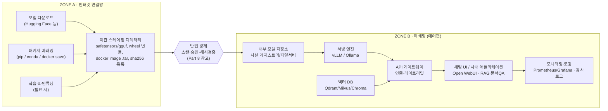

# 폐쇄망 LLM 구축 가이드

> 대상 독자: LLM 사전지식이 없는 실무자. 2026년 9월 기준 웹 조사를 종합해 작성.
>
> 범례 — `[확인됨]` 공식 문서·1차 자료 기반 / `[참고용]` 업계 비교글 등 2차 자료 기반 / `[공개 안 됨]` 조사 시점에 공개 자료 없이 일반 관행으로만 서술.

## 목차

- [Part 1. LLM 기초 개념](#part-1-llm-기초-개념)
- [Part 2. 왜 폐쇄망인가 — 실제 운영 사례](#part-2-왜-폐쇄망인가--실제-운영-사례)
- [Part 3. 표준 아키텍처](#part-3-표준-아키텍처)
- [Part 4. 학습 로드맵 (0~7단계)](#part-4-학습-로드맵-07단계)
- [Part 5. 서빙 엔진 비교표](#part-5-서빙-엔진-비교표)
- [Part 6. 모델 선택 가이드](#part-6-모델-선택-가이드)
- [Part 7. 하드웨어 사이징 가이드](#part-7-하드웨어-사이징-가이드)
- [Part 8. 폐쇄망 반입 절차 체크리스트](#part-8-폐쇄망-반입-절차-체크리스트)
- [Part 9. 참고 자료 모음](#part-9-참고-자료-모음)

---

## Part 1. LLM 기초 개념

### LLM은 결국 "다음 단어 맞히기" 기계다

대규모 언어모델(LLM)은 문장을 통째로 "이해"한다기보다, 지금까지 나온 텍스트를 보고 **다음에 올 확률이 가장 높은 조각(토큰)**을 계속 예측해 이어 붙이는 방식으로 글을 씁니다. 인터넷 규모의 텍스트를 학습하며 문법·사실관계·추론 패턴을 파라미터라는 숫자 뭉치에 압축해 담았기 때문에 이 반복만으로 번역·요약·코드 작성·질의응답이 가능합니다.

### 토큰(Token)과 컨텍스트 윈도우

모델은 글자가 아니라 **토큰** 단위로 텍스트를 자릅니다. 영어는 대략 단어 하나가 토큰 1개 안팎, 한국어는 조사·어미 때문에 같은 글자 수라도 토큰이 더 많이 소모되는 경향이 있습니다. **컨텍스트 윈도우**는 모델이 한 번에 "기억"할 수 있는 토큰의 최대치이며, 이 길이를 넘어가면 앞의 대화 내용을 잊습니다.

### 파라미터 수(7B, 32B, 70B…)와 양자화

"7B"는 파라미터(가중치) 70억 개라는 뜻으로, 숫자가 클수록 대체로 똑똑하지만 그만큼 메모리(VRAM)를 많이 먹습니다. **양자화(quantization)**는 원래 16비트로 저장된 숫자를 4비트·8비트 등으로 눌러 담아 용량과 속도를 확보하는 압축 기법입니다.

| 포맷 | 특징 |
|---|---|
| `GGUF` | CPU/애플 실리콘까지 폭넓게 지원, Ollama·LM Studio·GPT4All의 공통 표준 포맷 |
| `AWQ` | GPU 전용, 4비트에서도 정확도 손실이 작아 최근 프로덕션 서빙에서 선호 |
| `GPTQ` | AWQ 이전 세대 표준, 신규 모델은 점차 AWQ로 이동 중 |

출처: [양자화 포맷 비교 (digitalapplied)](https://www.digitalapplied.com/blog/gguf-vs-awq-vs-gptq-vs-mlx-llm-quantization-formats-2026)

### RAG — 모델이 모르는 내부 문서를 답하게 만드는 법

LLM은 학습 시점 이후 정보나 사내 문서를 알지 못합니다. **RAG(검색증강생성)**는 질문이 들어오면 먼저 사내 문서를 임베딩(의미를 숫자 벡터로 변환)해 저장해둔 **벡터DB**에서 관련 문단을 검색하고, 그 문단을 프롬프트에 끼워 넣어 LLM이 "찾아 읽고 답하게" 만드는 구조입니다. 폐쇄망 환경에서 사내 규정·매뉴얼 QA를 만들 때 사실상 기본 패턴입니다.

### 클라우드 LLM vs 사내망 vs 완전 폐쇄망

| 구분 | 인터넷 접근 | 대표 예 | 보안 성격 |
|---|---|---|---|
| 클라우드 LLM | 있음 | ChatGPT, Claude, Gemini 등 API | 데이터가 외부 서버로 전송됨 |
| 사내망(온프레미스) | 제한적 (아웃바운드 통제) | 회사 데이터센터에 GPU 서버 구축 | 모델·데이터는 내부, 일부 외부 연동 허용 |
| 완전 폐쇄망(에어갭) | 물리적으로 차단 | 국방망, 금융권 내부망 일부, 정부 특수망 | 반입 절차를 거친 것 외 어떤 트래픽도 나가거나 들어오지 않음 |

이 가이드의 로드맵은 "인터넷 되는 개인 PC"에서 시작해 마지막 6~7단계에서 위 표의 오른쪽, 즉 폐쇄망 이관까지 다룹니다.

---

## Part 2. 왜 폐쇄망인가 — 실제 운영 사례

국내 금융·공공·대기업과 해외 벤더가 공개한 수준에서 정리했습니다. 대부분 마케팅 자료 수준의 공개라 세부 아키텍처까지는 확인되지 않는 점을 감안해서 보세요.

| 주체 | 영역 | 공개된 특징 | 공개 수준 |
|---|---|---|---|
| 한국은행 (Naver Neurocloud) | 공공·중앙은행 | 폐쇄망 전용 생성형 AI 플랫폼, 자체 보유 데이터로 학습, 2025년 10월 서비스 목표 | `[참고용]` |
| 미래에셋증권 (Naver HCX-DASH) | 금융 | 경량 sLM을 금융 특화 모델로 온프레미스 구축 완료 | `[참고용]` |
| 삼성SDS FabriX / Brity Copilot | 대기업 SaaS | ERP·메일·문서 도구에 결합, 암호화된 전용 프라이빗 클라우드에서 운영 | `[참고용]` |
| LG CNS AgenticWorks | 대기업·금융 | 사내구축형(온프레미스)을 기본 정책으로 표방, 자사 보안 솔루션 SecuXpert 결합. 망분리 은행권 문의 다수 | `[참고용]` |
| SK C&C | 대기업 | 파인튜닝·프롬프트엔지니어링·접근통제를 묶은 오케스트레이션 플랫폼 + 13개 업무 유스케이스 패키지 | `[참고용]` |
| KT Managed AI GPU | 공공·기업 | 설계·구축·운영을 묶은 턴키형 온프레미스 GPU 인프라, 클라우드형 GPUaaS와 이원화 제공 | `[참고용]` |
| 금융위·금융보안원 금융권 AI 플랫폼 | 금융 정책 | 오픈소스 AI를 금융사 내부망(폐쇄망)에 손쉽게 설치하도록 지원하는 "투트랙(상용/오픈소스)" 정책 발표 | `[확인됨]` |
| NVIDIA NIM | 글로벌 표준 | 공식 문서로 에어갭 배포 절차 공개 — 인터넷 연결 머신에서 모델 캐시를 내려받아 폐쇄망 호스트로 물리 이전 | `[확인됨]` |
| IBM watsonx.ai | 글로벌 | Red Hat OpenShift 기반 온프레미스/에어갭 구성 지원, VMware와 "Private AI" 참조 아키텍처 공동 발표 | `[확인됨]` |
| AWS Outposts | 글로벌 | 학습은 리전에서, 서빙은 Outposts/Local Zones에서 — 데이터 잔류(residency) 요건 대응형 RAG 패턴 공식 블로그 공개 | `[확인됨]` |

**출처**: [한국은행·매일신문](https://www.imaeil.com/page/view/2025032809033855827) · [미래에셋·AI타임스](https://www.aitimes.com/news/articleView.html?idxno=163452) · [삼성SDS FabriX](https://www.samsungsds.com/kr/insights/fabrix.html) · [LG CNS 보도자료](https://www.lg.co.kr/media/release/29289) · [SK C&C·AI타임스](https://www.aitimes.com/news/articleView.html?idxno=157016) · [KT Enterprise](https://enterprise.kt.com/bt/blog/3788.do) · [금융위원회](https://www.fsc.go.kr/no010101/83594) · [NVIDIA NIM 에어갭 문서](https://docs.nvidia.com/nim/large-language-models/latest/deploy-air-gap.html) · [IBM+VMware](https://www.ibm.com/new/product-blog/ibm-and-vmware-help-enterprises-adopt-generative-ai-with-watsonx-on-premises) · [AWS Compute Blog](https://aws.amazon.com/blogs/compute/build-rag-powered-ai-solutions-at-the-edge-with-aws-local-zones-and-outposts/)

> **⚠ 조사 한계**: 국내 기업 사례는 대부분 보도자료·인터뷰 수준 공개로, 실제 네트워크 구성도나 서빙 스택 상세는 공개되어 있지 않습니다. 반대로 NVIDIA NIM은 실무 매뉴얼 수준의 공식 에어갭 배포 문서를 제공해, Part 4의 6단계(폐쇄망 이관) 실습의 참고 모델로 가장 구체적입니다.

### 공공·금융 규제 동향 (알아만 두면 되는 것)

- **행안부·디지털플랫폼정부위원회** — "공공부문 초거대 AI 도입·활용 가이드라인 2.0"(2025.4 개정)에서 "범정부 공통기반 활용"과 "자체 구현" 두 경로를 국가 망 보안체계와 연동해 정의
- **국가정보원** — "국가·공공기관 AI보안 가이드북"(2025.12) 및 망분리를 일부 완화하는 "국가 망 신(新)보안체계" 단계적 시행
- **금융위·금융보안원** — 생성형 AI를 금융권 내부망에 도입할 수 있도록 지원하는 정책과 "Human-in-the-Loop" 원칙 강조

출처: [공공부문 AI 가이드라인 2.0](https://bigdata.dongjak.go.kr/board/viewArticle?boardId=4&articleNo=954) · [국정원 AI보안 가이드북](https://www.aikorea.go.kr/web/board/brdDetail.do?menu_cd=000011&num=144) · [국가 망 신보안체계](https://www.newsis.com/view/NISX20250123_0003044340)

---

## Part 3. 표준 아키텍처



기본 원칙은 하나입니다 — **Zone B(폐쇄망) 안의 어떤 구성요소도 스스로 인터넷에 나가려 하지 않아야 한다**는 것. Ollama가 백그라운드로 버전 체크 요청을 보내는 것처럼, 겉보기엔 오프라인 도구도 숨은 네트워크 호출을 가진 경우가 있어 방화벽에서 아웃바운드를 **기본 차단(default-deny)**으로 걸고 예외를 화이트리스트로 여는 방식이 권장됩니다.

출처: [The Air-Gapped LLM Blueprint](https://tianpan.co/blog/2026/05/01/air-gapped-llm-blueprint-egress-free-deployment) · [Ollama 오프라인 설치 가이드](https://markaicode.com/ollama-offline-installation-guide/)

---

## Part 4. 학습 로드맵 (0~7단계)

개인 PC(인터넷 됨)에서 시작해 마지막에 폐쇄망 이관까지 갑니다. 각 단계는 이전 단계의 결과물 위에 쌓이므로 순서대로 진행하는 걸 권장합니다.

### 0단계 · 개념 다지기 (1~2일)

용어에 낯설음이 없어질 때까지 무료 코스 하나를 완주합니다. 실습 없이 읽기만 해도 됩니다.

- [ ] [Hugging Face LLM Course](https://huggingface.co/learn/llm-course/en/chapter1/1) 1~3장 읽기 (토크나이저·트랜스포머·허브)
- [ ] [mlabonne/llm-course](https://github.com/mlabonne/llm-course)의 로드맵 다이어그램으로 전체 그림 확인
- [ ] [roadmap.sh AI Engineer](https://roadmap.sh/ai-engineer) 로드맵에서 이 가이드가 다루는 범위를 확인

### 1단계 · 내 PC에서 첫 로컬 LLM 실행 (30분)

터미널이 무섭다면 GPT4All로, 이후 단계와 이어가려면 Ollama로 시작하세요. 목표는 "인터넷 없이도 모델이 답한다"를 직접 확인하는 것.

**옵션 A · GPT4All (제일 쉬움, GPU 불필요)**: 공식 설치파일을 받아 실행 → 앱 안에서 모델을 고르고 다운로드 → 바로 채팅. CPU만으로 동작하며 8GB RAM이면 충분.

**옵션 B · Ollama (추천, 2단계와 연결됨)**:

```bash
# macOS / Linux 설치
curl -fsSL https://ollama.com/install.sh | sh

# 한국어 성능이 좋은 모델 받기 (약 4.7GB)
ollama pull qwen2.5:7b

# 바로 대화 시작
ollama run qwen2.5:7b
```

Windows는 [ollama.com](https://ollama.com/download)에서 설치 파일을 받아 실행하면 됩니다. 실행 후 `ollama list`로 받은 모델을 확인하세요.

- [ ] Wi-Fi를 끈 상태에서도 `ollama run` 응답이 오는지 확인 (진짜 로컬 실행 체감)
- [ ] 같은 질문을 한국어/영어로 각각 물어보고 답변 품질 비교

출처: [Ollama 설치 가이드](https://medium.com/@sridevi17j/step-by-step-guide-setting-up-and-running-ollama-in-windows-macos-linux-a00f21164bf3) · [GPT4All 시스템 요구사항](https://github.com/nomic-ai/gpt4all/blob/main/gpt4all-chat/system_requirements.md)

### 2단계 · ChatGPT처럼 생긴 웹 UI 붙이기 (30분)

터미널 대화창을 벗어나 브라우저에서 채팅하고, 대화 기록과 모델 전환이 되는 "사내용 ChatGPT"의 최소 형태를 만듭니다.

```bash
docker run -d -p 3000:8080 \
  --add-host=host.docker.internal:host-gateway \
  -v open-webui:/app/backend/data \
  --name open-webui \
  ghcr.io/open-webui/open-webui:main
```

브라우저에서 `http://localhost:3000` 접속 → 계정 생성(로컬 저장, 외부 전송 없음) → 설정에서 Ollama 연결 확인 → 1단계에서 받은 모델이 목록에 뜨면 성공.

- [ ] 여러 모델을 pull해두고 UI에서 드롭다운으로 전환해보기
- [ ] PDF 하나를 업로드해 Open WebUI 내장 RAG로 질문해보기 (4단계 예습)

출처: [Open WebUI + Ollama 설정 가이드](https://codersera.com/blog/open-webui-ollama-self-hosted-chatgpt-2026/)

### 3단계 · 모델·양자화 비교 실습 (1시간)

"더 큰 모델 = 더 느림", "양자화 = 품질 약간 손해, 용량 크게 절약"을 숫자로 체감합니다.

```bash
# 같은 모델, 다른 양자화 수준을 받아 비교
ollama pull qwen2.5:7b-instruct-q4_K_M
ollama pull qwen2.5:7b-instruct-q8_0

# 응답 속도(tokens/s)는 --verbose 로 확인
ollama run qwen2.5:7b-instruct-q4_K_M --verbose
```

- [ ] 같은 프롬프트로 Q4 vs Q8 응답을 나란히 놓고 품질 차이 체감
- [ ] `--verbose` 출력의 eval rate(tok/s)를 기록해두기 — Part 7 하드웨어표와 비교
- [ ] 7B → 3B 급으로 모델을 낮춰보고 속도/품질 트레이드오프 확인

### 4단계 · 내 문서에 질문하기 (RAG) (2~3시간)

사내 매뉴얼 QA의 축소판을 로컬에서 완전히 오프라인으로 완성합니다.

```bash
pip install langchain langchain-community chromadb pypdf

# 임베딩 모델도 로컬에서: nomic-embed-text (Ollama) 또는 BGE-M3
ollama pull nomic-embed-text
```

흐름: PDF 로드 → 문단 단위로 쪼개기(chunking) → `nomic-embed-text`로 임베딩 → Chroma에 저장 → 질문이 오면 유사 문단 검색 → 검색된 문단 + 질문을 Ollama 모델에 프롬프트로 전달.

- [ ] 회사 소개 자료나 매뉴얼 PDF로 실습 (개인정보 없는 문서로)
- [ ] 문서에 없는 질문을 던져 "모른다"고 답하는지, 없는 사실을 지어내는지(환각) 확인
- [ ] Chroma → 나중에 Qdrant/Milvus로 바꿀 것을 염두에 두고 벡터DB를 코드에서 분리해두기

출처: [LangChain 로컬 RAG 튜토리얼](https://markaicode.com/tutorial/langchain-rag-tutorial/) · [BGE-M3 임베딩](https://bge-model.com/bge/bge_m3.html)

### 5단계 · 여러 명이 써도 버티는 서빙 엔진으로 교체 (반나절, GPU 필요)

Ollama는 혼자 쓰는 실험엔 충분하지만 동시 사용자가 늘면 처리량이 급격히 떨어집니다. 여기서부터는 실제 GPU 서버가 필요합니다. **이 단계 전에 `docs/02-serving-theory.md`로 원리를 먼저 읽어두면 설정 옵션들이 훨씬 잘 이해됩니다.**

```bash
pip install vllm

# 로컬에 이미 받아둔 모델 폴더를 그대로 서빙
vllm serve ./models/qwen2.5-7b-instruct --port 8000
```

- [ ] 같은 모델을 Ollama와 vLLM 양쪽에서 띄워 동시 요청 여러 개를 보내 처리량 차이 체감
- [ ] OpenAI 호환 API 엔드포인트(`/v1/chat/completions`)로 붙여, 2단계 UI를 vLLM 백엔드로 바꿔보기

출처: [vLLM vs Ollama 프로덕션 비교](https://codersera.com/blog/vllm-vs-ollama-vs-lm-studio-production-2026/)

### 6단계 · 인터넷 없는 환경으로 통째로 옮기기 (1~2일)

지금까지 만든 스택(모델·서빙엔진·패키지)을 인터넷이 되는 스테이징 PC에 그대로 재현한 뒤, 그 결과물만 승인된 경로로 폐쇄망에 반입하는 **실전 리허설**을 합니다.

```bash
# 모델 파일 챙기기
pip install "huggingface_hub[cli]"
huggingface-cli download Qwen/Qwen2.5-7B-Instruct \
  --local-dir ./staging/models/qwen2.5-7b

# 파이썬 패키지 오프라인 번들 (인터넷 되는 곳에서)
pip download -r requirements.txt -d ./staging/wheels
# 폐쇄망에서는 인터넷 없이 설치
pip install --no-index --find-links=./staging/wheels -r requirements.txt

# Docker 이미지 내보내기/불러오기
docker save vllm/vllm-openai:latest -o ./staging/vllm-image.tar
# --- 반입 경계 통과 후, 폐쇄망 안에서 ---
docker load -i ./vllm-image.tar
```

- [ ] 모델·패키지·이미지 각각 sha256 체크섬을 기록해 반입 신청서에 첨부
- [ ] 폐쇄망에서 `HF_HUB_OFFLINE=1`, `TRANSFORMERS_OFFLINE=1` 환경변수를 설정해 실수로도 외부 호출을 시도하지 않게 하기
- [ ] 방화벽에서 아웃바운드를 전부 막아둔 채 전체 파이프라인이 정상 동작하는지 최종 리허설

출처: [NVIDIA NIM 에어갭 배포](https://docs.nvidia.com/nim/large-language-models/latest/deploy-air-gap.html) · [Docker 이미지 에어갭 이전](https://labs.iximiuz.com/challenges/docker-transfer-images-air-gapped) · [오프라인 PyPI 서버](https://techbeatly.com/offline-pypi-server-disconnected-environment/)

### 7단계 · 운영·보안 다지기 (지속)

한 번 넣고 끝이 아니라 계속 굴러가야 하는 시스템으로 만듭니다.

- [ ] Prometheus + Grafana로 GPU 사용률·응답 지연·토큰 처리량 대시보드 구성
- [ ] 모델 교체·업그레이드 시 반입 절차를 처음부터 다시 밟는 "재반입 훈련" 1회 진행
- [ ] Part 8 체크리스트를 조직의 실제 보안팀 규정과 대조해 문서화
- [ ] Part 7 하드웨어표를 실제 운영 트래픽(동시 사용자 수)에 맞춰 재검토

---

## Part 5. 서빙 엔진 비교표

| 엔진 | 적합한 상황 | 폐쇄망 적합성 | 2026년 시점 비고 |
|---|---|---|---|
| **vLLM** | 다중 사용자, 높은 동시 처리량이 필요한 프로덕션 기본값 | 우수 | 사실상 업계 표준. `HF_HUB_OFFLINE=1` 등 오프라인 환경변수 지원 |
| **Ollama** | 개인 실험, 1~4단계 학습용 | 주의 | 추론 자체는 완전 오프라인이지만 백그라운드 버전 체크 호출이 있어 방화벽에서 별도 차단 필요. 프로덕션 부하에는 약함 |
| **Hugging Face TGI** | (신규 도입 비권장) | — | **단종 수순** — 2025.12 유지보수 모드 전환, 2026.3 GitHub 저장소 아카이브. HF 공식 문서도 vLLM/SGLang으로 유도 |
| **LocalAI** | 여러 포맷·백엔드를 하나의 OpenAI 호환 API로 통합하고 싶을 때 | 우수 | 설계 자체가 완전 자체호스팅 지향. 다만 설정 난이도가 높은 편 |
| **llama.cpp / llama-server** | GPU 없는 CPU 서버, 엣지·소규모 온프레미스 | 우수 | Ollama 등 상위 도구 다수의 내부 엔진. GGUF 포맷의 원조 |
| **SGLang** | 멀티턴 대화, RAG처럼 프롬프트 접두어가 반복되는 워크로드 | 우수 | vLLM과 유사한 셀프호스팅 패턴. 빠르게 성장 중인 대안 |
| **TensorRT-LLM** | NVIDIA GPU 단일 모델을 장기간 고정 운영 | 주의 | 컴파일 단계가 필요해 초기 셋업 부담 큼(1~2주 언급), NVIDIA 하드웨어 종속 |

> **⚠ 수치 관련 주의**: 엔진 간 처리량 배수(예: "vLLM이 Ollama보다 9~19배")는 SEO성 비교 블로그에서 반복 인용되는 수치로, 단일 공신력 있는 벤치마크로 추적되지 않습니다. 방향성(vLLM·SGLang이 다중 사용자에 강함)은 신뢰할 만하지만, 정확한 배수는 자체 벤치마크로 재검증하세요.

출처: [HF TGI GitHub (아카이브됨)](https://github.com/huggingface/text-generation-inference) · [vLLM 오프라인 서빙 이슈](https://github.com/vllm-project/vllm/issues/1910) · [에어갭 AI 스택 비교](https://markaicode.com/best/air-gapped-ai-stack/)

---

## Part 6. 모델 선택 가이드 — 특히 한국어

라이선스를 가장 먼저 보세요. 학습용으로는 문제없어도 폐쇄망 상용 서비스에는 못 쓰는 모델이 있습니다.

| 모델 | 개발사 | 크기 | 라이선스 | 비고 |
|---|---|---|---|---|
| Qwen 2.5 / 3 | Alibaba | 0.5B~235B | Apache 2.0 계열 | 201개 언어 지원, 다국어·한국어 모두 강한 선택지로 자주 인용됨 |
| Llama 3.3 / 4 | Meta | 1B~405B | Llama 커뮤니티 라이선스 | MAU 7억 초과 시 별도 계약 필요 — 대기업은 확인 필수 |
| Gemma 3 | Google | 1B~27B | Gemma 라이선스 | 온디바이스 최적화, 140여개 언어 지원 |
| Mistral Large 3 | Mistral AI | - | Apache 2.0 | 80개 이상 언어 지원 |
| EXAONE 4.0 | LG AI연구원 | 1.2B~32B+ | **비상업(NC)** | 오픈 가중치는 비상업 라이선스 — 상업적 폐쇄망 배포 전 별도 계약 확인 필요 |
| HyperCLOVA X SEED | Naver | 0.6B~33B | 모델별 확인 필요 | 한국어 추론 특화 32B "Think" 변형 포함 |
| SOLAR Open 2 | Upstage | 250B (A15B MoE) | Apache 2.0 기반 자체 라이선스 | 상업적 사용·파생 허용(파생모델은 "Solar-" 표기 의무). 국가 소버린 AI 사업 연계 |
| Mi:dm 2.0 | KT | 2.3B / 11.5B | **상업 이용 제한 없음** | 국내 기업 최초로 완전 개방형 라이선스로 공개한 1B급 이상 한국어 모델. 문서 QA에 강점 |

**추천 조합**: 3단계 학습·실습용으로는 Qwen2.5-7B(다국어 밸런스) 또는 Mi:dm 2.0(한국어·상업 라이선스 명확)로 시작하고, 문서QA 위주 폐쇄망 서비스를 실제로 만들 계획이라면 라이선스가 가장 깔끔한 Mi:dm 2.0 또는 SOLAR Open 2를 우선 검토하세요.

출처: [EXAONE 4.0 라이선스](https://huggingface.co/LGAI-EXAONE/EXAONE-4.0-32B/blob/main/LICENSE) · [Mi:dm 2.0](https://huggingface.co/K-intelligence/Midm-2.0-Base-Instruct) · [SOLAR Open 2](https://www.upstage.ai/blog/en/solar-open-2) · [HyperCLOVA X SEED](https://huggingface.co/collections/naver-hyperclovax/hyperclova-x-seed)

---

## Part 7. 하드웨어 사이징 가이드

아래 수치는 컨텍스트 길이·배치 크기에 따라 달라지는 어림값입니다. 3단계 실습에서 직접 잰 tok/s와 비교해보세요.

| 파라미터 | Q4 (4비트) | Q8 (8비트) | FP16 |
|---|---|---|---|
| 7B | 6~8GB | 10~12GB | 16~18GB |
| 13B | 10~12GB | 16~18GB | 28~30GB |
| 32B | 20~24GB | 34~38GB | 64~70GB |
| 70B | 40~48GB | 70~78GB | 140~150GB |

### 학습용 vs 소규모 프로덕션

- **학습·실습 머신** — RTX 4090/3090 (24GB) 1장이면 7B~13B는 여유, 32B도 Q4로는 빠듯하게 가능. 별도 클라우드 요금 없이 반복 실험하기 좋습니다.
- **소규모 온프레미스 프로덕션** — A100(40/80GB) 또는 H100급. 70B 이상, 다중 사용자 동시 서빙, ECC 메모리·NVLink 확장이 필요할 때.

> **⚠ 라이선스 주의**: NVIDIA GeForce 드라이버 EULA는 소비자용 GPU(RTX 4090/3090 등)의 **데이터센터 상업 배포를 금지**합니다. 학습·PoC 단계는 게이밍 GPU로 충분하지만, 실제 폐쇄망 "운영" 서버 구축 시에는 A100/H100/L40S급 데이터센터 GPU로 예산을 잡아야 합니다.

출처: [LLM VRAM 요구사항 가이드](https://techsy.io/en/blog/llm-vram-requirements-guide) · [A100 vs RTX 4090](https://www.thundercompute.com/blog/nvidia-a100-vs-rtx-4090-fine-tuning)

---

## Part 8. 폐쇄망 반입 절차 체크리스트

모델 파일·Docker 이미지·패키지처럼 "AI 특유의" 반입물에 대한 공식 표준 절차는 국내에 아직 공개되어 있지 않습니다. 아래는 일반 소프트웨어/자료 반입(망연계)에 공통적으로 쓰이는 패턴을 정리한 것으로, **반드시 자체 보안팀·정보보호팀 규정을 우선 확인**하세요.

> **⚠ 이 장은 "일반적 관행"입니다**: 국정원·금융보안원·KISA 어디에도 "AI 모델 가중치 반입 표준 절차"를 못박은 공개 문서는 확인되지 않았습니다. KISA의 SW 공급망 보안 가이드라인, 국정원의 망연계 관련 지침은 일반 소프트웨어·자료 반입에 적용되는 원칙이며, 여기 정리한 체크리스트도 그 일반 원칙을 AI 반입물에 맞춰 재구성한 것입니다.

1. **반입 신청** — 반입물 목록(모델명·버전·용도·담당자), 출처(Hugging Face 등 원본 URL), 예상 크기를 명시해 승인 요청
2. **확장자·파일유형 화이트리스트 검사** — `.safetensors`, `.gguf`, `.whl`, `.tar` 등 허용 목록에 있는지 확인
3. **백신·악성코드 검사** — 대용량 모델 파일도 예외 없이 스캔 (스캔 시간이 오래 걸릴 수 있어 일정에 반영)
4. **개인정보·민감정보 스캔** — 특히 파인튜닝용 데이터셋을 반입할 경우 필수
5. **체크섬 검증** — 반입 전 sha256 등으로 원본과 대조해 전송 중 변조·손상 여부 확인
6. **반입 이력 로깅** — 승인자, 반입 시각, 파일 목록을 감사 로그로 남김
7. **격리 검증 후 운영 반영** — 폐쇄망 내 별도 테스트 구간에서 먼저 기동 확인 후 운영 시스템에 반영

### 실무 팁

- Python 패키지는 개별 반입보다 **devpi·Sonatype Nexus 같은 내부 PyPI 미러**를 한 번 구축해두면, 이후엔 pip 설정만 내부 서버로 돌려 반복 반입 부담을 줄일 수 있습니다.
- Docker 이미지도 매번 tar로 옮기기보다 **내부 프라이빗 레지스트리**를 세우면 여러 호스트가 거기서 pull하는 구조로 전환할 수 있습니다.
- 대규모 모델 파일은 반입 승인에 시간이 걸리므로, 3~5단계 실습 때부터 "이 모델이 실제로 필요한가"를 추려 반입 목록을 최소화하는 습관을 들이는 게 좋습니다.

출처: [보안뉴스 — 망분리·망연계](https://m.boannews.com/html/detail.html?idx=118540) · [KISA SW 공급망 보안 가이드라인](https://www.kisa.or.kr/2060204/form?postSeq=15&page=1) · [오프라인 PyPI 서버 구축](https://techbeatly.com/offline-pypi-server-disconnected-environment/)

---

## Part 9. 참고 자료 모음

- [Hugging Face LLM Course](https://huggingface.co/learn/llm-course/en/chapter1/1) — 트랜스포머부터 RAG·에이전트까지 무료 공식 코스
- [mlabonne/llm-course](https://github.com/mlabonne/llm-course) — LLM Scientist / LLM Engineer 두 트랙, 깃허브 최다 스타 로드맵 중 하나
- [roadmap.sh — AI Engineer](https://roadmap.sh/ai-engineer) — 추론·학습·임베딩·벡터DB·RAG·에이전트를 아우르는 시각화 로드맵
- [musamaanjum/ai-engineer-roadmap](https://github.com/musamaanjum/ai-engineer-roadmap) — 무료/유료 강의, 포트폴리오 프로젝트 5개, 면접 준비 포함
- [freeCodeCamp — Qwen3 + Ollama로 나만의 로컬 AI 만들기](https://www.freecodecamp.org/news/build-a-local-ai/) — 1단계와 거의 동일한 실습을 다른 각도로 설명
- [DeepLearning.AI 단기 강좌](https://learn.deeplearning.ai/) — "Open Source Models with Hugging Face", "Fast & Efficient LLM Inference with vLLM" 등 5단계 이후 심화용
- [폐쇄망 LLM 구축기 시리즈 (hoft.tistory.com)](https://hoft.tistory.com/entry/airgap-llm-survival-ep01-why-local-llm) — 기초/인터넷망 준비/폐쇄망 설치/실전 운영/고급 활용 5단계 18편으로 기획된 국내 실전 구축기. 이 글 작성 시점엔 1편만 발행돼 있었지만, GPU 선택(V100 포함)·LiteLLM 게이트웨이·RHEL Podman·Continue.dev 활용까지 다루는 구성이 알차서 `vault/concepts/GPU 선택.md`·`vault/engines/LiteLLM.md`·`vault/engines/Podman.md`·`vault/engines/Continue.dev.md` 노트를 이 인덱스를 참고해 추가했습니다.

### 이 문서의 조사 방법과 한계

2026년 9월 기준으로 웹 검색을 통해 국내 언론·기업 보도자료·해외 공식 기술문서·기술 블로그를 종합해 작성했습니다. `[참고용]`으로 표시된 항목은 마케팅 자료 수준의 정보이며, 실제 도입 전에는 반드시 해당 벤더·기관에 최신 스펙을 직접 확인하시길 권합니다.
