# 서빙 이론 노트

> [01-roadmap.md](01-roadmap.md) 5단계(프로덕션 서빙 엔진 전환)를 진행하기 전에 읽으면, vLLM 설정 옵션들이 뭘 조절하는 건지 원리로 이해할 수 있습니다.

서빙의 핵심은 몇 가지 원리만 잡으면 나머지는 다 그 위에 얹은 최적화입니다. Prefill/Decode 구조부터 시작해 양자화가 서빙 속도에 영향을 주는 이유까지, 하나의 체인으로 이어집니다.

## 1. 왜 서빙이 특이한 문제인가 — Prefill vs Decode

LLM 추론은 한 번에 다 계산하는 게 아니라 토큰을 한 개씩 순차적으로 뱉어내는 autoregressive 구조라서 생기는 문제입니다. 여기엔 성격이 완전히 다른 두 단계가 있습니다.

- **Prefill (프롬프트 처리)** — 입력 프롬프트 전체를 한 번에 병렬로 통과시킵니다. 행렬곱 연산이 커서 GPU 연산력을 거의 다 씁니다 (compute-bound).
- **Decode (토큰 생성)** — 한 스텝에 토큰 딱 1개만 만듭니다. 연산량 자체는 작은데, 매 스텝마다 이전 토큰들의 상태를 다시 읽어와야 해서 **GPU 연산력이 아니라 메모리 대역폭이 병목**입니다 (memory-bound).

이 둘의 성격 차이를 이해하는 게 서빙 최적화 전체의 출발점입니다 — "왜 처리량을 올리려면 배치를 키워야 하는가"가 여기서 나옵니다.

## 2. KV 캐시 — 메모리를 잡아먹는 진짜 범인

토큰을 하나 생성할 때마다 이전 모든 토큰의 attention key/value를 매번 다시 계산하면 낭비이므로, 한 번 계산한 값을 **캐시(KV 캐시)**해두고 재사용합니다. 문제는 이 캐시가

```
KV 캐시 크기 ∝ (프롬프트 길이 + 지금까지 생성한 토큰 수) × 레이어 수 × 헤드 수
```

에 비례해서 대화가 길어질수록 계속 자라난다는 것 — 그래서 "컨텍스트가 길수록 VRAM을 더 먹는다"가 여기서 나옵니다. 요청 하나하나가 크기를 예측하기 어려운 메모리 덩어리를 계속 요구하는 셈이라, 이걸 어떻게 배치·할당하느냐가 서빙 엔진 성능 차이의 8할입니다.

## 3. 배칭 — GPU를 놀리지 않는 법

여러 사용자의 요청을 동시에 처리해야 GPU가 효율적으로 돌아갑니다.

- **Static batching** — 요청 N개를 한 배치로 묶어 처리. 그런데 배치 안에서 가장 긴 응답이 끝날 때까지 이미 끝난 다른 요청들도 자리를 비우지 못하고 대기 → GPU가 놀게 됨.
- **Continuous batching (in-flight batching)** — vLLM·TGI 계열이 쓰는 방식. 요청이 끝나는 즉시 배치에서 빼고, 대기 중이던 새 요청을 그 자리에 바로 채워 넣습니다. GPU 유휴 시간이 거의 없어져서 처리량이 크게 오릅니다.

```mermaid
gantt
    title Static batching vs Continuous batching (GPU 슬롯 점유 예시)
    dateFormat  X
    axisFormat %s

    section Static batching
    요청A (짧음)      :done, s1, 0, 3
    자리 비움(낭비)    :crit, s1b, 3, 8
    요청B (길음)      :done, s2, 0, 8
    새 요청 대기중... :active, s3, 8, 10

    section Continuous batching
    요청A         :done, c1, 0, 3
    요청C (바로 채움) :done, c1b, 3, 8
    요청B         :done, c2, 0, 8
    요청D (바로 채움) :done, c3, 8, 10
```



## 4. PagedAttention — vLLM이 빠른 진짜 이유

KV 캐시를 요청마다 통짜로 미리 예약해두면 메모리가 단편화되고 낭비가 생깁니다. vLLM의 핵심 아이디어는 **OS의 가상메모리처럼 KV 캐시를 고정 크기 "페이지" 단위로 쪼개 관리**하는 것 — 필요한 만큼만 페이지를 할당하고, 여러 요청이 같은 프롬프트 접두어를 공유하면(예: 시스템 프롬프트가 같은 여러 요청) 페이지 자체를 공유합니다. 이게 다른 엔진 대비 동시 처리량이 높은 이유의 핵심입니다.

## 5. 처리량 vs 지연시간 — 실무에서 튜닝하는 손잡이

배치를 키우면 GPU당 처리량(throughput)은 오르지만, 개별 요청 입장에서는 다른 요청과 같이 대기하는 시간이 늘어 지연시간(latency)이 나빠집니다. 서빙 설정에서 최대 배치 크기·최대 대기 시간을 튜닝하는 게 결국 이 트레이드오프를 조절하는 일입니다. 챗봇처럼 응답 체감이 중요하면 지연시간 쪽으로, 배치 문서 요약처럼 응답 속도가 안 중요하면 처리량 쪽으로 기울입니다.

이게 실제로 vLLM에서 만지는 값들입니다:

| 옵션(예시) | 무엇을 조절하는가 |
|---|---|
| `--max-num-seqs` | 동시에 배치에 들어갈 수 있는 요청 수 상한 → 처리량/지연시간 트레이드오프 |
| `--gpu-memory-utilization` | KV 캐시용으로 얼마나 많은 VRAM을 미리 확보할지 (PagedAttention 페이지 풀 크기) |
| `--max-model-len` | 컨텍스트 윈도우 상한 → KV 캐시가 최대 얼마나 커질 수 있는지 |

## 6. 모델이 GPU 하나에 안 들어갈 때 — 병렬화

- **Tensor Parallelism** — 레이어 하나의 행렬 연산 자체를 여러 GPU에 쪼갬. GPU 간 통신이 잦아서 NVLink처럼 빠른 인터커넥트가 필요.
- **Pipeline Parallelism** — 레이어 묶음을 GPU별로 나눠 순차 통과. 통신은 적지만 GPU들이 순서대로 기다리는 "파이프라인 버블"이 생김.

70B급 이상을 여러 GPU에 걸쳐 서빙할 때 이 둘을 섞어 쓰는 게 일반적입니다.

## 7. 양자화가 서빙 속도에도 영향을 주는 이유

양자화(GGUF/AWQ 등)는 "용량을 줄인다"만 생각하기 쉬운데, decode 단계가 메모리 대역폭 병목이라는 걸 떠올리면 — **가중치를 작게 만들면 메모리에서 읽어올 데이터량이 줄어 decode 자체가 빨라집니다.** [01-roadmap.md 3단계](01-roadmap.md#3단계--모델양자화-비교-실습-1시간) 실습에서 Q4가 Q8보다 tok/s가 높게 나온 게 바로 이 이유입니다.

## 8. (심화) Speculative Decoding

작은 draft 모델이 여러 토큰을 미리 추측하고, 큰 모델이 그 추측을 한 번에 검증하는 방식. 토큰을 하나씩만 생성해야 하는 autoregressive 특성의 순차적 병목을 일부 우회하는 최신 기법입니다. 5단계 이후 심화 주제로 남겨둡니다.

---

## 한 줄 요약 체인

**Prefill/Decode 구조 → KV 캐시가 메모리를 먹는다 → 그래서 배칭과 메모리 관리(PagedAttention)가 성능을 가른다 → 그 위에서 처리량/지연시간을 튜닝하고, 안 들어가면 병렬화한다.**

이 체인 하나만 잡으면 vLLM 설정 옵션이 뭘 조절하는 건지 다 이 그림 안에서 설명됩니다.
