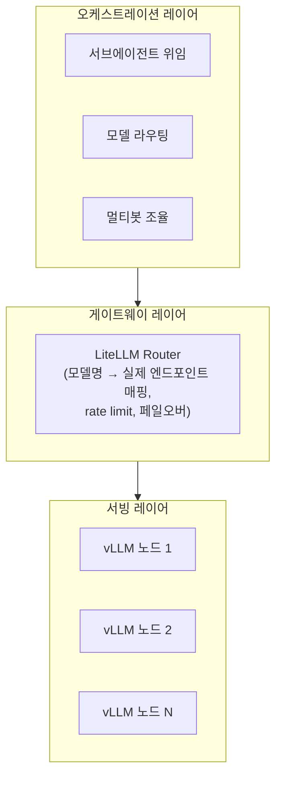

# 에이전트 오케스트레이션 아키텍처 분석 — 클로드 코드·Hermes Agent를 통해 본 원리

> 이 글은 [01-roadmap.md](01-roadmap.md)·[02-serving-theory.md](02-serving-theory.md)가 다루는 "모델을 어떻게 서빙하는가"의 다음 단계, 즉 **"서빙된 모델을 여러 클라이언트·여러 에이전트가 어떻게 나눠 쓰는가"**를 다룹니다. [구축기 v2.0](구축기-v2.0/README.md) 시리즈에서 DGX 4대 위에 실제로 구현하기 전에, 클로드 코드와 Hermes Agent라는 두 실제 제품이 이 문제를 어떻게 풀었는지 원리 수준에서 정리해둡니다.

## 1. 문제 정의 — 왜 "오케스트레이션"이 별도 레이어인가

지금까지 이 레포에서 다룬 서빙 스택(vLLM·LiteLLM)은 **"요청 하나가 들어오면 어떻게 빨리 처리하는가"**에 집중합니다. 그런데 실제 에이전트형 도구(클로드 코드, Hermes Agent)를 쓰다 보면 요청이 하나가 아니라 **여러 개가 동시에, 서로 다른 목적으로** 발생합니다.

- 메인 대화 하나가 답변을 만드는 동안, 별도의 하위 작업(코드 검색, 파일 여러 개 리뷰)을 병렬로 처리하고 싶다 → **서브에이전트**
- 코드 자동완성처럼 짧고 빈번한 요청은 가벼운 모델로, 복잡한 추론은 무거운 모델로 보내고 싶다 → **모델 라우팅**
- 역할이 다른 여러 "봇"(리서처, 코더, 리뷰어)이 서로 메시지를 주고받으며 협업하게 하고 싶다 → **멀티에이전트 조율**

이 세 가지를 통틀어 **오케스트레이션**이라고 부릅니다. 서빙 엔진(vLLM)은 "요청 하나 빨리 처리"만 알지, "누가 몇 개를 언제 보내는가"는 모릅니다 — 그 위에 별도 레이어가 필요한 이유입니다.

## 2. 클로드 코드의 서브에이전트 모델

클로드 코드는 `Agent` 툴로 서브에이전트를 스폰합니다. 핵심 특징:

- **격리된 컨텍스트**: 서브에이전트는 메인 대화의 전체 히스토리를 물려받지 않고, 호출 시점에 명시적으로 넘겨준 프롬프트만 봅니다. 메인 컨텍스트 창을 서브에이전트의 방대한 중간 결과로 오염시키지 않기 위한 설계입니다.
- **결과만 반환**: 서브에이전트가 수십 번 파일을 읽고 검색해도, 메인 에이전트에는 최종 요약만 돌아옵니다.
- **병렬 vs 순차**: 서로 의존성이 없는 서브에이전트는 한 메시지 안에서 동시에 여러 개 스폰해 병렬로 돌립니다. 의존 관계가 있으면(A의 결과가 B의 입력) 순차 실행합니다.
- **백그라운드 실행**: 결과가 당장 필요 없는 서브에이전트는 백그라운드로 돌리고, 완료되면 알림으로 돌아옵니다 — 메인 대화는 그동안 다른 일을 계속합니다.

이 모델의 전제는 **"뒤에서 얼마든지 동시 요청을 처리할 수 있는 용량"**입니다. 클라우드 API(Anthropic 등)는 이 용량이 사실상 수평 확장되어 있어 서브에이전트 5개를 동시에 띄워도 개별 요청 지연이 거의 안 늘어납니다.

## 3. Hermes Agent의 위임·봇·라우팅 삼분법

Hermes Agent(Nous Research)는 같은 문제를 세 개의 독립된 컴포넌트로 나눠 풀었습니다.

| 컴포넌트 | 파일(문서 기준) | 역할 |
|---|---|---|
| 서브에이전트 위임 | `delegate_tool.py` | 메인 에이전트가 특정 작업을 별도 에이전트 인스턴스에 위임, 병렬 워크스트림 생성 |
| 프로바이더 라우팅 | `runtime_provider.py` | (provider, model) 튜플을 (api_mode, api_key, base_url)로 매핑 — 18개+ 프로바이더, alias 해석, CLI·게이트웨이·크론이 공유하는 리졸버 |
| 멀티봇 조율 | Bot Mode | 프로필을 명명된 봇 명단으로 전환, 봇마다 모델 고정(pin) 가능, `message_agent()` 툴과 그룹 채팅으로 봇 간 상호작용, `hermes peer`로 머신 간 통신 |

클로드 코드가 "하나의 에이전트가 서브에이전트를 부리는" 수직적 모델이라면, Hermes의 Bot Mode는 "역할이 다른 여러 에이전트가 수평적으로 협업"하는 모델에 가깝습니다 — @mention, 그룹 채팅(최대 3라운드 순차 응답) 같은 개념이 이걸 보여줍니다.

## 4. 셀프호스팅 환경에서 겹치는 지점 — 라우팅의 이중화 문제

3절의 `runtime_provider.py`를 보면 알 수 있듯, Hermes Agent는 **자체적으로도 모델 라우팅 능력을 가지고 있습니다.** 그런데 이 레포에서 이미 LiteLLM 게이트웨이([EP05](구축기-v1.0/EP05-LiteLLM-설정.md), [EP10](구축기-v1.0/EP10-LiteLLM-게이트웨이-구성.md))를 구축해뒀다면, "모델 이름 → 실제 엔드포인트" 변환 책임이 두 군데(Hermes 리졸버, LiteLLM Router)에 중복으로 존재하게 됩니다.

클라우드 API를 쓰는 환경에서는 이 중복이 문제되지 않습니다 — 프로바이더가 이미 자체적으로 무한에 가까운 동시성을 보장하기 때문에, 클라이언트 쪽 라우팅은 그냥 "어느 API 키를 쓸지" 정도의 선택 문제일 뿐입니다. 하지만 **GPU 물리 노드가 유한한 셀프호스팅 환경**에서는 얘기가 다릅니다 — 라우팅 로직이 두 곳에 나뉘어 있으면 "지금 어느 노드가 바쁜지"에 대한 판단 기준이 어긋날 수 있고, 한쪽에서 걸어둔 동시성 제한이 다른 쪽에서 보이지 않는 문제가 생깁니다.

**원칙**: 물리 자원(GPU 노드)에 대한 실시간 부하 판단과 페일오버는 LiteLLM 게이트웨이 한 곳에만 맡기고, Hermes(또는 다른 에이전트 클라이언트)의 프로바이더 리졸버는 "LiteLLM이라는 프로바이더 하나"만 바라보게 단순화합니다. 클라이언트 쪽 라우팅은 "어떤 논리적 모델(alias)을 쓸지" 선택까지만 담당합니다.

## 5. GPU 용량과 오케스트레이션 전략의 관계

서브에이전트·멀티봇 오케스트레이션이 실익이 있으려면 "동시 요청을 늘려도 개별 지연이 크게 안 늘어나는" 용량 여유가 있어야 합니다. 이 조건이 [02-serving-theory.md 5절](02-serving-theory.md)의 처리량/지연시간 트레이드오프와 직결됩니다.

| 인프라 규모 | 서브에이전트 병렬 스폰 | 멀티봇 조율 |
|---|---|---|
| GPU 1~3장, 노드 1개 | 비권장 — 큐잉만 늘어남, 순차 처리와 체감 차이 적음 | 비권장 |
| GPU 4장 이상, 노드 여러 개(독립형) | 권장 — LiteLLM이 노드 간 least-busy 라우팅으로 실제 처리량 분산 | 권장 — 봇별로 노드/모델을 분리 배정 가능 |
| 노드 여러 개(클러스터형, NVLink/IB로 결합) | 조건부 — 노드를 합쳐 모델 1개를 크게 키우는 데 쓰면 오히려 동시성은 줄어들 수 있음 | 비권장에 가까움 — 물리적으로 노드 분리가 안 되어 봇별 자원 격리가 어려움 |

**[구축기 v2.0](구축기-v2.0/README.md) 시리즈**는 이 표의 두 번째 행 — "GPU 4장 이상, 독립형 노드" 시나리오를 실제로 구현하는 걸 목표로 합니다.

## 6. 설계 체크리스트 — 오케스트레이션을 자체 인프라에 얹기 전에

- [ ] 라우팅 책임을 한 곳(LiteLLM)으로 모았는가 — 클라이언트가 물리 노드 주소를 직접 알 필요가 없는 구조인가
- [ ] 노드별 `max_parallel_requests`(또는 동등한 동시성 상한)를 게이트웨이에 걸어뒀는가
- [ ] 역할별 모델(추론용/코드용/임베딩용)을 분리해뒀는가, 아니면 모든 요청이 같은 모델 풀을 놓고 경쟁하는가
- [ ] 서브에이전트 동시 스폰 개수에 상한이 있는가 — 무제한으로 늘어나면 게이트웨이 rate limit이 있어도 큐 대기시간이 커짐
- [ ] 봇/서브에이전트가 실패했을 때(노드 다운, 타임아웃) 페일오버 대상이 명확한가

## 참고

- [Hermes Agent 공식 문서](https://hermes-agent.nousresearch.com/docs) — Bot Mode, 서브에이전트 위임, 프로바이더 라우팅 설명
- [구축기-v1.0/EP05-LiteLLM-설정.md](구축기-v1.0/EP05-LiteLLM-설정.md), [구축기-v1.0/EP10-LiteLLM-게이트웨이-구성.md](구축기-v1.0/EP10-LiteLLM-게이트웨이-구성.md) — 이미 구축한 게이트웨이 레이어
- [02-serving-theory.md](02-serving-theory.md) — 처리량/지연시간, 배칭, PagedAttention 원리
