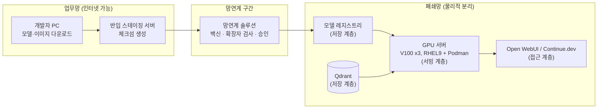

# EP02. 전체 아키텍처 설계

> 시리즈: [폐쇄망 LLM 구축기](README.md) · 이전: EP01(왜 폐쇄망에서 로컬 LLM인가) · 다음: [EP03. GPU 선택 가이드](EP03-GPU-선택-가이드.md)

EP01에서 왜 폐쇄망 안에 로컬 LLM을 직접 세워야 하는지 얘기했었죠. 이번 편은 그 결심을 실제로 어떤 그림으로 옮겼는지에 관한 이야기예요. GPU를 사기 전에, vLLM을 설치하기 전에 이 단계를 한 번은 제대로 밟아야 하더라구요 — 안 그러면 나중에 꼭 다시 그리게 돼요.

## 🎯 요구사항부터 숫자로 잡았어요

"AI 챗봇 만들어주세요"라는 한 줄 요청서만 들고 아키텍처를 그리면 100% 나중에 GPU가 모자라거나 남아요. 그래서 저희 팀은 먼저 이 표부터 채웠습니다.

| 항목 | 확인한 값 | 비고 |
|---|---|---|
| 대상 사용자 | 현업 상품기획팀 40명 + 개발팀 25명 | 전사 배포 아님, 1차는 두 팀 |
| 동시 접속 예상 | 피크 시 10~15명 | 아침 회의 직후, 월말 마감 전후 집중 |
| 주 용도 | 사내 규정·상품 매뉴얼 QA(현업), 코드 자동완성·리뷰(개발팀) | RAG + 코딩 어시스턴트 두 갈래 |
| 응답 지연 허용치 | 첫 토큰 3초 이내, 전체 응답 20초 이내 | 챗봇 UX 기준 벤치마킹 |
| 데이터 민감도 | 사내 규정(대외비), 소스코드(대외비) | 개인정보·고객정보는 이 시스템에 넣지 않기로 사전 확정 |
| 반입 주기 | 모델 갱신은 분기 1회, 문서 갱신은 주 1회 | RAG 반입이 더 잦다는 게 나중에 중요해짐 |

동시 접속 10~15명이라는 숫자, 이거 진짜 중요해요. 다음 편(GPU 선택)이랑 나중에 vLLM 배치 크기 정할 때까지 계속 기준점으로 쓰거든요. 이 숫자 없이 GPU부터 고르면 무조건 과다 아니면 과소예요.

## 🏗️ 4계층으로 나눠봤어요

전체를 그냥 "AI 서버" 하나로 뭉뚱그리면, 나중에 장애 났을 때 원인을 못 찾아요. 그래서 역할별로 4개 계층으로 쪼갰습니다.

| 계층 | 역할 | 우리 구성 |
|---|---|---|
| ① 반입 계층 | 외부(인터넷망)에서 검증한 모델·문서·패키지를 폐쇄망으로 들여옴 | 망연계 솔루션 + 반입 스테이징 서버 |
| ② 저장 계층 | 모델·벡터 데이터를 영구 보관 | 로컬 모델 레지스트리(파일서버) + Qdrant |
| ③ 서빙 계층 | 실제 추론을 수행 | vLLM(LLM) + Ollama(임베딩) + LiteLLM(게이트웨이) |
| ④ 접근 계층 | 사용자가 실제로 쓰는 지점 | Open WebUI(현업용), Continue.dev(개발팀용) + 감사 로그 |

이렇게 나눠두면 "챗봇이 느려요"라는 민원이 들어왔을 때 ③번(서빙 계층 GPU가 포화됐나?)부터 볼지 ④번(게이트웨이가 타임아웃 났나?)부터 볼지 바로 갈래를 탈 수 있어요. EP13(모니터링 편)에서 계층별로 다른 알람을 거는 것도 다 여기서 시작된 얘기예요.

## 🖥️ 물리적 네트워크는 이렇게 그렸어요

여기가 진짜 회의를 제일 많이 한 부분이에요. 보안팀 요구사항은 "폐쇄망 안의 어떤 장비도 스스로 인터넷에 나가면 안 된다"는 한 문장이었는데, 이걸 실제로 지키려면 반입 구간을 명확하게 그려야 하더라구요.

업무망(인터넷 가능)이랑 폐쇄망 사이에 물리적으로 분리된 망연계 구간을 두고, 이 구간을 통과하는 모든 파일은 보안팀이 정한 절차(확장자 화이트리스트 → 백신 검사 → 승인)를 거치게 했어요. 구체적인 체크리스트는 `docs/01-roadmap.md` Part 8을 그대로 가져다 썼고, 여기에 모델 파일(`.safetensors`, `.gguf`)이랑 컨테이너 이미지(`.tar`)를 화이트리스트에 추가로 올렸습니다.

## 📋 용량은 일단 러프하게

이 시점엔 정확한 GPU 스펙까지는 못 정해요. 대신 "동시 15명이 각자 다른 질문을 던져도 첫 토큰까지 3초를 안 넘긴다"를 목표로 못박아두고, 이 목표를 만족하는 GPU 구성은 다음 편에서 따져보기로 했어요. 미리 스포하자면 — 결론은 "새로 사지 말고 있는 V100 3장으로 시작해보자"였습니다. 그 계산 과정은 다음 편에서요.

---

📌 **EP.02 한 줄 요약**
아키텍처는 요구사항(동시 15명, 첫 토큰 3초)을 숫자로 먼저 잡고, 반입·저장·서빙·접근 4계층으로 나눈 뒤, 망연계 구간을 사이에 둔 물리적 네트워크로 그렸다.

**다음 편**: [EP03. GPU 선택 가이드 — V100 vs A100 vs 소비자 GPU](EP03-GPU-선택-가이드.md)
