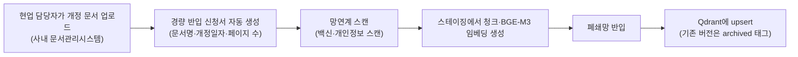

# EP12. 오프라인 패키지 설치

> 시리즈: [폐쇄망 LLM 구축기](README.md) · 이전: [EP11. OpenWebUI 연동 & 사용자 추적](EP11-OpenWebUI-연동-사용자-추적.md) · 다음: [EP13. 모니터링 & 트러블슈팅](EP13-모니터링-트러블슈팅.md)

Phase 4, "실전 운영 편"이에요. EP06에서 반입 패키지를 크게 한 번 만들어서 넘겼는데, 그건 사실 시작이었지 끝이 아니었어요. EP02에서 "문서 갱신은 주 1회, 모델 갱신은 분기 1회"라고 잡아뒀던 거 기억나시나요? 이번 편은 그 **반복되는 반입**을 매번 EP06처럼 무겁게 하지 않도록 파이프라인화한 이야기예요.

## 🎯 매번 이렇게 하면 안 되겠다 싶었어요

EP06의 manifest.json 방식은 큰 반입(모델·이미지 세트)에는 적합한데, 문서 몇 개 업데이트하는 데도 똑같은 무게로 심사받으려니 담당자도 저희도 지치더라구요. 그래서 반입물 종류별로 절차 무게를 다르게 나눴습니다.

| 반입 종류 | 주기 | 절차 |
|---|---|---|
| 모델·컨테이너 이미지 | 분기 1회 | EP06 방식 그대로(무거운 manifest, 정보보호위원회 보고) |
| 사내 문서(RAG용) | 주 1회 | 경량 신청서 + 자동 검증 스크립트 (이번 편) |
| 설정 파일 변경 | 수시 | Git으로 버전 관리, 변경 이력만 감사팀 공유 |

## 📦 내부 프라이빗 레지스트리부터 만들었어요

이미지를 매번 tar로 주고받는 대신, 폐쇄망 안에 사설 레지스트리를 하나 세워서 여러 서버가 거기서 pull하게 했어요.

```bash
podman run -d --name registry \
  -p 5000:5000 \
  -v /opt/airgap-data/registry:/var/lib/registry:Z \
  localhost/registry:2

podman tag localhost/vllm-v100:latest localhost:5000/vllm-v100:2026Q3
podman push localhost:5000/vllm-v100:2026Q3 --tls-verify=false
```

이렇게 해두면 GPU 서버가 여러 대로 늘어나도(EP18에서 다룰 확장 얘기랑도 연결돼요) 이미지를 다시 tar로 옮길 필요 없이 내부 레지스트리에서 바로 pull하면 됩니다.

## 📋 문서 반입은 경량 신청서로

주 1회 들어오는 사내 규정 문서는 이런 흐름으로 정리했어요.



경량 신청서는 문서명·개정일자·페이지 수 정도만 자동으로 채워지고, 담당자가 "개인정보 포함 여부"만 체크하면 끝나요. EP06처럼 모델 파일 체크섬을 일일이 대조할 필요가 없어서(문서는 애초에 무해한 텍스트니까), 심사 시간이 하루 이틀에서 몇 시간으로 줄었어요.

## ✅ upsert 스크립트

```python
# refresh_docs.py
from qdrant_client import QdrantClient
import hashlib

client = QdrantClient(host="qdrant", port=6333)

def upsert_document(doc_id: str, chunks: list[dict]):
    # 기존 버전은 지우지 않고 archived=true로 표시만 해둔다
    client.set_payload(
        collection_name="internal_docs",
        payload={"archived": True},
        points=client.scroll(
            collection_name="internal_docs",
            scroll_filter={"must": [{"key": "doc_id", "match": {"value": doc_id}}]},
        )[0],
    )
    client.upsert(collection_name="internal_docs", points=chunks)
```

문서를 바로 지우지 않고 `archived` 태그만 붙여두는 이유는, 감사 시점에 "그때는 어떤 규정 버전으로 답했는가"를 재현할 수 있어야 하기 때문이에요. RAG가 매번 최신 문서만 보게 필터를 걸어두고, 예전 버전은 감사용으로만 남겨둡니다.

---

📌 **EP.12 한 줄 요약**
반입 절차를 반입물 성격별로 무게를 다르게 나눴다. 모델·이미지는 EP06 방식을 유지하고, 매주 들어오는 문서는 경량 신청서 + 자동 upsert 파이프라인으로 만들었으며, 내부 레지스트리로 이미지 재배포 부담도 줄였다.

**다음 편**: [EP13. 모니터링 & 트러블슈팅](EP13-모니터링-트러블슈팅.md)
