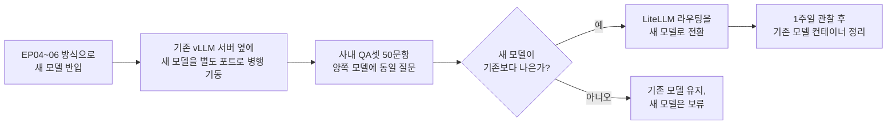

# EP14. 모델 업데이트 전략

> 시리즈: [폐쇄망 LLM 구축기](README.md) · 이전: [EP13. 모니터링 & 트러블슈팅](EP13-모니터링-트러블슈팅.md) · 다음: [EP15. 폐쇄망 RAG 구축 ①](EP15-폐쇄망-RAG-구축-1.md)

Phase 4 마지막 편이에요. EP02에서 "모델 갱신은 분기 1회"로 잡아뒀는데, 첫 분기가 돌아왔을 때 실제로 뭘 했는지 적어볼게요. 결론부터 말하면 — **새 모델을 기존 모델과 나란히 띄워놓고, 사내 QA셋으로 비교한 다음에야 전환**했어요. 무중단으로 확 바꾸는 건 처음부터 고려하지 않았습니다.

## 🎯 왜 한번에 안 바꾸냐면

Qwen2.5-32B를 쓰다가 다음 분기에 더 최신 버전이나 다른 모델로 바꾸고 싶어질 수 있죠. 근데 새 모델이 우리 도메인(금융 상품·사내 규정)에서 예전 모델보다 더 잘한다는 보장은 없어요. [[GPTQ]] 재양자화 과정에서 정확도가 얼마나 깎이는지도 매번 달라질 수 있고요. 그래서 "새 게 무조건 낫다"고 가정하지 않고, 매번 직접 비교하기로 했습니다.

## 📋 전환 절차



새 모델을 반입할 때도 EP06의 무거운 반입 절차를 그대로 따라요 — 모델은 문서와 달리 EP12에서 가볍게 뺀 대상이 아니거든요.

```bash
# 기존 모델은 그대로 8000번 포트에서 서비스 중
podman run -d --name vllm-server-v2 \
  --device nvidia.com/gpu=all \
  --network airgap-net \
  -v /opt/models/qwen2.5-32b-v2-gptq:/models/qwen2.5-32b-v2:Z \
  -p 8001:8000 \
  localhost:5000/vllm-v100:2026Q4 \
  vllm serve /models/qwen2.5-32b-v2 --tensor-parallel-size 3 --quantization gptq
```

V100 3장을 기존 모델이 이미 쓰고 있는데 새 모델까지 동시에 올리면 VRAM이 부족하니, 검증 기간에는 야간 시간대에 기존 모델을 잠시 내리고 새 모델로 QA셋을 돌리는 방식으로 진행했어요. GPU 자원이 넉넉했다면 완전한 블루/그린이 가능했겠지만, 있는 장비로 하다 보니 이 정도가 현실적인 타협이었습니다.

## 🔀 LiteLLM alias로 무중단 전환

실제 전환은 클라이언트(Open WebUI, Continue.dev) 설정을 하나도 안 건드리고 LiteLLM 설정만 바꿔서 처리했어요.

```yaml
model_list:
  - model_name: qwen2.5-32b        # 클라이언트는 이 이름만 알고 있음
    litellm_params:
      model: openai/qwen2.5-32b-v2   # 실제로는 v2로 바뀜
      api_base: http://vllm-server-v2:8000/v1
```

클라이언트 입장에서는 항상 `qwen2.5-32b`라는 이름만 호출하고, 그 이름이 실제로 어느 컨테이너를 가리키는지는 LiteLLM 설정에서만 바뀌는 구조예요. [[모델 서빙과 서비스 배포]]에서 얘기했던 "API 게이트웨이가 있으면 클라이언트를 안 건드리고 뒷단을 바꿀 수 있다"는 게 여기서 실현됩니다.

## ↩️ 롤백은 항상 준비해뒀어요

전환하고 1주일은 기존 모델 컨테이너를 내리지 않고 그대로 뒀어요. 새 모델 응답 품질에 문제가 발견되면 LiteLLM 설정의 `api_base`만 예전 컨테이너로 되돌리면 되니까, 롤백 자체는 몇 분이면 끝났습니다. 실제로 EP18 회고에서 다시 나오는 얘기지만, 이 1주일 관찰 기간 동안 한 번 롤백을 실제로 했었어요.

---

📌 **EP.14 한 줄 요약**
새 모델을 무조건 좋다고 가정하지 않고 기존 모델과 병행 기동해 사내 QA셋으로 비교했다. 전환은 LiteLLM의 모델 별칭(alias)만 바꿔 클라이언트를 건드리지 않고 처리했고, 기존 컨테이너를 1주일간 유지해 즉시 롤백 가능하게 했다.

**다음 편**: [EP15. 폐쇄망 RAG 구축 ①](EP15-폐쇄망-RAG-구축-1.md)
