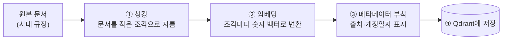

# EP15. 폐쇄망 RAG 구축 ①

> 시리즈: [폐쇄망 LLM 구축기](README.md) · 이전: [EP14. 모델 업데이트 전략](EP14-모델-업데이트-전략.md) · 다음: [EP16. 폐쇄망 RAG 구축 ②](EP16-폐쇄망-RAG-구축-2.md)

Phase 5, "고급 활용 편"이에요. 지금까지는 인프라를 세우는 얘기였다면, 이제부터 두 편은 현업팀이 실제로 쓰는 [[RAG]] 파이프라인 자체를 다뤄볼게요.

## 🗺️ 이번 두 편에서 만드는 것 (전체 그림부터 보고 가요)

[[RAG]]는 성격이 다른 두 과정으로 나뉘어요 — **문서를 미리 준비해두는 과정**(오프라인, 문서가 바뀔 때만)이랑 **질문이 올 때마다 검색하고 답하는 과정**(온라인, 요청마다). 이번 편(①)은 앞부분을, 다음 편(②)은 뒷부분을 다룹니다.

이번 편에서 실제로 만드는 파이프라인은 이거예요.



네 단계 다 순서대로 아래에서 보여드릴게요. 참고로 이 스크립트들이 쓰는 `kiwipiepy`·`qdrant-client`·`requests` 파이썬 패키지는 EP04에서 미리 받아둔 wheel 파일을 `pip install --no-index --find-links=./wheels ...`로 설치해뒀다는 전제입니다.

## ① [[청킹]] — 문서를 왜 굳이 작은 조각으로 자르나

문서 하나는 보통 수십 페이지예요. 이걸 통째로 임베딩하면 "이 문서는 대충 이런 내용이다"라는 뭉뚱그려진 의미만 벡터에 담겨요. 근데 사용자는 "연차가 며칠이야?" 처럼 아주 구체적인 걸 물어봐요. 그래서 문서를 **작은 조각(청크)**으로 잘라서, 조각 하나하나가 구체적인 내용 하나만 담게 만들어야 해요 — 그래야 나중에 질문이 왔을 때 딱 맞는 조각만 쏙 찾아낼 수 있습니다. "청킹"은 이 자르는 작업을 말해요.

## 📄 청킹부터 삽질이었어요

처음엔 그냥 "500자마다 자르기"로 단순하게 시작했어요. 근데 검색 결과를 사람이 눈으로 확인해보니 문장 중간에서 뚝 잘려서 맥락이 끊긴 조각이 많았어요. 예를 들어 "연차는 입사일 기준으로 산정하며, 육아휴직 기간은"까지 잘리고 다음 조각이 "산정 대상 기간에서 제외한다"로 시작하는 식이었죠. 이러면 임베딩 자체가 애매한 의미를 담게 되고, 검색 정확도가 떨어져요.

그래서 글자 수 기준이 아니라 **문장 경계를 먼저 잡고, 문장 단위로 묶어서 청크를 만드는 방식**으로 바꿨어요. 한국어 문장 분리는 마침표만으로는 안 되는 경우(약관 문서 특유의 "제1조(목적)" 같은 조항 번호, 소수점 등)가 많아서, 문장 분리 라이브러리(`kiwipiepy`)로 먼저 문장 단위를 잡고 그 위에서 청크를 조립했습니다.

코드가 하는 일을 말로 먼저 풀면 이래요.

1. Kiwi로 문서를 문장 단위로 쪼갠다.
2. 문장을 하나씩 순서대로 이어붙이다가, 누적 글자 수가 400자를 넘으면 그 직전까지를 청크 하나로 완성한다.
3. 다음 청크를 시작할 때, 방금 끝난 청크의 **마지막 문장 하나를 다시 가져와서** 새 청크 맨 앞에 겹치게 넣는다.

```python
# chunk_docs.py
from kiwipiepy import Kiwi

kiwi = Kiwi()

def split_sentences(text: str) -> list[str]:
    return [s.text for s in kiwi.split_into_sents(text)]

def make_chunks(sentences: list[str], max_chars: int = 400, overlap_sentences: int = 1) -> list[str]:
    chunks, current = [], []
    current_len = 0
    for sent in sentences:
        if current_len + len(sent) > max_chars and current:
            chunks.append(" ".join(current))
            current = current[-overlap_sentences:]  # 문맥 유지를 위해 마지막 문장 겹치기
            current_len = sum(len(s) for s in current)
        current.append(sent)
        current_len += len(sent)
    if current:
        chunks.append(" ".join(current))
    return chunks
```

3번(겹치기)을 하는 이유는, 완전히 딱 잘라 나누면 경계에 걸친 내용이 양쪽 청크 어디에도 온전히 안 담기는 경우가 있어서예요. 문장 하나 정도 겹치는 중복은 감수하고, 대신 경계에서 맥락이 끊기는 걸 막았습니다.

## ② 임베딩 — 각 청크를 숫자 벡터로

청크가 준비됐으면, 이제 [[BGE-M3]]한테 하나씩 넘겨서 벡터로 바꿉니다. `embed()` 함수가 그 역할이에요 — 텍스트를 [[Ollama]]에 떠 있는 BGE-M3 API로 보내고, 벡터를 받아옵니다.

## ③ 메타데이터 부착 — 벡터만 저장하면 안 되는 이유

벡터만 저장하면 "이 벡터가 어느 문서, 어느 버전에서 나온 건지"를 나중에 알 수가 없어요. 그래서 벡터 옆에 **출처 정보(메타데이터)**를 같이 붙여서 저장합니다 — `doc_id`(문서 번호), `revision_date`(개정일자), `archived`(구버전 여부).

## ④ Qdrant에 저장 — ②·③을 합쳐서 upsert

```python
# embed_and_upsert.py
import requests
from qdrant_client import QdrantClient
from qdrant_client.models import PointStruct

client = QdrantClient(host="qdrant", port=6333)

def embed(text: str) -> list[float]:
    resp = requests.post(
        "http://ollama-server:11434/api/embeddings",
        json={"model": "bge-m3", "prompt": text},
    )
    return resp.json()["embedding"]

def upsert_chunks(doc_id: str, revision_date: str, chunks: list[str]):
    points = [
        PointStruct(
            id=f"{doc_id}-{i}",
            vector=embed(chunk),          # ② 임베딩
            payload={                      # ③ 메타데이터
                "doc_id": doc_id,
                "revision_date": revision_date,
                "text": chunk,
                "archived": False,
            },
        )
        for i, chunk in enumerate(chunks)
    ]
    client.upsert(collection_name="internal_docs", points=points)  # ④ 저장
```

`payload`에 `doc_id`·`revision_date`·`archived`를 같이 넣은 게 EP12에서 만든 upsert 파이프라인이랑 맞물리는 부분이에요. 검색할 때 `archived: false`인 것만 걸러서, 항상 최신 개정본만 답변에 쓰이게 했습니다.

컬렉션(Qdrant 안에서 "internal_docs"라는 이름의 저장 공간)은 미리 한 번만 만들어두면 됩니다.

```python
from qdrant_client.models import VectorParams, Distance

client.create_collection(
    collection_name="internal_docs",
    vectors_config=VectorParams(size=1024, distance=Distance.COSINE),  # BGE-M3 임베딩 차원
)
```

여기까지가 문서 반입 → 청킹 → 임베딩 → 메타데이터 부착 → Qdrant 저장, 4단계 파이프라인이에요. 다음 편은 이제 사용자가 질문했을 때 이 데이터를 어떻게 검색하고, LLM한테 어떻게 넘겨서 답을 만드는지 다뤄볼게요.

---

📌 **EP.15 한 줄 요약**
글자 수 기준 청킹은 문맥이 끊겨서, 한국어 문장 분리기로 문장 경계를 먼저 잡고 약간의 겹침을 두고 청킹했다. BGE-M3로 임베딩하면서 개정일자·archived 여부를 메타데이터로 같이 저장해 항상 최신 문서만 검색되게 했다.

**다음 편**: [EP16. 폐쇄망 RAG 구축 ②](EP16-폐쇄망-RAG-구축-2.md)
