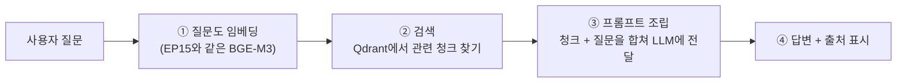

# EP16. 폐쇄망 RAG 구축 ②

> 시리즈: [폐쇄망 LLM 구축기](README.md) · 이전: [EP15. 폐쇄망 RAG 구축 ①](EP15-폐쇄망-RAG-구축-1.md) · 다음: [EP17. Continue.dev 코딩 어시스턴트](EP17-Continue.dev-코딩-어시스턴트.md)

EP15에서 문서를 다 넣어놨으니, 이번 편은 사용자가 질문했을 때 실제로 일어나는 일 — 검색부터 답변 생성까지예요.

## 🗺️ 이번 편에서 만드는 것 (전체 그림)



질문도 EP15와 똑같은 방식(BGE-M3)으로 벡터로 바꾸고, 그 벡터로 Qdrant에서 "의미가 비슷한 청크"를 찾은 다음, 그 청크들을 질문과 함께 LLM에 넘겨서 답을 만들게 합니다 — 이게 [[RAG]]의 "검색증강생성"이라는 이름 그대로예요. 근데 ②번(검색) 단계에서 처음에 문제가 하나 있었어요.

## ⚠️ 순수 벡터 검색만으로는 부족했어요

BGE-M3 임베딩만으로 검색했더니, "연차 산정 기준이 뭐야?"라고 물으면 가끔 "연차"라는 단어가 정확히 들어간 조항이 아니라 의미상 비슷한 다른 조항(예: 병가 관련 조항)이 먼저 나오는 경우가 있었어요. 벡터 검색은 "의미가 비슷한 것"을 찾는 데는 강한데, 정확한 용어·조항 번호처럼 "그 단어가 정확히 들어갔는가"가 중요한 경우엔 약하더라구요.

그래서 검색 방식을 두 가지로 나눠서 같이 썼어요.

- **벡터 검색(dense)** — EP15에서 만든 BGE-M3 임베딩으로 "의미가 비슷한 청크"를 찾는 방식. 지금까지 하던 방식이에요.
- **키워드 검색(sparse, BM25 계열)** — 옛날부터 쓰던 검색엔진 방식으로, "정확히 이 단어가 들어간 문서"를 찾는 방식이에요. 의미는 몰라도 단어가 정확히 일치하는 걸 잘 찾아요.

이 둘을 각각 따로 돌려서 후보를 뽑은 다음, 두 결과를 하나로 합치는 걸 **[[하이브리드 검색]]**이라고 불러요. Qdrant가 dense·sparse 벡터를 한 컬렉션에서 같이 관리하고 결과를 합치는 기능(`Prefetch`, `FusionQuery`)을 지원해서, 이 위에서 구현했습니다.

코드가 하는 일을 말로 먼저 풀면 이래요.

1. 질문을 dense 벡터(BGE-M3 임베딩)로도, sparse 벡터(키워드 기반)로도 각각 변환한다.
2. `Prefetch` 두 개로 "dense 기준 상위 20개", "sparse 기준 상위 20개"를 각각 미리 뽑아둔다.
3. `FusionQuery(fusion=Fusion.RRF)`로 이 두 순위표를 하나로 합친다 — RRF(Reciprocal Rank Fusion)는 "각 목록에서 몇 등이었는지"를 기준으로 점수를 매겨 합치는 방식이에요. 두 목록 모두에서 상위권이었던 청크가 최종적으로도 위로 올라옵니다.
4. 합쳐진 결과 중 상위 `top_k`개만 최종적으로 반환한다.

```python
from qdrant_client.models import Fusion, FusionQuery, Prefetch

def hybrid_search(query: str, top_k: int = 5):
    dense_vec = embed(query)          # EP15의 BGE-M3 임베딩 (의미 기반)
    sparse_vec = bm25_encode(query)   # 키워드 기반 sparse 벡터

    results = client.query_points(
        collection_name="internal_docs",
        prefetch=[
            Prefetch(query=dense_vec, using="dense", limit=20),
            Prefetch(query=sparse_vec, using="sparse", limit=20),
        ],
        query=FusionQuery(fusion=Fusion.RRF),  # 두 결과를 순위 기반으로 합침
        limit=top_k,
        query_filter={"must": [{"key": "archived", "match": {"value": False}}]},
    )
    return results
```

`archived: False` 필터를 여기서도 꼭 넣었어요 — EP15에서 메타데이터로 남겨둔 걸 여기서 실제로 써먹는 거죠. 하이브리드로 바꾸고 나서 "연차" 같은 정확한 키워드가 포함된 질문의 검색 정확도가 눈에 띄게 좋아졌습니다.

## 🧩 프롬프트 조립 — 출처 표시가 특히 중요했어요

②번에서 찾아낸 청크들을 그냥 이어붙여서 던지지 않고, 각 청크에 출처(문서명·조항)를 달아서 LLM이 답변에 출처를 인용하도록 프롬프트를 짰어요. 금융권이라 "그거 어디 근거로 그렇게 답한 거예요?"라는 질문에 바로 답할 수 있어야 했거든요.

```
당신은 A저축은행 사내 규정 안내 챗봇입니다.
아래 [참고 문서]에 있는 내용만 근거로 답하세요.
참고 문서에 없는 내용은 "관련 규정을 찾을 수 없습니다"라고 답하고 추측하지 마세요.
답변 끝에 반드시 참고한 문서명과 조항을 표시하세요.

[참고 문서]
(1) 인사규정 제12조(연차유급휴가), 2026-01-15 개정
"연차는 입사일 기준으로 산정하며..."

(2) 인사규정 제13조(휴직 기간의 처리)
"육아휴직 기간은 연차 산정 대상 기간에서 제외한다..."

[질문]
연차는 어떻게 계산돼?
```

"참고 문서에 없으면 모른다고 답하라"는 문장을 넣은 이유는 [[환각]](hallucination) 때문이에요. 사내 QA셋으로 검증하다 보니, 이 문장이 없으면 모델이 그럴듯하게 답을 지어내는 경우가 종종 있었거든요. 이 한 문장을 넣은 뒤로 "모르는 건 모른다고 답하는 비율"이 눈에 띄게 올라갔습니다.

## ✅ 최종 검증

EP08·EP14에서 계속 써온 사내 QA셋 50문항을 이번엔 RAG 파이프라인 전체(검색+생성)로 다시 돌렸어요. 정답에 필요한 조항을 실제로 인용한 비율, 근거 없이 답을 지어낸 비율(환각률)을 사람이 채점했고, 하이브리드 검색 + 출처 표시 프롬프트를 적용한 뒤 환각률이 도입 전 대비 확연히 줄어든 걸 확인하고서야 현업팀 전체 오픈으로 넘어갔습니다.

---

📌 **EP.16 한 줄 요약**
순수 벡터 검색만으로는 정확한 키워드 질의에 약해서 벡터(dense)+키워드(sparse) 검색을 RRF로 합치는 하이브리드 검색으로 바꿨고, 프롬프트에 "근거 없으면 모른다고 답하라"와 출처 표시 요구를 넣어 환각을 줄였다.

**다음 편**: [EP17. Continue.dev 코딩 어시스턴트](EP17-Continue.dev-코딩-어시스턴트.md)
