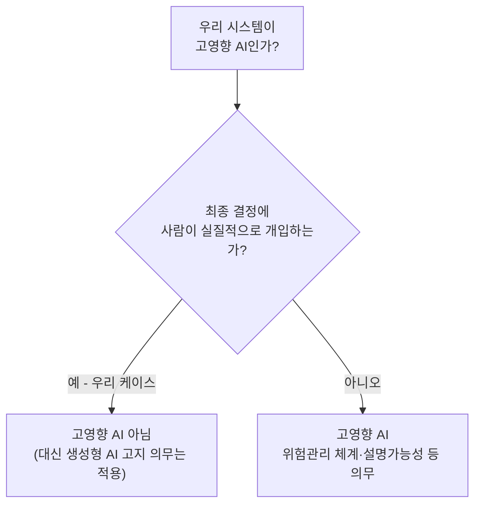

# EP19. 컴플라이언스 프레임워크 매핑

> v1.1: [전사 확대](README.md) · v1.0: [폐쇄망 LLM 구축기](../구축기-v1.0/README.md) (EP01~18) · 다음: [EP20. AI 게이트웨이 보안 강화](EP20-AI-게이트웨이-보안-강화.md)

EP18에서 "전사 확대 얘기가 나오고 있다"고 했었죠. 실제로 나왔고, 이번엔 정보보호팀 실무 승인 선에서 끝나지 않았어요. **정보보호위원회 정식 심의**로 올라가면서 컴플라이언스팀이 처음으로 이 프로젝트에 합류했고, 첫 요구사항이 "우리 시스템이 금융권 AI 관련 규제·가이드라인 어디에 해당하는지 표로 정리해오라"는 거였어요. EP02에서 4계층으로 나눴던 것처럼, 이번엔 규제를 항목별로 쪼개서 우리 아키텍처에 하나씩 대조해봤습니다.

## 📜 우리가 대조한 4가지 규제·가이드라인

| 구분 | 이름 | 시행 | 주관 |
|---|---|---|---|
| 원칙 | 금융분야 AI 가이드라인 (7대 원칙) | 2026.6.22 | 금융위원회 |
| 법률 | 인공지능 발전과 신뢰 기반 조성 등에 관한 기본법 (AI 기본법) | 2026.1.22 | 과기정통부 등 |
| 보안 | 금융분야 AI 보안 가이드라인 | 2023~2024 등록, 개정 진행 중 | 금융위·금융보안원 |
| 개인정보 | 금융분야 가명처리·익명처리 안내서 | 2020 제정, 신용정보법 개정 반영 | 금융위 |

## 🧭 7대 원칙 중 우리한테 제일 중요했던 건 "보조수단성"

금융분야 AI 가이드라인은 거버넌스·합법성·**보조수단성**·신뢰성·금융안정성·신의성실·보안성 7개 원칙으로 이뤄져 있어요. 이 중 컴플라이언스팀이 제일 먼저 짚은 게 보조수단성 — **AI는 최종 의사결정자가 아니라 보조 수단으로 기능해야 한다**는 원칙이었어요.

다행히 우리 시스템(사내 규정 QA + 코드 자동완성)은 처음부터 이 원칙에 맞게 설계돼 있었어요. Open WebUI 답변은 사람이 읽고 판단하는 참고 자료일 뿐이고, Continue.dev 자동완성도 개발자가 리뷰 후 커밋하는 구조니까요. 다만 "설계 의도가 그렇다"는 것과 "실제로 그렇게 쓰이고 있다"는 것 사이엔 차이가 있을 수 있어서, Open WebUI 답변 하단에 배너를 붙이기로 했어요.

```
⚠️ 이 답변은 AI가 생성했습니다. 실제 업무 처리 전 반드시 원문 규정을 확인하세요.
```

사소해 보이지만, 이게 다음에 나올 AI 기본법 판단에서 실제로 중요한 역할을 했어요.

## ⚖️ AI 기본법 — "고영향 AI"에 해당하는가부터 확인

AI 기본법은 사람의 권리·의무에 중대한 영향을 미치는 시스템을 [[고영향 AI와 인간개입|고영향 인공지능]]으로 분류하고, 여기 해당하면 위험관리 체계·설명가능성 확보·이용자 보호조치 같은 무거운 의무가 붙어요. 법 조문에 직접 예시로 나오는 게 "대출심사"라서, 저희도 "설마 우리 문서QA도 여기 걸리나" 하고 긴장했어요.

확인해보니 핵심은 **인간의 개입 여부**였어요. 법은 최종 의사결정에 사람이 개입해 그 결과를 실질적으로 통제할 수 있으면 고영향 AI에서 제외한다고 정하고 있고, 저희 시스템은 애초에 최종 결론(연차를 실제로 며칠 쓸지, 코드를 실제로 커밋할지)을 사람이 정하는 구조라 이 요건을 만족했어요. 위에서 붙인 배너가 바로 이 "인간 개입"을 문서로도 증명하는 장치였던 거죠 — 설계만 그렇다고 주장하는 것과, 사용자 화면에 실제로 그렇게 안내되고 있다는 걸 같이 보여줄 수 있었으니까요.



고영향 AI가 아니어도 없어지는 건 아니고, **생성형 AI라는 걸 이용자에게 고지할 의무**는 그대로 남아요. 배너 문구에 "AI가 생성했습니다"를 넣은 게 이 의무도 같이 만족시킵니다.

## 🔐 금융분야 AI 보안 가이드라인 — 위협 분류표에 우리 통제를 대응시켜봄

이 가이드라인은 데이터 포이즈닝·모델 포이즈닝·모델 추출·모델 인버전·회피 공격(evasion) 같은 위협 분류와, "AI 챗봇 서비스 보안 체크리스트"를 담고 있어요. 우리 아키텍처에서 뭘 이미 갖췄고 뭘 못 갖췄는지 하나씩 대조했습니다.

| 위협/체크 항목 | 우리 현황 | 근거 |
|---|---|---|
| 반입물 무결성(모델 변조 방지) | ✅ 갖춤 | 체크섬 검증, 화이트리스트 (EP06) |
| 실행 환경 격리 | ✅ 갖춤 (예외 사유 문서화) | vLLM 컨테이너 rootful 예외 + 보완 통제 (EP08) |
| 감사 로그(누가 언제 뭘 물었나) | ✅ 갖춤 | 계층별 모니터링 (EP13) |
| 회피 공격 방어([[프롬프트 인젝션]]) | ❌ 없음 | → EP20에서 다룸 |
| 민감정보 유출 방지([[PII 마스킹]]) | ❌ 없음 | → EP20에서 다룸 |
| 모델 추출 공격 방어 | ⚠️ 부분적 | 물리적 에어갭 자체가 1차 방어. 게이트웨이 단 요청량 제한은 EP10에 있었으나 "추출 목적 반복 질의" 패턴 탐지는 아직 없음 (백로그로 남김) |

표에 빈칸(❌)이 두 개나 있는 걸 보고 정보보호위원회가 "이번 확대 전에 이 두 개는 반드시 메꾸라"고 조건부 승인을 내렸어요. 그게 다음 편(EP20)의 시작입니다.

## 🕵️ 가명처리 안내서 — 검수하다 실제로 하나 걸렸어요

EP02에서 "개인정보·고객정보는 이 시스템에 넣지 않기로 사전 확정"했다고 적었었죠. 전사 확대를 앞두고 RAG에 색인된 문서 전체를 다시 훑어보는 재검수를 했는데, 사내 규정 문서 하나에 **개정 이력 각주로 담당자 실명과 내선번호**가 남아있는 걸 발견했어요. "개인정보를 안 넣기로 했다"는 원칙이 "문서에 우연히 섞여 들어온 개인정보까지 걸러낸다"를 보장하진 않는다는 걸 이때 알았어요.

금융분야 가명처리·익명처리 안내서의 절차(준비 → 가명처리 → 적정성 검토 → 이용 및 사후관리)를 참고해서, EP12의 문서 반입 파이프라인 앞단에 **개인정보 패턴 스캔 단계**를 하나 추가하기로 했어요. 이 스캔 자체를 실제로 구현하는 얘기는 EP20에서 Presidio를 들이면서 이어집니다.

## 🏛️ 그 밖에 확인만 해둔 것들

- **망분리 로드맵** — 금융위가 2024년에 발표한 3단계 완화 로드맵(1단계: 생성형 AI 활용 허용, 2단계: 규제특례 정식화, 3단계: 자율보안체계 전환)의 존재를 확인했어요. 지금 우리는 여전히 완전 에어갭(EP02)을 유지하지만, "왜 에어갭인지"와 "언젠가 완화될 수도 있다는 정책 방향"을 같이 알아두는 게 앞으로 아키텍처를 다시 그릴 때(EP18에서 예고한 A100 증설 시점) 참고가 될 것 같아 기록해둡니다.
- **ISMS-P** — 금융보안원이 금융권 인증 발급을 담당하는 정보보호·개인정보보호 통합 인증체계예요. KISA가 2025년 8월 "AI 서비스 기업이 고려해야 할 보안 요구사항"을 별도로 낸 것도 확인했는데, ISMS-P 인증 항목 자체에 AI 전용 챕터가 신설된 건 아직 아니라서 이번 확대 심의의 필수 항목으로 넣진 않았어요. 다음 정기 인증 심사 때 참고자료로만 제출하기로 했습니다.

---

📌 **EP.19 한 줄 요약**
전사 확대 심의에서 금융분야 AI 가이드라인 7대 원칙(특히 보조수단성)·AI 기본법의 고영향 AI 판단(인간 개입 여부)·금융분야 AI 보안 가이드라인의 위협 체크리스트를 우리 아키텍처에 대조했다. 대부분 기존 설계(rootful 예외 문서화, 계층별 감사 로그)로 충족했지만 PII 마스킹과 프롬프트 인젝션 방어가 빠진 걸 확인했고, 문서 재검수 중 개인정보가 실제로 섞여 있던 사례도 발견했다.

**다음 편**: [EP20. AI 게이트웨이 보안 강화](EP20-AI-게이트웨이-보안-강화.md)

출처: [금융분야 AI 가이드라인(7대 원칙) 보도자료](https://www.fnnews.com/news/202606181448451242) `[참고용]` · [AI 기본법 전문 (국가법령정보센터)](https://www.law.go.kr/lsInfoP.do?lsiSeq=268543) `[확인됨]` · [금융분야 AI 보안 가이드라인 관련 (금융보안원)](https://www.fsec.or.kr/bbs/detail?menuNo=69&bbsNo=11607) `[참고용]` · [금융분야 가명·익명처리 안내서 (금융위)](https://www.fsc.go.kr/comm/getFile?srvcId=BBSTY1&upperNo=74464&fileTy=ATTACH&fileNo=4) `[확인됨]` · [금융분야 망분리 개선방안 보도자료 (금융위)](https://www.fsc.go.kr/no010101/77672) `[확인됨]` · [ISMS-P (KISA)](https://isms.kisa.or.kr/main/)
