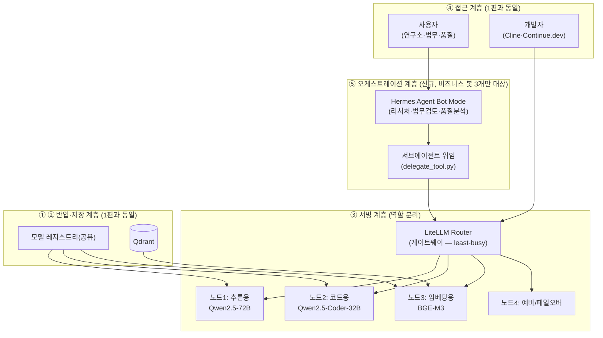

# EP02. 전체 아키텍처 설계 (4계층 + 오케스트레이션 레이어)

> 시리즈: [폐쇄망 멀티에이전트 구축기](README.md) · 이전: [EP01. 왜 멀티에이전트 오케스트레이션인가](EP01-왜-멀티에이전트-오케스트레이션인가.md) · 다음: [EP03. DGX 노드 선정과 독립형 vs 클러스터형 판단](EP03-DGX-노드-선정과-독립형-vs-클러스터형-판단.md)

EP01에서 "오케스트레이션을 도입한다"까지는 정했는데, 이걸 그림으로 옮기려니 애매한 지점이 하나 있었어요 — [1편(구축기 v1.0)](../구축기-v1.0/README.md)에서 이미 4계층(반입·저장·서빙·접근)으로 나눠봤던 경험이 있는데, 이번엔 그 위에 뭘 얹어야 하나였습니다. 처음부터 새로 그리고 싶은 유혹이 있었는데, 결국 **1편 구조를 그대로 두고 레이어 하나만 끼워 넣는 쪽**으로 정리했어요.

## 🧱 1편 4계층은 그대로 둔다

1편에서 확정한 4계층은 "장애가 났을 때 어디부터 볼지"를 정하는 실전 도구였어요. 노드가 4대로 늘었다고 이 도구 자체를 버릴 이유는 없더라구요. 그래서 각 계층이 노드 4대 환경에서 뭐가 달라지는지만 표로 정리했습니다.

| 계층 | 1편(V100 3장)에서 역할 | v2.0(DGX 4대)에서 달라지는 점 |
|---|---|---|
| ① 반입 계층 | 망연계 솔루션 + 반입 스테이징 서버 | 그대로. 다만 반입 물량이 4노드분 모델·패키지로 늘어남(EP05에서 다룸) |
| ② 저장 계층 | 로컬 모델 레지스트리 + Qdrant | 모델 레지스트리를 4노드가 공유하는 NFS 공유 스토리지로 승격. Qdrant는 여전히 단일 인스턴스(4노드가 같이 바라봄) |
| ③ 서빙 계층 | vLLM(LLM) + Ollama(임베딩) + LiteLLM(게이트웨이 겸 서빙) | vLLM만 4노드에 역할별로 분산(EP06). LiteLLM은 "게이트웨이"로 역할이 명확히 분리됨(EP04, EP07) |
| ④ 접근 계층 | Open WebUI + Continue.dev + 감사 로그 | 그대로. 다만 이 계층에 도달하기 전에 새 레이어를 하나 거침 |

바뀐 게 없는 계층(①②)은 "노드가 늘어도 반입·저장의 원칙은 그대로"라는 걸 보여주는 부분이라 오히려 안심이 됐어요. 진짜 변화는 ③번 안에서 게이트웨이 역할이 또렷해지는 것과, ④번 앞에 완전히 새로운 레이어가 생기는 것 두 가지뿐이었습니다.

## 🧭 오케스트레이션 레이어를 어디에 끼워 넣을까

[06-에이전트-오케스트레이션-분석.md](../06-에이전트-오케스트레이션-분석.md)에서 정리해둔 3단 구조(오케스트레이션 → 게이트웨이 → 서빙)를 1편의 4계층 위에 그대로 겹쳐봤습니다.

개발자(Cline·Continue.dev)는 오케스트레이션 계층을 아예 거치지 않고 게이트웨이로 바로 들어가요 — 코드 작업은 서브에이전트 위임도, 봇 간 협업도 필요 없는 "질문 하나에 답변 하나" 패턴이라, 굳이 Hermes Bot Mode로 한 번 더 감쌀 이유가 없었습니다(자세한 판단은 EP08).

여기서 중요한 원칙 하나 — **오케스트레이션 계층은 물리 노드 주소를 몰라야 합니다.** Bot Mode도, 서브에이전트 위임도 "어떤 논리적 모델을 쓸지"까지만 결정하고, "그 모델이 지금 어느 노드에서 얼마나 바쁜지"는 전부 LiteLLM Router(서빙 계층)에 맡깁니다. EP01에서 못박아둔 "라우팅 책임 단일화" 원칙이 여기서 그림으로 나온 거예요. 이 원칙은 오케스트레이션 계층을 아예 거치지 않는 개발팀 경로에도 똑같이 적용됩니다 — Cline·Continue.dev도 게이트웨이 하나만 바라볼 뿐, 물리 노드는 몰라요.

## 🎯 요구사항, 1편보다 한 단계 더 복잡해졌어요

1편은 "동시 15명, 첫 토큰 3초"라는 단순한 숫자 하나였는데, 이번엔 부서마다 패턴이 달라서 표를 나눠야 했습니다.

| 부서 | 인원 | 피크 동시 접속 | 요청 1건당 서브에이전트 | 봇 |
|---|---|---|---|---|
| 연구소 | 30명 | 8~10명 | 최대 4개(특허·논문 교차검증) | 리서처 봇 |
| 법무팀 | 20명 | 5~7명 | 최대 4개(조항별 다관점 검토) | 법무검토 봇 |
| 품질관리팀 | 20명 | 5~7명 | 최대 4개(원인 후보 병렬 조사) | 품질분석 봇 |
| 개발팀 | 25명 | 10~12명 | 없음(1편과 동일, 단일 요청) | 없음 — Cline·Continue.dev가 게이트웨이 직결 |

단순히 "동시 접속자 수"만 보면 1편(15명)보다 조금 늘어난 수준(28~36명)인데, 서브에이전트까지 감안하면 **실제 GPU에 꽂히는 동시 요청은 최대 100건 안팎**까지 뛸 수 있다는 계산이 나왔어요. 이 격차 — "사람 기준 동시성"과 "GPU 기준 동시성"이 서브에이전트 때문에 몇 배로 벌어진다는 것 — 이 다음 편에서 노드 대수·독립형 여부를 판단하는 핵심 근거가 됩니다.

## 📋 이번 편에서 확정한 것

| 항목 | 결정 |
|---|---|
| 레이어 구조 | 1편 4계층(반입·저장·서빙·접근)은 유지, 오케스트레이션 계층 1개만 접근 계층 앞에 신규 추가 |
| 저장 계층 변경 | 모델 레지스트리를 4노드 공유 스토리지로 승격, Qdrant는 단일 인스턴스 유지 |
| 서빙 계층 변경 | LiteLLM Router를 "게이트웨이" 역할로 명확히 분리, vLLM 4노드에 역할별 배치 |
| 동시성 기준 | 사람 기준 피크 28~36명, 서브에이전트 포함 GPU 기준 최대 ~100건 |
| 오케스트레이션 원칙 | Bot Mode·서브에이전트는 논리적 모델 선택까지만, 물리 노드 판단은 LiteLLM Router 전담 |

다음 편에서는 이 ~100건 동시 요청을 감당하려면 노드를 어떻게 배치해야 하는지 — 독립형 4대 vs NVLink/InfiniBand로 묶은 클러스터형 중 뭘 골라야 하는지 계산해봅니다.

---

📌 **EP.02 한 줄 요약**
1편의 4계층 구조는 그대로 두고 그 앞에 오케스트레이션 계층 하나만 신규로 얹었으며, 부서별 요구사항을 합산한 결과 사람 기준 동시성(28~36명)과 GPU 기준 동시성(서브에이전트 포함 최대 100건) 사이의 격차가 다음 편의 핵심 판단 근거가 되었다.

**다음 편**: [EP03. DGX 노드 선정과 독립형 vs 클러스터형 판단](EP03-DGX-노드-선정과-독립형-vs-클러스터형-판단.md)
