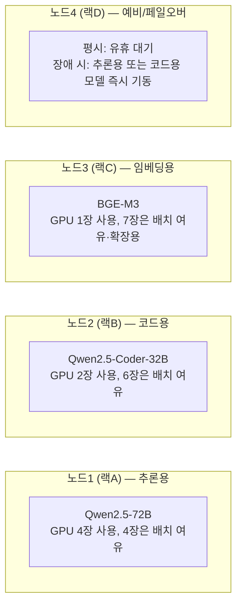

# EP03. DGX 노드 선정과 독립형 vs 클러스터형 판단

> 시리즈: [폐쇄망 멀티에이전트 구축기](README.md) · 이전: [EP02. 전체 아키텍처 설계](EP02-전체-아키텍처-설계.md) · 다음: [EP04. LiteLLM Router 다중 노드 라우팅 설계](EP04-LiteLLM-Router-다중노드-라우팅-설계.md)

[1편(구축기 v1.0) EP03](../구축기-v1.0/EP03-GPU-선택-가이드.md)은 "GPU를 뭘 살까"였는데, 이번엔 이미 장비(DGX H100 4대)가 확정돼 있으니 질문이 달라요 — **"이 4대를 하나로 묶을까, 따로 둘까"**입니다. 회의 초반엔 다들 "묶으면 무조건 좋은 거 아니냐"는 분위기였는데, 실제로 뜯어보니 그렇지가 않더라구요.

## ⚖️ 두 가지 옵션을 놓고 비교했어요

| 항목 | 옵션A. 독립형 (물리적으로 분리된 랙 4곳) | 옵션B. 클러스터형 (NVLink/InfiniBand로 결합) |
|---|---|---|
| 노드 간 통신 | 없음 — 각 노드가 완전히 별개 서버 | InfiniBand로 노드 간 저지연 통신, 하나의 거대 자원 풀처럼 동작 |
| 장애 격리 | 노드 하나 죽어도 나머지 3개 무관 | 결합 구조에 따라 장애가 전파될 수 있음 |
| 모델 배치 자유도 | 노드별로 완전히 다른 모델·역할 배정 가능 | 모델 하나를 여러 노드에 걸쳐 텐서 병렬화 가능(초대형 모델용) |
| 물리 설치 요건 | 랙 4곳에 분산 배치만 하면 됨 | 랙 간 InfiniBand 배선, 스위치 추가 구매·구성 필요 |
| 라우팅 복잡도 | LiteLLM Router가 4개의 독립 엔드포인트만 보면 됨 | 클러스터 스케줄러(Slurm/Kubernetes 등) 개념이 추가로 필요 |
| 우리 요구사항과의 궁합 | 역할별 분리(추론/코드/임베딩/예비)와 정확히 맞아떨어짐 | 모델 하나가 노드 하나보다 커야 실익 — 우리는 해당 없음 |

결론부터 말하면 **옵션A(독립형)**로 갔습니다. 이유는 간단해요 — 클러스터형이 값어치를 하려면 "모델 하나가 GPU 8장(DGX H100 1대분)으로도 못 담는 초대형 모델"이어야 하는데, 저희가 쓸 모델(Qwen2.5-72B, Qwen2.5-Coder-32B, BGE-M3) 중엔 그런 게 없었습니다.

## 🧮 실제로 한 대에 들어가는지 계산해봤어요

| 모델 | 파라미터 | FP16 기준 필요 VRAM(대략) | DGX H100 1대(H100 80GB × 8) 대비 |
|---|---|---|---|
| Qwen2.5-72B-Instruct | 72B | 약 145GB (KV 캐시 제외) | GPU 2장(160GB)이면 충분, 여유분 감안 4장 사용 |
| Qwen2.5-Coder-32B | 32B | 약 65GB | GPU 1~2장이면 충분, 여유분 감안 2장 사용 |
| BGE-M3 | 0.6B | 수 GB | GPU 1장으로 충분 |

DGX H100 1대에 GPU가 8장 들어있는데, 위 계산대로면 노드 하나에 역할 하나만 몰아줘도 남는 GPU가 꽤 생겨요. 그 남는 자원은 그대로 **KV 캐시 여유분과 동시 요청 배치 크기**로 돌렸습니다 — [EP02](EP02-전체-아키텍처-설계.md)에서 뽑은 "GPU 기준 최대 100건 동시 요청"을 감당하려면 모델을 태우는 것보다 배치 여유가 훨씬 중요하더라구요.

## 🗺️ 그래서 노드 배치를 이렇게 확정했어요

노드4를 "예비"로 통째로 비워둔 게 처음엔 낭비 아니냐는 의견도 있었어요. 그런데 [06-에이전트-오케스트레이션-분석.md 6절 체크리스트](../06-에이전트-오케스트레이션-분석.md)의 "봇/서브에이전트가 실패했을 때 페일오버 대상이 명확한가"를 그대로 따라가려면, 최소 1노드는 평시에 비워두고 장애 시 즉시 같은 컨테이너 이미지로 기동할 수 있게 해두는 게 맞다고 결론 냈습니다. 이 페일오버 전환 절차는 EP11(모니터링 & 노드 페일오버)에서 실제로 검증합니다.

## 📋 이번 편에서 확정한 것

| 항목 | 결정 |
|---|---|
| 노드 결합 방식 | 독립형 — InfiniBand/NVLink 노드 간 결합 없음 |
| 노드1(추론) | Qwen2.5-72B, GPU 4장 사용 |
| 노드2(코드) | Qwen2.5-Coder-32B, GPU 2장 사용 |
| 노드3(임베딩) | BGE-M3, GPU 1장 사용 |
| 노드4(예비) | 평시 유휴, 장애 시 노드1 또는 노드2 이미지로 즉시 전환 |
| 판단 기준 | 모델이 노드 하나(GPU 8장)보다 커야 클러스터형 실익 — 해당 없음 → 독립형 확정 |

다음 편에서는 이 4개의 독립 노드를 LiteLLM Router가 실제로 어떻게 하나의 논리적 엔드포인트처럼 보이게 라우팅 설계를 하는지, 그리고 EP01에서 예고했던 "Hermes 자체 라우팅과의 충돌" 문제를 어떻게 풀었는지 다룹니다.

---

📌 **EP.03 한 줄 요약**
쓰는 모델 중 DGX H100 1대(GPU 8장)를 넘는 크기가 없어 클러스터형의 실익이 없다고 판단, 4개 노드를 역할별(추론·코드·임베딩·예비)로 분리한 독립형 구성을 확정했다.

**다음 편**: [EP04. LiteLLM Router 다중 노드 라우팅 설계](EP04-LiteLLM-Router-다중노드-라우팅-설계.md)
