# Continuous Batching

[[vLLM]]·[[Hugging Face TGI|TGI]] 계열이 쓰는 배칭 방식. 요청이 끝나는 즉시 배치에서 빼고, 대기 중이던 새 요청을 그 자리에 바로 채워 넣어 GPU 유휴 시간을 최소화합니다. [[Static Batching]]과 달리 긴 요청 하나 때문에 다른 요청들이 기다릴 필요가 없습니다.

```mermaid
gantt
    title Continuous Batching — 요청이 끝나자마자 대기열의 새 요청으로 즉시 교체
    dateFormat X
    axisFormat %s
    section GPU 슬롯 1
    요청A (3틱) :done, a1, 0, 3
    요청C, 대기 없이 즉시 투입 (5틱) :done, a2, 3, 8
    section GPU 슬롯 2
    요청B (8틱) :done, b1, 0, 8
    요청D, 즉시 투입 :done, b2, 8, 10
```

[[Static Batching]]의 다이어그램과 비교하면, 슬롯 1의 낭비 구간이 요청C로 채워져 있는 게 핵심 차이입니다.

## 관련
- [[배치]] — Continuous Batching이 운영하는 대상
- [[Static Batching]] — Continuous Batching이 개선한 이전 방식
- [[PagedAttention]] — Continuous Batching과 함께 vLLM 처리량을 만드는 다른 한 축
- [[처리량과 지연시간]] — 배치 크기를 키울수록 처리량은 오르고 지연시간은 늘어나는 트레이드오프
