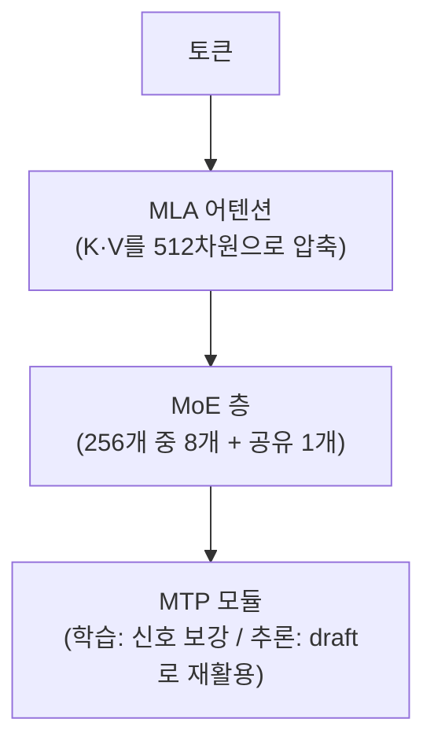

# DeepSeek-V3 아키텍처

DeepSeek-V3는 671B 총 파라미터 중 토큰 하나당 37B만 실제로 활성화되는(약 5.5%) 극단적으로 희소한 모델입니다. 이 vault에서 개별적으로 다룬 여러 최신 기법(MoE, MLA, MTP, DualPipe)이 실제로 한 모델 안에서 어떻게 같이 맞물리는지를 보여주는 사례라, 그 기법들을 한데 묶어 이해하는 용도로 이 노트가 존재합니다.

## 파라미터 구성

| 구성 요소 | 파라미터 |
|---|---|
| 임베딩 | 0.93B |
| 첫 3개 층(밀집 MLP, MoE 라우터 없음) | 1.2B |
| 58개 층의 MoE(전문가 256개 + 공유 1개) | 461B |
| MTP 모듈 | 14B |
| **합계** | **671B** |
| **토큰당 활성 파라미터** | **약 37B**(어텐션 8.8B + MLP 15.9B + 임베딩 1.2B 등) |

첫 3개 층을 일부러 라우터 없는 밀집 MLP로 남겨두는 건, 학습 초반 표현이 아직 안정되지 않은 앞쪽 층에서 라우팅을 억지로 강제하면 학습이 불안정해질 수 있다는 실무적 판단으로 알려져 있습니다.

## 네 가지 축이 동시에 맞물리는 구조

- **[[MoE (Mixture of Experts)]]** — 671B의 지식을 담되 토큰당 계산은 37B만 쓰는 핵심 축. 전문가 256개 중 상위 8개 + 공유 전문가 1개를 항상 함께 씁니다. 부하 균형도 보조 손실 없이 편향값으로 조정하는 최신 방식을 씁니다.
- **MLA(Multi-Head Latent Attention)** — [[Multi-Head Attention]]에서 다룬 Key·Value 압축 방식으로, K·V를 512차원 잠재 공간으로 눌러 캐싱합니다. 128K 컨텍스트 기준 KV 캐시가 7.6GB로, 같은 조건의 GQA(약 30.5GB)보다 4배가량 작습니다.
- **[[Multi-Token Prediction]]** — 14B짜리 추가 모듈이 학습 중에는 몇 스텝 뒤 토큰까지 동시에 예측해 학습 신호를 촘촘하게 만들고, 추론 시에는 이 모듈을 그대로 [[Speculative Decoding]]의 draft로 재활용해 수락률 80% 이상을 냅니다.
- **[[DualPipe 병렬화]]** — 2,048장의 H800으로 14.8조 토큰을 학습하면서 GPU 이용률 95% 이상을 유지한 파이프라인 스케줄.

## 왜 이 조합이 의미가 있는가

각 기법은 따로 봐도 유의미하지만, DeepSeek-V3는 이걸 "총 파라미터는 최대한 늘리되 활성 FLOP당 품질을 최대화한다"는 하나의 방향으로 모두 정렬시킵니다 — MLA로 메모리를, MoE로 연산을, MTP로 학습 신호와 추론 속도를 동시에 아끼고, DualPipe로 그 큰 모델을 실제로 학습 가능한 시간 안에 돌립니다. 네 기법 중 하나만 썼다면 얻지 못했을 총 파라미터-대-서빙비용 비율이 이 조합에서 나옵니다.

## 관련
- [[MoE (Mixture of Experts)]] — 이 아키텍처의 핵심 축, 부하 균형·공유 전문가 등 세부 메커니즘
- [[Multi-Head Attention]] — MLA의 원리(K·V 잠재 공간 압축)가 설명된 곳
- [[Multi-Token Prediction]] — 학습·추론 양쪽에서 이득을 보는 모듈
- [[DualPipe 병렬화]] — 이 모델을 실제로 학습시킨 파이프라인 스케줄
- [[오픈 모델 아키텍처 비교]] — 다른 오픈 모델들과의 설계 선택 비교
