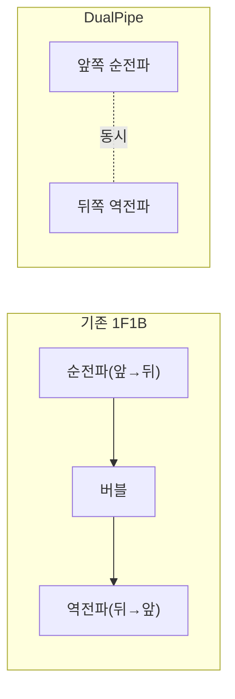

# DualPipe 병렬화

[[Pipeline Parallelism]]은 순전파가 파이프라인 끝까지 도달해야 역전파가 반대 방향으로 흐르기 시작하는 구조라, 그동안 앞쪽 GPU들이 노는 "파이프라인 버블"이 생깁니다. 마이크로배치로 어느 정도 줄일 수는 있어도, 8단계 파이프라인 기준으로도 여전히 GPU 시간의 12%가량이 버블로 낭비된다고 알려져 있습니다. DualPipe는 DeepSeek-V3가 2,048장의 H800으로 14.8조 토큰을 학습하며 쓴 스케줄로, 이 버블을 두 가지 장치로 정면 공략합니다.

## 장치 1 — 순전파 자체를 4개 조각으로 쪼개 서로 숨기기

[[MoE (Mixture of Experts)]] 층의 순전파는 사실 성격이 다른 네 단계로 나뉩니다 — ① 어텐션 계산, ② 토큰을 담당 전문가에게 나눠 보내는 all-to-all dispatch 통신, ③ 각 전문가의 MLP 실행, ④ 전문가 출력을 다시 모으는 all-to-all combine 통신. 통신(②·④)과 계산(①·③)은 서로 다른 하드웨어 자원(네트워크 vs 연산 유닛)을 쓰므로, "이번 마이크로배치의 MLP를 계산하는 동안 다음 마이크로배치의 dispatch 통신을 동시에 흘려보내는" 식으로 겹쳐서 어느 한쪽이 노는 시간을 없앨 수 있습니다.

## 장치 2 — 파이프라인 양 끝에서 동시에 밀어 넣기

기존 파이프라인은 마이크로배치를 한쪽 끝에서만 순서대로 밀어 넣습니다. DualPipe는 각 GPU가 모델의 앞부분과 뒷부분 레이어를 동시에 들고 있게 하고, 파이프라인의 양 끝에서 동시에 마이크로배치를 주입합니다 — 한쪽 방향의 순전파와 반대쪽 방향의 역전파가 시간축에서 정확히 겹치도록 스케줄을 짜서, 이론상 버블을 거의 남기지 않습니다.

## 실측 성과

DeepSeek-V3는 이 스케줄로 GPU 이용률 95% 이상을 달성했다고 보고했습니다 — 기존 1F1B 스케줄 대비 버블로 날아갔을 34~42만 GPU시간을 되찾은 셈입니다. 다만 앞·뒤 레이어를 동시에 들고 있어야 해서 파라미터를 사실상 두 벌 복제해두는 메모리 오버헤드가 있고, 이를 줄이면서 버블을 약간만 더 허용하는 절충안(DualPipeV)도 후속 연구로 제안됐습니다.

## 관련
- [[Pipeline Parallelism]] — DualPipe가 버블을 없애려 하는 원본 파이프라인 스케줄
- [[MoE (Mixture of Experts)]] — dispatch/combine 통신이 발생하는 이유(토큰별 전문가 라우팅)
- [[DeepSeek-V3 아키텍처]] — DualPipe가 실제로 적용된 사례
- [[Tensor Parallelism]] — 학습 시점에 함께 조합되는 다른 병렬화 축
