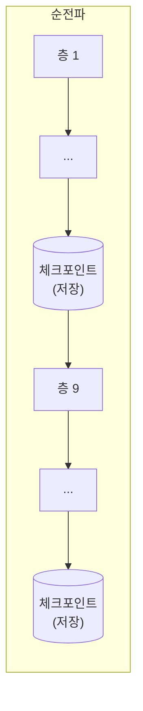

# Gradient Checkpointing

[[역전파]]는 순전파 중 계산된 모든 중간 활성화값(각 층의 출력)을 메모리에 저장해뒀다가 역전파에서 그대로 재사용합니다 — 이 덕분에 계산량은 순전파 1회+역전파 1회로 끝나지만, 층이 깊고 시퀀스가 길수록 저장해야 할 활성화값 자체가 GPU 메모리를 다 잡아먹습니다. 예를 들어 은닉 차원 8192, 시퀀스 길이 8192, 배치 1인 64층 모델은 활성화값 저장에만 약 51GB가 필요합니다. Gradient Checkpointing은 이 활성화값을 저장해두는 대신 **일부러 버리고, 역전파 때 필요한 순간에 다시 계산**해서 메모리를 아끼는 기법입니다.

## 메모리와 계산을 맞바꾸는 정도

가장 단순한 형태(모든 층의 활성화를 버림)는 역전파 중 각 층에 도달할 때마다 그 층의 순전파를 처음부터 다시 실행해야 해서, 전체 계산량(FLOPs)이 원래보다 약 33% 늘어납니다(정상적인 순전파+역전파 흐름에 순전파 한 번이 추가로 끼어드는 셈). 대신 메모리는 활성화값을 거의 다 버리므로 원래의 약 10% 수준까지 줄어듭니다 — "계산을 30%쯤 더 하는 대신 메모리를 90% 아낀다"는 트레이드오프입니다.

## sqrt(L) 전략 — 어디에 체크포인트를 둘 것인가

극단(전부 저장 vs 전부 버림) 사이의 절충안은 "층 L개 중 일정 간격마다만 활성화를 저장해두는 체크포인트를 두는" 것입니다. 이 간격을 층 수의 제곱근(`√L`)으로 잡으면 메모리 사용량과 재계산 비용을 모두 최소화하는 지점에 가까워진다는 결과가 알려져 있습니다 — 예를 들어 64층이면 매 8층마다 체크포인트를 하나씩 두는 식입니다. 체크포인트 사이 구간은 역전파 때 그 구간의 시작점부터 다시 순전파를 돌려 필요한 활성화를 복원합니다.

## 선택적 체크포인팅 — 어디를 버릴지도 고를 수 있다

모든 활성화를 똑같이 취급하는 대신, 메모리를 가장 많이 잡아먹는 부분만 골라 체크포인팅하는 방식도 있습니다. [[Query·Key·Value|어텐션]]의 소프트맥스 확률 행렬은 시퀀스 길이의 제곱(`O(L²)`)에 비례해 커져 전체 활성화 메모리의 대부분을 차지하는데, 이 부분만 재계산 대상으로 고르고 나머지 상대적으로 가벼운 활성화는 그냥 저장해두면, 재계산해야 할 FLOPs는 전체의 약 15% 수준으로 줄어 오버헤드가 5% 미만까지 떨어집니다 — 메모리는 여전히 5배 가까이 아끼면서 계산 비용은 거의 공짜에 가까워지는 절충점입니다.

## 왜 학습에서만 문제이고 서빙에서는 등장하지 않는가

이 기법이 존재하는 이유 자체가 "역전파를 위해 중간값을 저장해야 한다"는 [[역전파]]의 특성 때문입니다. 추론(서빙)에는 애초에 역전파가 없으므로 중간 활성화를 나중에 쓸 일이 없고, 따라서 Gradient Checkpointing도 필요 없습니다 — 이 vault의 다른 노트들이 다루는 "서빙 최적화"([[KV 캐시]], [[배치]] 등)와 이 노트가 서로 겹치지 않는 이유입니다.

## 관련
- [[역전파]] — 이 트레이드오프가 존재하는 근본 이유(순전파 중간값을 왜 저장해야 하는가)
- [[Query·Key·Value]] — 선택적 체크포인팅이 특히 겨냥하는 O(L²) 메모리의 발생 지점
- [[Tensor Parallelism]] — 대규모 학습에서 메모리를 확보하는 또 다른(모델을 쪼개는) 축과 함께 쓰임
