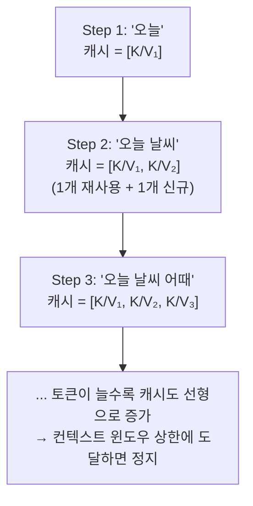

# KV 캐시

토큰을 하나 생성할 때마다 이전 모든 토큰의 [[Query·Key·Value|attention key/value]]를 매번 다시 계산하면 낭비이므로, 한 번 계산한 값을 캐시해두고 재사용합니다. [[Causal Masking]]이 미래 토큰을 보지 못하게 막아주는 덕분에, 과거 토큰의 K·V는 이후 어떤 토큰이 추가되든 절대 바뀌지 않는다고 수학적으로 보장됩니다 — 그래서 캐시가 안전합니다. 이 캐시는 `(프롬프트 길이 + 생성한 토큰 수) × 레이어 수 × [[Multi-Head Attention|헤드 수]]`에 비례해 대화가 길어질수록 계속 자라나며, 서빙 엔진 메모리 사용의 가장 큰 변수입니다.

요청 하나가 시작되면 이 KV 캐시는 그 요청이 끝날 때까지 특정 [[GPU]]의 [[VRAM]]에 붙어 있습니다 — 이게 LLM 서빙이 [[Stateful 서빙|stateful]]한 이유입니다.

매 스텝 새로 계산하는 건 그 스텝의 Query 하나뿐이고, 나머지 K·V는 캐시에서 그대로 재사용된다는 점이 이 그림의 핵심입니다.

## FlashAttention — 메모리 대역폭이 진짜 병목이라는 발견

캐시를 아무리 잘 관리해도 어텐션 계산 자체가 느리면 소용없습니다. 여기서 핵심 통찰은 "학습은 병렬적이고 연산량(FLOP)에 발목 잡히지만, 추론은 순차적이고 **메모리 대역폭**에 발목 잡힌다"는 것입니다. 표준적인 방식으로 어텐션을 계산하면 `S=QKᵀ`, `softmax(S)`, `P·V` 세 단계마다 N×N 크기의 중간 행렬을 GPU의 느린 메모리(HBM)에 썼다가 다시 읽어와야 합니다. H100 기준 HBM 대역폭은 초당 3TB인데 GPU 내부 SRAM은 초당 30TB — 10배 차이가 나기 때문에, 이 왕복 자체가 병목이 됩니다.

FlashAttention은 이 세 단계를 통째로 메모리에 쓰지 않고, Q·K·V를 128×128 정도의 작은 타일로 쪼개 SRAM(빠른 메모리) 안에서만 계산을 끝낸 뒤 최종 결과만 HBM에 기록합니다. 문제는 소프트맥스가 전체 행의 합으로 정규화해야 하는데, 타일 단위로 쪼개면 그 시점엔 전체 합을 모른다는 것입니다. 이를 해결하는 게 **온라인 소프트맥스**입니다 — 타일을 하나씩 처리하면서 "지금까지 본 최댓값"과 "지금까지 본 합"을 계속 갱신하고, 새 타일이 오면 이전 결과에 보정 계수(`exp(이전 최댓값 - 새 최댓값)`)를 곱해 다시 맞춰주는 방식입니다. 근사가 아니라 표준 어텐션과 비트 단위로 동일한 결과를 내면서, 메모리 사용량만 O(N²)에서 O(N)으로 줄입니다.

이 최적화는 [[KV 캐시]]가 "다시 계산하지 않기"로 얻는 이득과는 층이 다릅니다 — KV 캐시는 이미 계산한 값의 재계산을 막고, FlashAttention은 아직 계산 안 한 값을 계산하는 과정 자체의 메모리 이동을 줄입니다. 실전에서는 이 둘이 항상 같이 적용됩니다. 참고로 [[Multi-Head Attention]]에서 다룬 GQA·MLA처럼 캐시에 저장하는 헤드 수 자체를 줄이는 최적화와도 별개의 축이라, 세 가지(캐시 재사용 + IO 최적화 + 헤드 수 축소)가 함께 쌓여 실제 서빙 성능을 만듭니다.

## 관련
- [[Query·Key·Value]] — 캐시되는 K·V가 무엇인지에 대한 배경 개념
- [[Causal Masking]] — 캐시가 안전하게 재사용될 수 있다는 걸 보장하는 장치
- [[Multi-Head Attention]] — 캐시 크기가 헤드 수만큼 곱해지는 이유
- [[컨텍스트 윈도우]] — KV 캐시 크기를 결정하는 요인
- [[PagedAttention]] — KV 캐시를 페이지 단위로 관리해 낭비를 줄이는 기법
- [[Stateful 서빙]] — KV 캐시가 만드는 상태 종속성
- [[VRAM]] — KV 캐시가 실제로 차지하는 자원

## 실전 사례
- [EP13. 모니터링 & 트러블슈팅 (구축기)](../../docs/구축기/EP13-모니터링-트러블슈팅.md) — 초대형 프롬프트 하나가 KV 캐시를 잠식해 전체 서비스가 느려졌던 실제 장애
