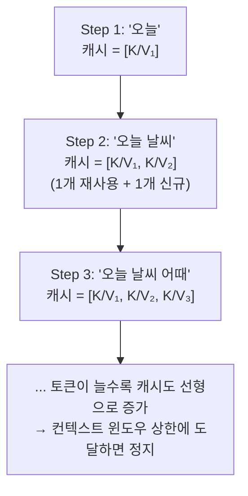

# KV 캐시

토큰을 하나 생성할 때마다 이전 모든 토큰의 [[Query·Key·Value|attention key/value]]를 매번 다시 계산하면 낭비이므로, 한 번 계산한 값을 캐시해두고 재사용합니다. [[Causal Masking]]이 미래 토큰을 보지 못하게 막아주는 덕분에, 과거 토큰의 K·V는 이후 어떤 토큰이 추가되든 절대 바뀌지 않는다고 수학적으로 보장됩니다 — 그래서 캐시가 안전합니다. 이 캐시는 `(프롬프트 길이 + 생성한 토큰 수) × 레이어 수 × [[Multi-Head Attention|헤드 수]]`에 비례해 대화가 길어질수록 계속 자라나며, 서빙 엔진 메모리 사용의 가장 큰 변수입니다.

요청 하나가 시작되면 이 KV 캐시는 그 요청이 끝날 때까지 특정 [[GPU]]의 [[VRAM]]에 붙어 있습니다 — 이게 LLM 서빙이 [[Stateful 서빙|stateful]]한 이유입니다.

매 스텝 새로 계산하는 건 그 스텝의 Query 하나뿐이고, 나머지 K·V는 캐시에서 그대로 재사용된다는 점이 이 그림의 핵심입니다.

## 관련
- [[Query·Key·Value]] — 캐시되는 K·V가 무엇인지에 대한 배경 개념
- [[Causal Masking]] — 캐시가 안전하게 재사용될 수 있다는 걸 보장하는 장치
- [[Multi-Head Attention]] — 캐시 크기가 헤드 수만큼 곱해지는 이유
- [[컨텍스트 윈도우]] — KV 캐시 크기를 결정하는 요인
- [[PagedAttention]] — KV 캐시를 페이지 단위로 관리해 낭비를 줄이는 기법
- [[Stateful 서빙]] — KV 캐시가 만드는 상태 종속성
- [[VRAM]] — KV 캐시가 실제로 차지하는 자원
