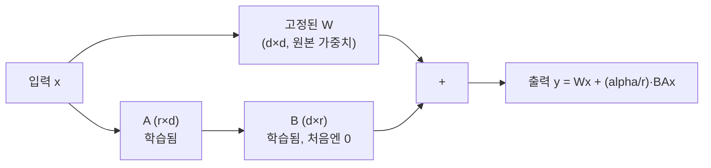

# LoRA (파인튜닝)

8B 모델을 통째로 파인튜닝하려면 대략 56GB VRAM이 필요합니다 — 가중치(fp16) 16GB, 그래디언트 16GB, 옵티마이저 상태(Adam의 모멘텀·분산 두 벌) 24GB입니다. 클라우드 GPU 기준 한 번 실행에 $30~40이 들고, 게다가 모든 파라미터를 업데이트하면 모델이 원래 잘하던 것까지 망가뜨리는 "재앙적 망각(catastrophic forgetting)" 위험도 따라옵니다. LoRA(Low-Rank Adaptation)는 "파인튜닝 중 일어나는 가중치 업데이트가 사실 낮은 고유 랭크(intrinsic rank)를 가진다"는 관찰에서 출발해, 전체 가중치 행렬을 다시 학습하는 대신 작은 두 행렬의 곱만 학습합니다.

## 수식 — 두 개의 저랭크 행렬로 업데이트를 대신하기

기존 레이어는 `y = Wx`(W는 d×d)입니다. LoRA는 여기에 저랭크 경로를 더합니다.

```
y = Wx + BAx
```

`A`는 (r×d), `B`는 (d×r) 행렬이고, `r`(랭크)은 d보다 훨씬 작습니다. 4096×4096 레이어에 r=16을 쓰면 원본은 1,670만 파라미터인데 LoRA 경로는 131,072개 — 원본의 0.78%만 학습합니다. **W 자체는 완전히 고정(freeze)**되고, 학습되는 건 B·A 두 행렬뿐입니다.

초기화도 의도적입니다 — A는 1/√r로 스케일된 무작위 가우시안, B는 전부 0으로 시작합니다. B가 0이면 학습 시작 시점의 `BAx`는 정확히 0이라, 학습 전 모델 출력과 완전히 같은 상태에서 출발합니다(원 모델 행동을 깨지 않고 시작).

**alpha 스케일링**: 실제 구현은 `y = Wx + (alpha/r)·BAx`처럼 스케일 계수를 하나 더 둡니다. alpha=r이면 1배 스케일(보수적), alpha=2r이 흔한 컨벤션으로 더 빠른 수렴을 주는 대신 값이 커지면 불안정해질 위험도 커집니다.



## 어느 레이어에, 어느 랭크로

모든 선형 레이어에 LoRA를 걸 필요는 없습니다. Query 프로젝션만 거는 것부터(7B 기준 470만 파라미터, "괜찮음") Query+Value(940만, "더 나음"), 어텐션 전체 q·k·v·o(1,890만, "어텐션 초점에 가장 효과적"), 전체 선형 레이어(3,770만, 파라미터는 2배인데 개선은 미미)까지 단계가 있고, 실무에서 자주 쓰는 "스위트 스팟"은 어텐션의 초점(Query)과 정보 추출(Value)을 조절하는 Q·V 프로젝션입니다.

랭크는 과제 난이도에 맞춥니다.

| 랭크 | 용도 |
|---|---|
| r=4 | 단순 분류, 감성 분석 |
| r=8 | 단일 도메인 Q&A, 요약 |
| r=16 | 멀티 도메인, 지시문 수행 |
| r=32 | 복잡한 추론, 코드 생성 |
| r≥64 | 수확 체감 — 굳이 필요한 경우 드묾 |

Llama 2 7B로 측정한 벤치마크에서 LoRA(r=16)는 풀 파인튜닝 대비 MMLU·MT-Bench·HumanEval 전 지표에서 약 1% 이내로 근접합니다 — "파라미터의 1% 미만만 학습해도 품질은 거의 그대로 유지된다"는 게 LoRA가 실무 표준이 된 이유입니다.

## QLoRA — 베이스 모델까지 4비트로 양자화하기

Dettmers 외(2023)가 제안한 QLoRA는 고정된(freeze) 베이스 모델 자체를 4비트로 [[양자화]]하고, 학습되는 LoRA 어댑터만 fp16으로 유지합니다. 세 가지 기술적 장치가 이를 가능하게 합니다.

- **NF4(Normal Float 4-bit)** — 16개 양자화 레벨을 균등 간격이 아니라 표준정규분포의 분위수 위치에 배치하는 포맷입니다. 신경망 가중치가 대략 정규분포를 따른다는 전제 하에, 정보이론적으로 최적에 가까운 압축입니다.
- **이중 양자화(Double Quantization)** — 양자화 스케일 인자 자체(블록당 fp32 4바이트)도 다시 fp8로 압축해, 7B 모델 기준 오버헤드를 0.4GB→0.1GB로 줄입니다.
- **페이지 옵티마이저(Paged Optimizer)** — 학습 중 옵티마이저 상태(Adam의 모멘텀·분산)가 GPU 메모리를 넘어서면, NVIDIA의 unified memory로 GPU·CPU RAM 사이를 자동으로 옮겨 OOM(메모리 부족) 크래시를 막습니다.

메모리·비용 차이가 실제로 큽니다(7B 모델, 5만 예시, 3 epoch 기준).

| 방식 | 학습 메모리 | GPU | 학습 비용 |
|---|---|---|---|
| 풀 파인튜닝(fp16) | ~56GB | A100 80GB × 2 | ~$32 |
| LoRA(fp16) | ~18GB | A100 40GB × 1 | ~$8 |
| QLoRA(4비트) | ~6GB | RTX 3090 24GB × 1 | ~$5 |
| QLoRA + Unsloth 최적화 | ~6GB | RTX 4090 24GB × 1 | ~$2 |

7B 모델 파인튜닝이 소비자용 GPU 한 장으로 몇 달러 수준까지 내려온다는 뜻입니다. Hugging Face PEFT가 LoRA/QLoRA의 사실상 표준 라이브러리이고, Unsloth는 Triton 커널을 다시 짜서 2~5배 속도·메모리 절반을 추가로 뽑아냅니다.

## 학습 후 — 어댑터를 분리해둘까, 합칠까

**분리 유지** — 베이스 모델 하나에 과제별 어댑터(보통 10~100MB)를 갈아 끼우는 방식. 하나의 베이스 모델로 여러 과제를 동시에 서빙할 수 있습니다. **영구 병합** — `W' = W + (alpha/r)·BA`를 계산해 원본 가중치를 통째로 교체. 모델 크기는 원본과 같아지고 추론 시 어댑터로 인한 오버헤드가 0이 되는 대신, 이후엔 어댑터를 떼어낼 수 없습니다.

## 파인튜닝은 세 번째 선택지다

지식·동작을 모델에 반영하는 방법은 순서가 있습니다 — 1) 프롬프트 엔지니어링, 2) [[RAG]], 3) 파인튜닝. 파인튜닝은 스타일·톤·출력 형식을 일관되게 만들거나 모델 자체를 경량화(distillation)해야 하는데 앞의 두 방법으로 안 될 때만 씁니다. 특히 "모델이 모르는 사실을 알게 하기" 목적이라면 파인튜닝보다 [[RAG]]가 비용·최신성·감사 가능성 모두에서 유리합니다.

## 관련
- [[SFT (Instruction Tuning)]] — 실무에서 LoRA로 수행되는 경우가 많은 학습 단계
- [[RLHF]] · [[DPO]] — SFT 이후 선호도 정렬 단계도 LoRA로 수행 가능
- [[양자화]] — QLoRA가 베이스 모델에 적용하는 압축 기법
- [[Gradient Checkpointing]] — 메모리를 줄이는 또 다른 축(연산량과 맞바꾸는 방식)
- [[RAG]] — 파인튜닝 대신 지식을 반영하는 대안, 비용·최신성 비교
- [[컨텍스트 압축]] — RAG 근거(가변 지식)가 너무 길 때 쓰는 대안 축, 파인튜닝(고정 지시문용)과 대상이 다름
