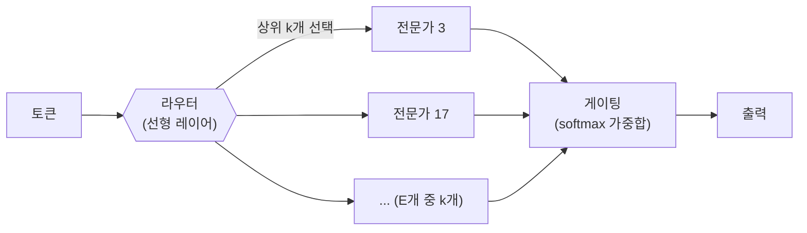

# MoE (Mixture of Experts)

일반적인("밀집") [[Transformer]]는 토큰 하나를 처리할 때마다 모델의 파라미터 전부를 사용합니다. MoE는 여기서 발상을 뒤집습니다 — FFN 자리에 여러 개의 독립적인 "전문가"를 두고, 토큰마다 그중 일부만 골라서 통과시킵니다. 밀집 70B 모델은 모든 토큰이 700억 파라미터를 다 거치지만, MoE 671B 모델(DeepSeek-V3)은 토큰 하나당 실제로 활성화되는 파라미터가 370억 개뿐입니다 — **저장된 지식은 5배 더 많은데, 토큰 하나 처리에 드는 연산은 오히려 절반 수준**이라는 역설적인 결과가 여기서 나옵니다.

## 세 부품: 라우터, 게이팅, 전문가

1. **라우터(Router)** — 단순한 선형 레이어 하나가 각 토큰의 은닉 상태를 전문가 수(E)만큼의 점수로 변환하고, 그중 상위 k개 전문가를 고릅니다.
2. **게이팅(Gating)** — 선택된 k개 전문가의 출력을 각자의 점수에 softmax를 적용한 가중치로 합칩니다: `출력 = Σ (게이트 가중치 × 전문가 출력)`.
3. **전문가(Experts)** — 각각 독립된 FFN(대개 SwiGLU 구조)입니다. 세밀하게(fine-grained) 설계된 최신 MoE는 전문가 하나의 크기를 밀집 FFN의 1/8 정도로 작게 만들고, 그 대신 개수를 훨씬 늘립니다.

## 구체적 규모 비교

| 모델 | 총 파라미터 | 토큰당 활성 파라미터 | 전문가 수 / 활성 개수 |
|---|---|---|---|
| Mixtral 8×22B | 141B | ~39B | 8개 중 2개 |
| DeepSeek-V3 | 671B | 37B | 256(+공유 1개) 중 8개 |
| Kimi K2 | 1T | ~32B | — |

같은 파라미터 예산이라도 "세밀한(fine-grained)" MoE — 전문가를 작게 쪼개고 개수를 늘리는 설계(예: 256개 중 8개 선택)는 조합 가능 경우의 수(C(256,8) ≈ 400조)가 고전적인 설계(8~64개 중 1~2개 선택)보다 훨씬 커서, 같은 파라미터 수로도 표현력을 더 끌어올릴 수 있습니다.

## 부하 균형 — 라우터가 몇 개 전문가만 편애하는 문제

라우터를 그냥 학습에 맡기면 특정 전문가에만 토큰이 몰리고 나머지는 거의 안 쓰이는 쏠림 현상이 생깁니다. 이를 막는 방법이 세대별로 바뀌어 왔습니다.

- **보조 손실(auxiliary loss)** — 전문가 사용량이 고르게 퍼지도록 손실 함수에 페널티 항을 추가(Switch Transformer, Mixtral). 다루기 까다로운 하이퍼파라미터가 하나 늘어나는 대가가 있습니다.
- **용량 제한 + 토큰 드롭** — 전문가마다 처리할 수 있는 토큰 수에 상한을 두고 넘치는 토큰은 그냥 버림(초기 Switch). 품질 저하가 발생합니다.
- **보조 손실 없는 균형 조정(DeepSeek-V3, 2024)** — 전문가마다 학습 가능한 편향값을 하나씩 두고, 학습 스텝마다 "이 전문가가 최근 목표보다 많이 쓰였으면 편향을 낮추고, 적게 쓰였으면 편향을 올리는" 식으로 조정합니다. 이 편향은 어떤 전문가를 **고를지(라우팅)**에만 영향을 주고, 실제 게이팅 가중치는 원래 점수로 그대로 계산합니다 — "선택"과 "가중치 부여"를 분리한 것이 핵심 아이디어이며, 손실 함수에 페널티 항을 넣지 않고도 균형을 맞출 수 있게 됐습니다.

## 공유 전문가(Shared Experts)

DeepSeek-V2/V3은 전문가를 두 종류로 나눕니다. 모든 토큰이 항상 거쳐가는 **공유 전문가**(일반적인 지식 담당)와, 라우터가 토큰마다 골라주는 **라우팅 전문가**(특화된 지식 담당)입니다. 예를 들어 V3는 공유 전문가 1개 + 256개 중 상위 8개를 라우팅 전문가로 함께 사용합니다.

## 메모리는 늘고 연산은 준다 — 트레이드오프의 실체

MoE의 함정은 "전문가 전부가 항상 GPU 메모리에 올라와 있어야 한다"는 점입니다. 어느 토큰이 어느 전문가를 고를지는 매 순간 달라지므로, 671B 모델이면 실제 사용량과 무관하게 전체 671B어치 가중치([[VRAM|VRAM]] 기준 FP16으로 약 1.3TB)를 항상 메모리에 대기시켜야 합니다. 그래서 실제 배포에서는 전문가들을 여러 GPU에 나눠 올리는 전문가 병렬화(Expert Parallelism, [[Tensor Parallelism]]·[[Pipeline Parallelism]]과 함께 쓰이는 또 다른 병렬화 축)를 쓰는데, 이때 진짜 병목은 행렬곱 자체가 아니라 GPU 사이를 오가며 토큰을 라우팅하는 all-to-all 통신입니다. 결과적으로 MoE는 토큰이 많이 몰리는 워크로드(채팅, 코드 생성)에는 유리하지만, 긴 컨텍스트를 처리하는 워크로드에는 상대적으로 불리합니다.

## 관련
- [[Transformer]] — FFN 자리를 여러 전문가로 대체한 원형
- [[파라미터 수]] — "총 파라미터"와 "활성 파라미터"가 갈라지는 지점
- [[VRAM]] — 전문가 전부가 상주해야 하는 이유
- [[Tensor Parallelism]] · [[Pipeline Parallelism]] — 전문가 병렬화가 얹히는 기존 병렬화 축
- [[스케일링 법칙]] — MoE가 파라미터 수와 연산량을 독립적으로 늘릴 수 있게 해주는 최근 변수
