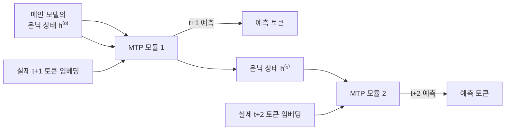

# Multi-Token Prediction

[[GPT와 인과적 언어모델링]]의 표준 학습 목표는 위치마다 딱 하나, "바로 다음 토큰"만 맞히는 것입니다. Multi-Token Prediction(MTP)은 여기서 한 걸음 더 나가, 같은 위치의 은닉 상태가 다음 토큰 하나가 아니라 그 뒤로 몇 개(D개)의 미래 토큰을 동시에 예측하도록 감독 신호를 늘리는 방식입니다.

## 왜 신호를 늘리는가

기존 방식은 위치 하나당 정답 토큰 1개로만 손실을 계산해서, 모델이 "다음 한 글자"보다 더 먼 구조(문장 전체의 흐름, 산술 계산의 다음 단계 등)를 학습할 신호가 상대적으로 약합니다. MTP는 위치 하나당 정답 토큰을 D+1개로 늘려, 같은 데이터로도 더 촘촘한 학습 신호를 뽑아냅니다.

## DeepSeek-V3의 구현 — 순차적 MTP

단순하게 같은 은닉 상태에서 서로 독립적인 D개의 예측 헤드를 다는 방식(병렬 MTP)도 있지만, 이렇게 하면 각 헤드의 예측이 서로 아무 관계 없이 따로 놉니다. DeepSeek-V3는 대신 **순차적 MTP 모듈**을 씁니다 — k번째 모듈이 `(k-1)`번째 모듈의 은닉 상태와 "실제 정답의 (k번째 미래) 토큰 임베딩"을 함께 받아 새 은닉 상태를 만들고, 그 상태로 다음 토큰을 예측합니다. 이건 자기회귀 디코더가 자기 출력을 다시 입력으로 먹는 구조와 똑같아서, 여러 미래 토큰을 예측하면서도 토큰들 사이의 인과 관계(causal chain)를 그대로 보존합니다.

## 학습 이득과 비용

DeepSeek-V3의 절제 실험에서는 MMLU·GSM8K·MATH·HumanEval 등에서 MTP를 켰을 때 수 퍼센트 포인트의 일관된 개선이 관찰됐습니다 — 각 위치가 여러 개의 감독 목표를 동시에 보므로 장거리 구조·일관성을 더 잘 배운다는 설명입니다. 대가는 학습 속도가 대략 10% 느려진다는 것과, 671B 모델 기준 MTP 모듈이 추가로 14B(전체의 약 2%) 파라미터를 차지한다는 것입니다.

## 추론 이득 — 그냥 버리지 않고 draft 모델로 재활용

MTP 모듈은 애초에 "몇 스텝 뒤 토큰을 예측"하도록 학습됐기 때문에, 학습이 끝난 뒤 이 모듈을 그대로 [[Speculative Decoding]]의 draft 모델로 재사용할 수 있습니다 — 별도의 draft 모델을 새로 학습시킬 필요 없이 "공짜로" 얻는 부산물인 셈입니다. DeepSeek-V3는 이 방식으로 깊이 1에서 80% 이상의 수락률을 달성해, 추가 학습 비용 대비 상당한 추론 속도 이득까지 함께 챙깁니다.

## 관련
- [[GPT와 인과적 언어모델링]] — MTP가 확장하는 원본 "다음 토큰 하나만 예측" 목표
- [[Speculative Decoding]] — 학습된 MTP 모듈이 그대로 재활용되는 추론 최적화
- [[DeepSeek-V3 아키텍처]] — MTP를 실제로 채택한 대표 사례
- [[MoE (Mixture of Experts)]] — 같은 모델 안에서 함께 쓰이는 다른 구조적 축
