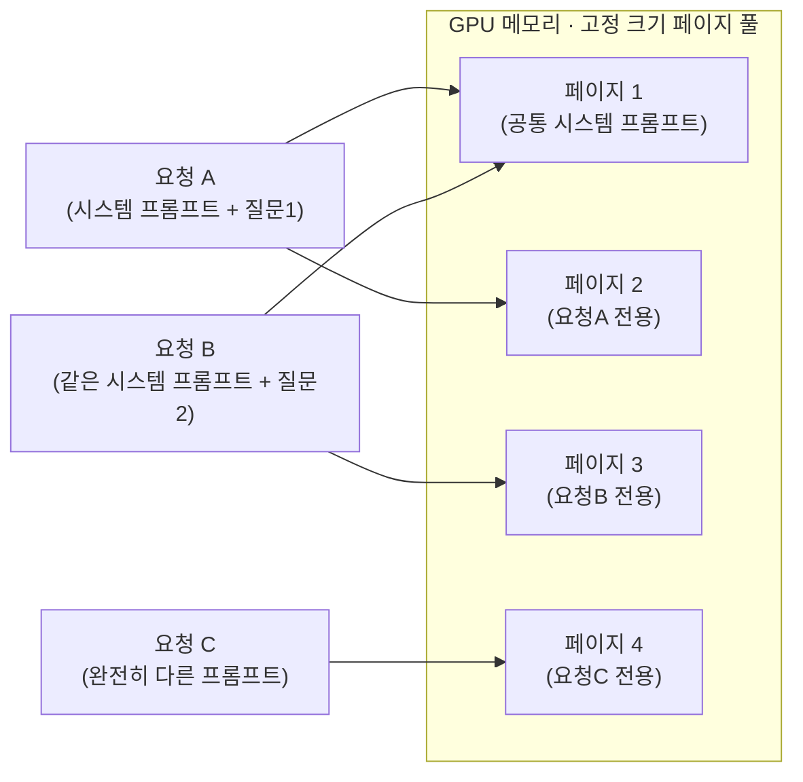

# PagedAttention

[[vLLM]]의 핵심 아이디어. [[KV 캐시]]를 요청마다 통짜로 미리 예약해두면 메모리가 단편화되고 낭비가 생기므로, OS의 가상메모리처럼 KV 캐시를 고정 크기 "페이지" 단위로 쪼개 관리합니다. 필요한 만큼만 페이지를 할당하고, 여러 요청이 같은 프롬프트 접두어를 공유하면(예: 같은 시스템 프롬프트) 페이지 자체를 공유합니다. 이게 vLLM이 다른 엔진보다 동시 처리량이 높은 핵심 이유입니다.

요청 A와 B는 시스템 프롬프트가 같아서 페이지 1을 공유하고, 각자 다른 질문 부분만 별도 페이지(2, 3)를 씁니다. 요청마다 통짜로 예약했다면 페이지 1의 내용을 A와 B 양쪽에 중복 저장했을 것 — 이 중복 제거가 PagedAttention이 메모리를 아끼는 방식입니다.

## 관련
- [[KV 캐시]] — PagedAttention이 관리하는 대상
- [[vLLM]] — PagedAttention을 구현한 엔진
- [[Continuous Batching]] — 함께 vLLM의 처리량을 만드는 다른 한 축
