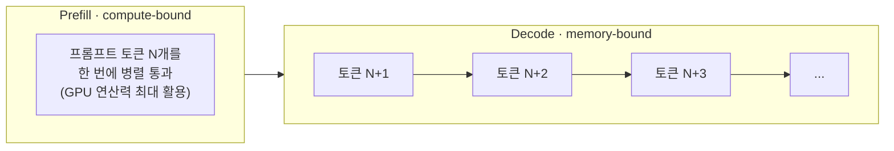

# Prefill과 Decode

LLM 추론은 한 번에 다 계산하는 게 아니라 [[토큰]]을 한 개씩 순차적으로 뱉어내는 autoregressive 구조라서, 성격이 다른 두 단계로 나뉩니다.

- **Prefill** — 입력 프롬프트 전체를 한 번에 병렬로 통과. 연산이 커서 GPU 연산력을 거의 다 씀 (compute-bound).
- **Decode** — 한 스텝에 토큰 1개만 생성. 연산량은 작지만 매 스텝마다 이전 상태를 다시 읽어야 해서 GPU 연산력이 아니라 **[[메모리 대역폭]]**이 병목 (memory-bound).

Decode 쪽은 매 화살표(스텝)마다 GPU가 [[KV 캐시]] 전체를 메모리에서 다시 읽어와야 해서, 연산량은 작아도 메모리 대역폭이 병목입니다. 이 구분이 서빙 최적화 전체의 출발점입니다 — [[양자화]]가 서빙 속도에 영향을 주는 이유, [[Continuous Batching|배칭]]이 왜 필요한지가 모두 여기서 나옵니다.

## 관련
- [[메모리 대역폭]] — Decode가 병목에 걸리는 근본 원인, Ops:Byte로 정량화하는 법
- [[KV 캐시]] — Decode 단계가 재사용하는 상태
- [[양자화]] — Decode의 메모리 대역폭 병목을 줄이는 방법
- [[처리량과 지연시간]] — Prefill/Decode 성격 차이가 만드는 트레이드오프
