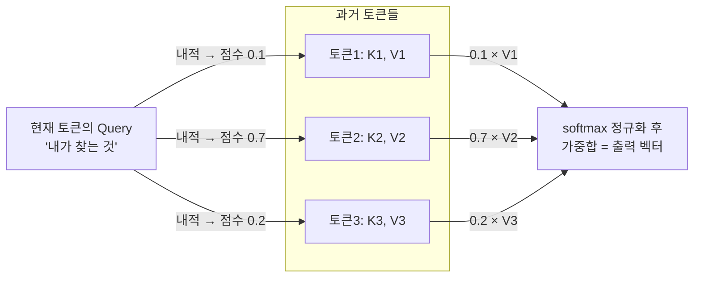

# Query·Key·Value

Transformer의 어텐션 메커니즘에서, 각 토큰은 자기 임베딩에 학습된 가중치 행렬을 곱해 세 가지 벡터를 만듭니다.

- **Query** — "지금 내가 뭘 찾고 있는가"를 나타내는 벡터. 지금 처리 중인 토큰의 관점에서 나옵니다.
- **Key** — "나는 이런 정보를 갖고 있다"는 색인표 같은 벡터. 문장 속 모든 토큰이 하나씩 갖고 있습니다.
- **Value** — 실제로 넘겨줄 "내용물" 벡터. Key와 짝을 이루지만 값 자체는 다릅니다.

동작 방식: 지금 토큰의 Query를 이전 모든 토큰들의 Key와 하나씩 내적(dot product)해 "얼마나 관련 있는가" 점수를 매기고, softmax로 정규화해 가중치로 바꾼 다음, 그 가중치만큼 각 토큰의 Value를 섞어(가중합) 최종 출력을 만듭니다. 도서관 검색에 비유하면 Query는 검색어, Key는 책마다 붙은 색인 태그, Value는 책의 실제 내용입니다.



점수가 가장 높은 토큰2의 Value가 출력에 가장 크게 반영됩니다 — "지금 토큰이 과거 어느 토큰을 가장 많이 참고했는가"가 바로 이 가중치입니다.

## 수식과 그 안의 이유

정식 정의는 `Attention(Q, K, V) = softmax(QKᵀ / √d_k) · V` 입니다. `QKᵀ`가 유사도 점수 행렬, `√d_k`(Key 차원 수의 제곱근)로 나누는 건 스케일링입니다 — 차원이 커질수록 내적값 자체가 커지는 경향이 있어서, 스케일링 없이 그대로 softmax에 넣으면 분포가 극단적으로 뾰족해지고(거의 원-핫) 나머지 항목의 그래디언트가 0에 가까워져 학습이 멈춰버립니다. √d_k로 나누면 차원이 바뀌어도 내적값의 크기가 일정 범위 안에 머뭅니다.

**왜 토큰 벡터를 그대로 안 쓰고 Q·K·V를 따로 만드나?** 토큰 벡터 자체를 Query이자 Key로 그대로 쓰면(자기 자신과 내적), 모든 토큰은 항상 자기 자신과 가장 강하게 매칭됩니다 — 다른 토큰을 의미 있게 참고하는 어텐션이 나올 수 없습니다. 그래서 학습 가능한 가중치 Wq·Wk·Wv를 따로 둬서, 같은 토큰이라도 "질문하는 입장의 모습(Q)", "검색당하는 입장의 모습(K)", "실제로 건넬 내용물(V)"을 독립적으로 학습하게 만듭니다.

새 토큰의 Query는 매 스텝 새로 계산하면 되지만, 비교 대상인 과거 토큰들의 Key·Value는 한 번 계산되면 이후에도 값이 바뀌지 않습니다(뒤에 어떤 토큰이 오든 앞 토큰의 K·V가 달라질 이유가 없음 — 왜 그런지는 [[Causal Masking]] 참고). 그래서 이 K·V만 재계산하지 않고 캐시해서 재사용하는 것이 [[KV 캐시]]입니다.

실제로는 이 어텐션을 전체 차원 하나로 한 번에 계산하지 않고 여러 "헤드"로 쪼개서 병렬로 계산합니다 — 자세한 내용과 이유는 [[Multi-Head Attention]] 참고.

## 왜 [[배치]]가 여기서 두 단계로 갈리는가

이 과정은 사실 성격이 다른 두 단계로 나뉩니다.

1. **Q·K·V를 "만드는" 단계** — 토큰 벡터에 Wq·Wk·Wv를 곱하는 고정된 변환일 뿐, 그 요청의 히스토리가 몇 턴짜리인지와 전혀 무관합니다. 그래서 64개 요청의 "지금 토큰" 벡터를 행렬로 쌓아 한 번에 곱하면 64명분의 Q·K·V를 한 번의 계산으로 다 만들 수 있습니다 — [[배치]]가 깔끔하게 적용되는 부분입니다.
2. **그 Query로 실제 "검색"하는 단계** — 요청 A의 Query는 A 자신의 히스토리(예: 500개 토큰만큼의 Key)하고만, 요청 B의 Query는 B 자신의 히스토리(예: 20개 토큰만큼의 Key)하고만 비교해야 합니다. 요청마다 히스토리 길이가 제각각(ragged)이라, 500개짜리와 20개짜리를 하나의 정형화된 행렬에 나란히 넣을 방법이 없습니다. 그래서 이 단계는 64개 요청을 하나의 균일한 행렬로 뭉뚱그릴 수 없고, 각자 자기 몫의 [[KV 캐시]]만 찾아가야 합니다.

도서관 비유로: 1단계는 다 같은 복사기로 검색 카드를 만드는 일(몇 명이 오든 복사기 하나로 동시 처리), 2단계는 그 카드를 들고 자기 책장(자기 히스토리)에서 책을 찾는 일(책장 크기가 사람마다 달라서 섞을 수 없음)입니다. 이 2단계를 여러 요청에 대해 그래도 병렬로 효율적으로 처리하기 위한 전용 장치가 [[PagedAttention]]입니다.

## 학습 중에는 Wq·Wk·Wv가 어떻게 업데이트되는가

지금까지 다룬 건 이미 학습이 끝난 Wq·Wk·Wv로 추론(순전파)하는 이야기입니다. 학습 중에는 이 가중치들도 [[역전파]]로 매 스텝 업데이트됩니다 — 서빙 노트들이 다루는 건 전부 이 과정이 끝나고 가중치가 고정된 이후의 이야기라는 점을 기억해두면 좋습니다.

손실 `L`에서 출발해 연쇄법칙을 거슬러 올라가면 대략 이런 경로를 탑니다.

```
∂L/∂output              ← 손실 함수에서 출발
∂L/∂V  = attention_weights ᵀ · ∂L/∂output
∂L/∂Wv = Xᵀ · ∂L/∂V                              ← V를 만든 가중치
∂L/∂weights = ∂L/∂output · Vᵀ
∂L/∂scores  = softmax의 국소 미분을 곱해 되돌림      ← [[역전파]]의 "덧셈/곱셈 기울기 전달" 그대로
∂L/∂Q  = ∂L/∂scores · K   /√d_k
∂L/∂K  = ∂L/∂scores · Q   /√d_k
∂L/∂Wq = Xᵀ · ∂L/∂Q,   ∂L/∂Wk = Xᵀ · ∂L/∂K
```

핵심은 Wq·Wk·Wv 세 개가 **같은 손실 하나로부터, 하지만 서로 다른 경로를 거쳐** 기울기를 받는다는 점입니다. Wv는 "값 자체가 얼마나 출력에 기여했는가"로, Wq·Wk는 "이 토큰이 얼마나 강하게 매칭됐어야 했는가"로 갈립니다. 그래서 학습이 끝난 뒤 세 행렬이 완전히 다른 값을 갖게 되는 것이고, 애초에 토큰 벡터를 그대로 Query·Key로 재사용하지 않고 세 가중치를 따로 둔 이유(위 "왜 토큰 벡터를 그대로 안 쓰고" 문단)도 결국 이 세 가지 역할이 서로 다른 방향의 기울기를 받아야 하기 때문입니다.

√d_k로 나누는 스케일링도 이 경로에 그대로 곱해지는 상수라, 스케일링이 없으면(또는 d_k가 커서 값이 커지면) `∂L/∂Q`·`∂L/∂K`가 커지거나 작아지는 정도가 아니라 애초에 softmax 입력 쪽에서 기울기가 죽어버린다는 게 스케일링이 실제로 학습에 영향을 주는 지점입니다.

## 관련
- [[역전파]] — 이 절에서 다룬 기울기 전달의 일반 원리(연쇄법칙·덧셈/곱셈 규칙)
- [[KV 캐시]] — Key·Value를 캐시해 재사용하는 서빙 최적화
- [[Prefill과 Decode]] — 이 계산이 실제로 일어나는 두 단계
- [[배치]] — Q·K·V 생성 단계엔 적용되고 어텐션 검색 단계엔 그대로 안 되는 최적화
- [[PagedAttention]] — 요청마다 다른 길이의 히스토리를 병렬로 다루는 방법
- [[Multi-Head Attention]] — 이 어텐션을 여러 개로 쪼개 병렬로 계산하는 이유
- [[Causal Masking]] — 미래 토큰을 못 보게 막아 KV 캐시가 안전하게 재사용되도록 보장하는 장치
