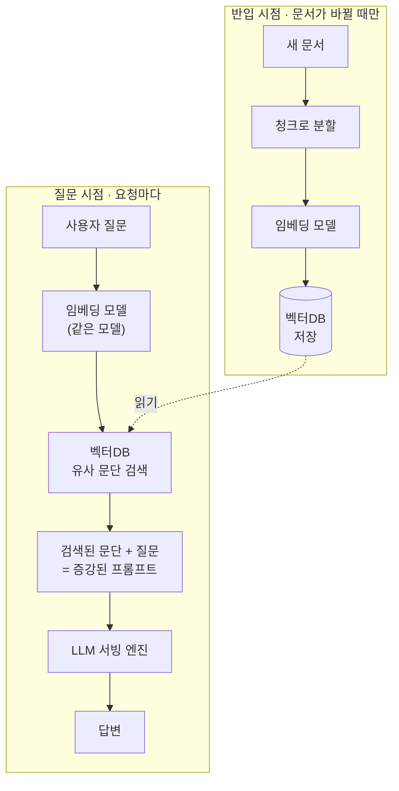

# RAG

[[LLM]]은 학습 시점 이후 정보나 사내 문서를 알지 못합니다. RAG(검색증강생성)는 질문이 들어오면 먼저 사내 문서를 [[임베딩과 벡터DB|임베딩]]해 저장해둔 벡터DB에서 관련 문단을 검색하고, 그 문단을 프롬프트에 끼워 넣어 LLM이 "찾아 읽고 답하게" 만드는 구조입니다. [[폐쇄망]] 환경에서 사내 규정·매뉴얼 QA를 만들 때 사실상 기본 패턴입니다.

## 배포 관점: 완전히 다른 두 시점이 합쳐진 것

RAG는 타이밍이 다른 두 파이프라인으로 이루어져 있습니다.

- **반입/색인 시점(오프라인)** — 문서가 생기거나 갱신될 때만: 문서를 청크로 분할 → 임베딩 모델로 벡터화 → 벡터DB에 저장.
- **질문 시점(온라인)** — 요청마다: 질문도 같은 임베딩 모델로 벡터화 → 벡터DB에서 유사 문단 검색 → 문단 + 질문을 합쳐 LLM에 전달 → 답변.

이 구분이 [[폐쇄망]] 배포에서 세 가지를 만듭니다.

1. **모델이 하나가 아니라 둘** — [[6단계 폐쇄망 이관]] 때 LLM 가중치만 챙기기 쉬운데, 임베딩 모델도 별도로 반입하고 별도로 서빙해야 합니다.
2. **벡터DB는 [[KV 캐시]]와 다른 종류의 상태** — KV 캐시는 요청이 끝나면 사라지는 일시적 상태지만, 벡터DB는 서버를 껐다 켜도 남아있어야 하는 영구적 상태라 백업·재해복구를 따로 신경 써야 합니다.
3. **문서 업데이트는 반복되는 반입 절차** — LLM 가중치는 한 번 반입하면 잘 안 바뀌지만, 사내 문서는 계속 추가·수정되어 그때마다 반입 체크리스트를 다시 거쳐야 합니다. 대신 LLM 자체를 파인튜닝해서 재반입하는 것보다는 훨씬 가벼운 절차라서, 이게 폐쇄망에서 RAG가 매력적인 이유이기도 합니다.

## 관련
- [[임베딩과 벡터DB]] — RAG의 검색 부분을 구성하는 요소
- [[LLM]] — RAG가 보완하는 대상
- [[4단계 RAG 실습]] — 이 개념을 실습하는 로드맵 단계
- [[6단계 폐쇄망 이관]] — 임베딩 모델도 함께 반입해야 하는 단계
- [[KV 캐시]] — 벡터DB와 대비되는 일시적 상태
- [[모델 서빙과 서비스 배포]] — "모델 서빙"이 이 전체 그림 중 일부일 뿐이라는 구분
- [[표준 아키텍처]] — 이 파이프라인 전체가 배치되는 큰 그림

## 실전 사례
- [EP15](../../docs/구축기/EP15-폐쇄망-RAG-구축-1.md) · [EP16. 폐쇄망 RAG 구축 (구축기)](../../docs/구축기/EP16-폐쇄망-RAG-구축-2.md) — 한국어 문장 분리 청킹, 하이브리드 검색, 출처 표시 프롬프트까지 실제로 구현한 과정
