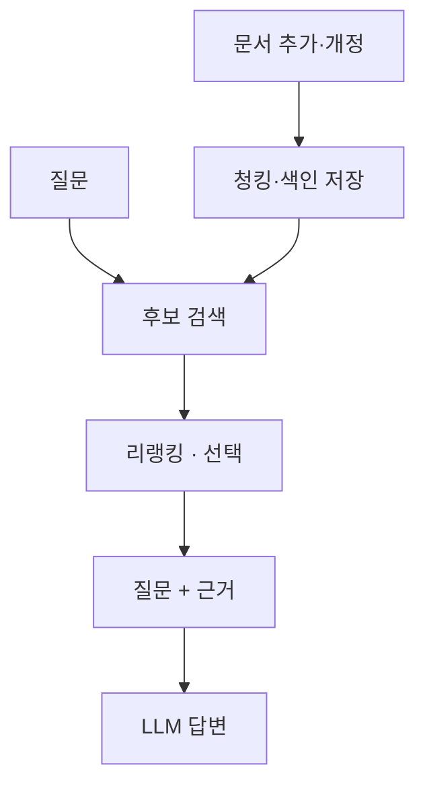

# RAG

질문에 필요한 외부 자료를 검색해 [[LLM]]의 입력에 넣고, 그 근거를 바탕으로 답하게 하는 구조입니다. 모델 가중치를 바꾸는 학습과 달리 **답변 시점의 입력을 보강**합니다. 벡터 검색뿐 아니라 키워드 검색으로도 구성할 수 있습니다.

## 두 파이프라인

RAG는 타이밍이 다른 두 파이프라인으로 이루어져 있습니다.

- **색인 시점(오프라인)** — 문서가 생기거나 갱신될 때만 실행: 문서 추출 → [[청킹과 문서 구조|청킹]] → 임베딩 모델로 검색 표현 생성 → 벡터DB에 저장.
- **질문 시점(온라인)** — 요청마다 실행: 질문도 같은 임베딩 모델로 벡터화 → [[하이브리드 검색|후보 검색]] → 필요하면 [[리랭킹]] → [[컨텍스트 구성|근거 구성]] → 답변. 이때 근거 없는 내용을 지어내는 [[환각]]을 막기 위해 "참고 문서에 없으면 모른다고 답하라"는 지시를 프롬프트에 명시하는 게 일반적입니다.

## 검색 성공과 답변 성공은 다르다

가상의 규정이 ‘보증기간 1년, 침수 제외’라면 **보증기간 문서만 찾는 것으로는 부족**합니다. 예외까지 검색됐는지, 실제 입력에 포함됐는지, 모델이 조건에 맞게 답했는지를 나눠 확인해야 합니다.

## RAG vs 파인튜닝 — 비용이 가르는 선택

모델에게 새 지식을 반영하는 방법은 크게 두 가지입니다 — 모델 가중치 자체를 다시 학습시키는 [[LoRA (파인튜닝)|파인튜닝]]과, 모델은 그대로 두고 질의 시점에 필요한 정보를 검색해 끼워 넣는 RAG입니다. 비용 차이가 결정적입니다 — RAG는 쿼리 한 번에 $0.01~$0.10 수준인 반면, 파인튜닝은 한 번 돌리는 데 $1,000~$100,000이 들 수 있습니다. 갱신 속도도 다릅니다 — 문서 하나가 바뀌면 RAG는 그 문서만 다시 색인하면 몇 분 안에 반영되지만, 파인튜닝은 모델을 통째로 다시 학습해야 합니다. 그래서 "모델이 모르는 사실을 알려주는" 목적이라면 RAG가 비용·최신성·감사 가능성(어느 문서에서 나온 답인지 추적 가능) 모두에서 유리합니다. 반대로 파인튜닝이 필요한 경우는 지식 주입이 아니라 스타일·톤·출력 형식처럼 프롬프트나 검색만으로는 만들기 어려운 성격을 바꿔야 할 때입니다.

## RAG 평가 — Recall@k와 Faithfulness

RAG의 품질은 "검색이 맞았는가"와 "생성이 맞았는가"를 따로 재야 합니다. 한쪽이 좋아도 다른 쪽이 나쁘면 전체 답은 틀립니다.

- **Recall@k** — 상위 k개로 검색된 청크 중 실제로 정답의 근거가 되는 청크가 포함된 비율입니다. 검색 단계만 떼어서 재는 지표로, 답변 품질과 무관하게 "애초에 필요한 문서를 찾아왔는가"만 봅니다.
- **Faithfulness(충실성)** — 생성된 답변의 각 주장이 검색된 문서에 실제로 근거하는지를 대조합니다. 검색은 맞았는데 모델이 그 문서를 무시하고 지어내는 경우([[환각]])를 이 지표가 잡아냅니다.
- **Answer Correctness** — 검색·생성을 합친 종단 지표로, 최종 답을 기대 정답과 직접 비교합니다.

이 세 지표는 자유 형식 생성 전반을 다루는 [[LLM 평가]]의 방법론(LLM-as-Judge 등)을 그대로 적용해 계산하는 경우가 많습니다 — RAG 평가는 그 일반적인 틀을 "검색 단계"와 "생성 단계"로 쪼개 따로 적용하는 특수 사례에 해당합니다.

## 관련

- [[RAG와 리랭킹 MOC]] — 전체 개념 지도
- [[청킹]] — 문서를 색인하기 전 가장 먼저 하는 작업
- [[임베딩과 벡터DB]] — 검색 표현과 저장소
- [[하이브리드 검색]] — 벡터 검색을 보완하는 검색 방식
- [[리랭킹]] — 후보에서 중요한 근거를 앞으로 올리는 단계
- [[사전학습 데이터 노출도 판단]] — 모델이 애초에 이 지식을 학습했는지를 먼저 가늠하고, 얕다고 판단됐을 때 RAG를 보완책으로 선택하는 판단 흐름
- [[환각]] — RAG가 줄여주는 LLM의 문제
- [[LLM]] — RAG가 보완하는 대상
- [[RAG 평가]] — 검색·입력·답변 실패를 구분하는 방법
- [[4단계 RAG 실습]] — 이 개념을 실습하는 로드맵 단계
- [[6단계 폐쇄망 이관]] — 임베딩 모델·리랭커도 함께 반입해야 하는 단계
- [[KV 캐시]] — 벡터DB와 대비되는 일시적 상태
- [[모델 서빙과 서비스 배포]] — "모델 서빙"이 이 전체 그림 중 일부일 뿐이라는 구분
- [[표준 아키텍처]] — 이 파이프라인 전체가 배치되는 큰 그림

## 출처

[RAG 원 논문](https://arxiv.org/abs/2005.11401) — 검색기와 생성기를 결합한 구조. 이 노트는 검색으로 생성 입력을 보강하는 넓은 의미를 다룹니다.
