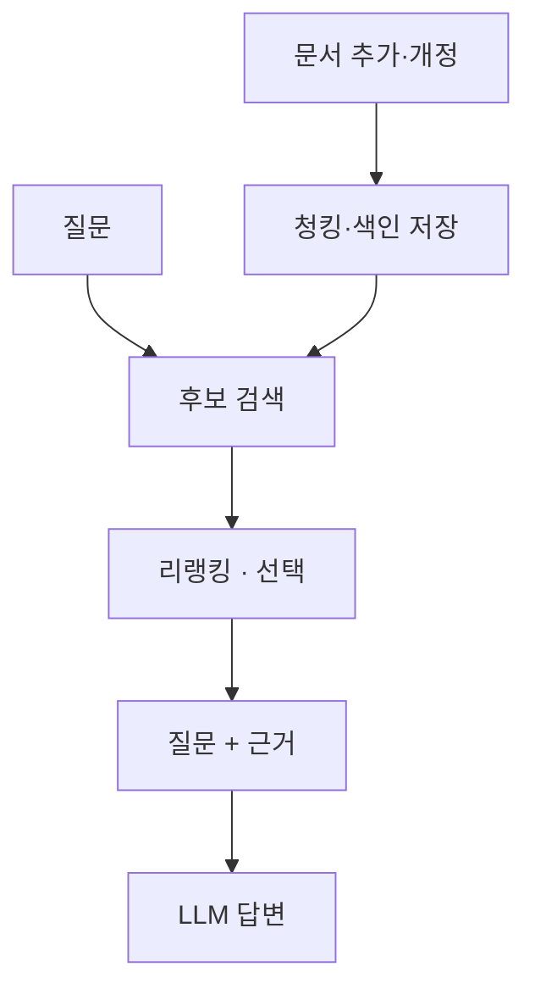

# RAG

질문에 필요한 외부 자료를 검색해 [[LLM]]의 입력에 넣고, 그 근거를 바탕으로 답하게 하는 구조입니다. 모델 가중치를 바꾸는 학습과 달리 **답변 시점의 입력을 보강**합니다. 벡터 검색뿐 아니라 키워드 검색으로도 구성할 수 있습니다.

## 두 파이프라인

- **색인 시점** — 문서 추출 → [[청킹과 문서 구조|청킹]] → 검색 표현 생성 → 저장. 문서가 추가·변경될 때 실행합니다.
- **질문 시점** — 후보 검색 → 필요하면 [[리랭킹]] → [[컨텍스트 구성|근거 구성]] → 답변. 질문마다 실행합니다.

## 검색 성공과 답변 성공은 다르다

가상의 규정이 ‘보증기간 1년, 침수 제외’라면 **보증기간 문서만 찾는 것으로는 부족**합니다. 예외까지 검색됐는지, 실제 입력에 포함됐는지, 모델이 조건에 맞게 답했는지를 나눠 확인해야 합니다.

## 관련

- [[RAG와 리랭킹 MOC]] — 전체 개념 지도
- [[임베딩과 벡터DB]] — 검색 표현과 저장소
- [[리랭킹]] — 후보에서 중요한 근거를 앞으로 올리는 단계
- [[RAG 평가]] — 검색·입력·답변 실패를 구분하는 방법
- [[6단계 폐쇄망 이관]] — 임베딩 모델·리랭커도 반입 대상

## 출처

[RAG 원 논문](https://arxiv.org/abs/2005.11401) — 검색기와 생성기를 결합한 구조. 이 노트는 검색으로 생성 입력을 보강하는 넓은 의미를 다룹니다.
