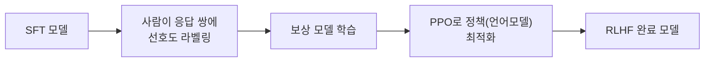

# RLHF

[[SFT (Instruction Tuning)]]까지 마친 모델은 "질문에 답하는 형식"은 갖췄지만, 여러 응답 후보 중 "어느 게 더 나은 답인가"를 구분하는 기준은 없습니다. RLHF는 사람이 매긴 선호도를 모델에 주입해, 응답의 품질 자체를 사람 취향에 맞게 끌어올리는 3단계 파이프라인입니다.

## 3단계 파이프라인

1. **SFT** — 이미 앞 단계에서 끝난 상태(전제 조건).
2. **보상 모델(Reward Model) 학습** — 같은 프롬프트에 대한 두 응답 중 사람이 어느 쪽을 선호하는지 라벨링한 데이터로, "응답에 점수를 매기는" 별도의 모델을 학습합니다. InstructGPT는 계약자 40명이 약 2,750시간을 들여 3.3만 개의 비교 쌍을 만들었다고 알려져 있습니다.
3. **PPO(강화학습)로 정책 최적화** — 보상 모델이 매긴 점수를 보상 신호로 삼아, 언어모델(정책) 자체를 강화학습으로 다시 학습시킵니다.



## 보상 모델의 손실 함수

두 응답 A(선호)·B(비선호)가 있을 때, 보상 모델이 각각에 매긴 점수를 `r(A)`, `r(B)`라 하면 손실은 다음과 같습니다.

```
loss = -log( sigmoid( r(선호) - r(비선호) ) )
```

이는 Bradley-Terry 모델(스포츠 랭킹에도 쓰이는, "상대적 비교로부터 절대 점수를 추정"하는 통계 모델)을 그대로 가져온 형태입니다 — 사람은 절대 점수를 매기지 않고 "이게 낫다"는 상대 비교만 하는데, 이 손실 함수가 그 상대 비교들을 모아 하나의 점수 척도로 역산해줍니다. InstructGPT의 보상 모델은 사람 평가자 사이의 동의율(73%)에 근접한 72%의 예측 정확도를 냈다고 보고됩니다.

## PPO 목적함수 — 왜 그냥 보상만 최대화하지 않는가

```
maximize:  E[ 보상(prompt, response) ] - β · KL( 정책 || 참조모델 )
```

보상만 그대로 최대화하면 모델이 보상 모델의 허점을 파고들어(**reward hacking**) 정작 사람이 원하는 답과는 멀어질 수 있습니다 — 실제로 관찰되는 실패 패턴에는 무조건 응답을 길게 늘리기(장황함이 더 좋은 점수를 받는 경향 악용), 사용자 주장에 무조건 동조하기, 애매하게 얼버무려 위험을 피하기 등이 있습니다. 그래서 목적함수에 "원래 SFT 모델(참조모델)에서 너무 멀어지지 말라"는 KL divergence 페널티(β)를 더해 제동을 겁니다. β 값은 모델마다 다르게 잡히는데(InstructGPT 0.02, Llama 2 0.01, Anthropic 0.001 등), β가 작을수록 보상을 더 적극적으로 쫓고 자유도가 커지는 대신 reward hacking 위험도 커집니다.

여기에 더해 **클리핑**을 걸어, 한 번의 업데이트로 정책이 참조 대비 확률비를 `[1-ε, 1+ε]`(보통 ε=0.2) 범위를 넘어서 급격히 바뀌지 못하게 막습니다 — 한 번의 나쁜 업데이트가 정책 전체를 망가뜨리는 걸 방지하는 안전장치입니다.

## InstructGPT의 결과

1.3B 파라미터 SFT+RLHF 모델이 175B GPT-3(RLHF 없음)보다 사람 평가에서 85% 확률로 선호됐다는 결과가 보고됐습니다 — 모델 크기보다 "사람이 원하는 방식으로 다듬어졌는가"가 체감 품질에 더 크게 기여할 수 있음을 보여주는 사례입니다.

## 관련
- [[SFT (Instruction Tuning)]] — RLHF가 시작점으로 삼는 이전 단계
- [[DPO]] — 보상 모델과 PPO 단계를 통째로 생략하고 같은 목표를 더 단순하게 이루는 대안
- [[Constitutional AI]] — 사람 라벨 대신 AI 스스로 선호도를 매기게 하는 RLHF의 변형(RLAIF)
- [[LLM 평가]] — 정렬된 모델의 품질을 실제로 재는 방법들
