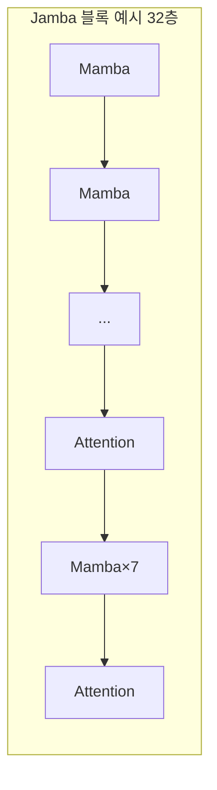

# SSM과 하이브리드 아키텍처 (Jamba)

[[Transformer]]의 [[Query·Key·Value|어텐션]]은 모든 과거 토큰과 매번 다시 내적을 하기 때문에 연산·[[KV 캐시]] 모두 시퀀스 길이에 대해 제곱(`O(N²)`)으로 커집니다. SSM(State Space Model)은 이 문제를 아예 다른 방식으로 풉니다 — 과거 전체를 매번 다시 들여다보는 대신, 고정 크기의 "상태" 하나에 지금까지의 정보를 압축해 담아 흘려보냅니다.

## SSM의 동작 원리

```
h_t = A·h_{t-1} + B·x_t     (상태 갱신)
y_t = C·h_t                  (출력)
```

`h_t`(은닉 상태)는 토큰이 몇 개가 들어왔든 크기가 고정돼 있습니다. 매 스텝 "이전 상태 + 지금 입력"만으로 다음 상태를 계산하므로, 추론 시 토큰 하나당 계산량이 시퀀스 길이와 무관하게 일정(`O(1)`)합니다 — 어텐션이 시퀀스가 길어질수록 매 토큰마다 더 많은 과거를 훑어야 하는 것과 정반대입니다. Mamba는 이 A·B·C 행렬을 입력에 따라 동적으로 바뀌게 만들어(selective SSM) 표현력을 끌어올린 대표적인 최신 SSM입니다.

## SSM의 대가 — 정확한 회상이 약하다

문제는 "고정 크기 상태에 압축해서 담는다"는 발상 자체입니다. 도서관 전체를 요약 카드 한 장에 눌러 담으면 개요는 남아도 특정 페이지의 정확한 문장은 사라지듯, SSM은 아주 오래전에 나온 특정 이름이나 숫자를 정확히 다시 끄집어내는 일(정밀한 컨텍스트 내 검색)에 약합니다. 반면 어텐션은 원리적으로 모든 과거 토큰의 Key·Value를 그대로 들고 있어서([[KV 캐시]]) 원하는 과거를 정확히 다시 찾아낼 수 있습니다.

## Jamba — 둘을 섞는 하이브리드

AI21의 Jamba는 "정확한 회상이 꼭 필요한 자리에만 어텐션을 남기고, 나머지는 SSM(Mamba)으로 채운다"는 절충안입니다. 대표 구성은 어텐션 층 1개당 Mamba 층 7개(1:7 비율)이고, 그중 일부 층(2층마다 한 번꼴)에는 [[MoE (Mixture of Experts)|MoE]]까지 얹습니다. 32층짜리 블록이라면 대략 Mamba 28층 + 어텐션 4층 + 그중 16층이 MoE를 쓰는 구성입니다.



## 메모리 절감 — 256K 컨텍스트에서

| 구성 | KV 캐시류 메모리 |
|---|---|
| 순수 Transformer(32층 풀 어텐션) | 메모리 오버플로우(약 128GB 이상 필요) |
| Jamba(하이브리드) | 어텐션 4층 KV 캐시 8.4GB + Mamba 고정 상태 3.7MB ≈ 16GB |

어텐션 층이 4개뿐이라 KV 캐시가 그만큼만 쌓이고, Mamba 층의 상태는 시퀀스 길이와 무관하게 고정 크기라 256K라는 긴 컨텍스트에서도 사실상 무시할 수 있는 크기입니다. 이 덕분에 Jamba는 80GB GPU 한 장으로 256K 컨텍스트를 돌릴 수 있는 반면, 같은 층 수의 순수 Transformer는 메모리가 넘쳐 불가능합니다.

## 관련
- [[Transformer]] — SSM이 대체하려는 기본 구조, 어텐션의 O(N²) 비용
- [[KV 캐시]] — 어텐션 층에만 여전히 남아있는 비용, Mamba 상태와 비교되는 대상
- [[MoE (Mixture of Experts)]] — Jamba가 일부 층에 함께 얹는 또 다른 최적화 축
- [[어텐션 변형 (GQA·MQA)]] — 어텐션 자체의 비용을 줄이는 다른(SSM과는 별개인) 접근들
