# Static Batching

[[배치]]를 운영하는 방식 중 하나. 요청 N개를 한 배치로 묶어 처리합니다. 배치 안에서 가장 긴 응답이 끝날 때까지 이미 끝난 다른 요청들도 자리를 비우지 못하고 대기해야 해서 GPU가 노는 시간이 생깁니다. [[Continuous Batching]]이 이 비효율을 해결하기 위해 나온 대안입니다.

```mermaid
gantt
    title Static Batching — 짧은 요청이 끝나도 배치 전체가 끝날 때까지 대기
    dateFormat X
    axisFormat %s
    section GPU 슬롯 1
    요청A (짧음, 3틱) :done, a1, 0, 3
    슬롯 비어있음 = 낭비 :crit, a2, 3, 8
    section GPU 슬롯 2
    요청B (김, 8틱) :done, b1, 0, 8
```

슬롯 1은 3틱 만에 끝났지만, 배치 전체가 슬롯 2(8틱)를 기다려야 해서 5틱만큼 GPU가 그냥 놀고 있습니다.

## 관련
- [[배치]] — Static Batching이 운영하는 대상
- [[Continuous Batching]] — Static Batching의 비효율을 해결한 방식
- [[처리량과 지연시간]] — 배칭 전략이 조절하는 트레이드오프
