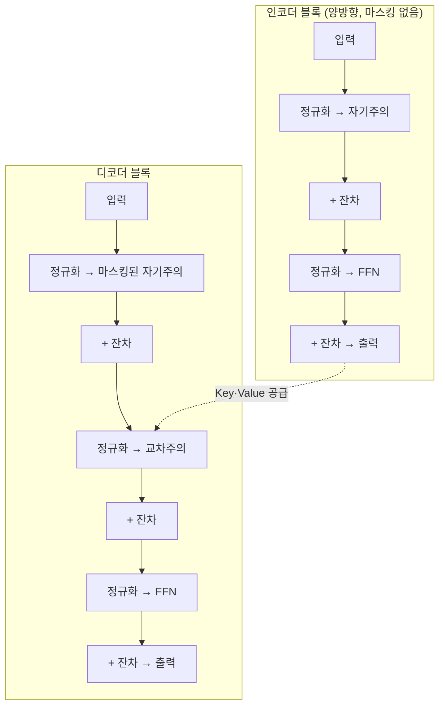

# Transformer

2017년 논문 "Attention Is All You Need"가 제안한 구조로, [[Query·Key·Value|어텐션]]만으로 시퀀스를 처리합니다. 지금 이 vault가 다루는 [[LLM]]·[[모델과 엔진]]·서빙 이론 전체가 이 구조 위에서 동작한다는 전제를 깔고 있습니다.

## 왜 RNN을 밀어냈는가 — 순차 계산이라는 병목

Transformer 이전 표준은 RNN이었습니다. RNN은 `h_t = f(h_{t-1}, x_t)` 형태로, t번째 상태를 계산하려면 반드시 t-1번째 상태가 먼저 나와야 합니다. 이 말은 1,024개 토큰짜리 문장을 처리하려면 GPU가 아무리 코어를 많이 갖고 있어도 1,024단계를 순서대로 밟아야 한다는 뜻입니다 — 병렬 코어 수천 개 중 사실상 하나만 쓰는 셈이라, GPU의 계산 능력 대부분이 낭비됩니다.

RNN은 이 순차성 때문에 두 가지 문제를 더 안고 있었습니다. 하나는 기울기 소실입니다. 50번째 토큰에 도달할 즈음엔 첫 토큰의 정보가 이미 50번의 비선형 변환을 거쳐 짓눌려 있어서, "작년 여름 교토 가는 비행기에서 읽은 책 제목이 뭐였지" 같은 장거리 의존 관계를 제대로 못 배웁니다(같은 현상이 신경망 일반에서 왜 생기는지는 [[역전파]] 참고). 다른 하나는 고정폭 병목입니다 — 인코더가 입력 문장 전체를 길이가 고정된 벡터 하나로 눌러 담아 디코더에 넘겨야 해서, 문장이 5토큰이든 500토큰이든 같은 크기의 병에 욱여넣어야 했습니다.

Transformer의 답은 단순합니다: 모든 위치가 다른 모든 위치를 **동시에** 참고하게 하자는 것입니다. `output_i = Σⱼ a_ij · v_j` 형태의 계산은 각 i가 서로 독립적이라, N×N 어텐션 행렬 전체를 한 번의 배치 행렬곱으로 채울 수 있습니다. 그 대가로 메모리는 O(N)에서 O(N²)로 늘어나지만(이 트레이드오프를 다루는 게 [[KV 캐시]]와 FlashAttention — 자세한 내용은 그쪽 노트), 순차 의존이 없다는 게 GPU 시대에는 훨씬 더 큰 이득이었습니다.

| 지표 | RNN | Transformer |
|---|---|---|
| 직렬 계산 깊이 | O(N) | O(1) |
| 메모리 | O(N) | O(N²) |
| 학습 속도(실측) | 기준 | 5~10배 |

직렬 깊이란 "반드시 순서대로 풀어야 하는 연산의 최장 사슬"입니다. GPU 코어가 아무리 많아도 이 사슬 길이만큼은 벽시계 시간이 소요되므로, RNN은 하드웨어를 아무리 늘려도 이 부분에서 못 벗어납니다.

## 여섯 가지 구성 요소

Transformer 블록 하나는 어텐션 말고도 이를 깊게 쌓을 수 있게 해주는 "비계(scaffolding)" 다섯 가지를 더 필요로 합니다.

1. **임베딩 + 위치 신호** — 토큰을 벡터로 바꾸고, 어텐션 자체는 순서를 모르므로 위치 정보를 별도로 주입합니다(자세한 내용은 [[위치 인코딩]]).
2. **자기주의(Self-Attention)** — [[Query·Key·Value]]·[[Multi-Head Attention]] 참고. 디코더에서는 미래 토큰을 가리는 [[Causal Masking]]이 추가됩니다.
3. **피드포워드(FFN)** — 위치별로 독립 적용되는 2층 MLP. 보통 은닉 차원을 4배로 확장했다가 되돌립니다.
4. **잔차 연결(Residual)** — `x + 부계층(x)` 형태. 층을 6개 이상 쌓으면 기울기가 사라지기 시작하는데, 잔차 연결은 기울기가 부계층을 건너뛰고 그대로 흐를 수 있는 지름길을 만들어 이를 막습니다.
5. **정규화(LayerNorm/RMSNorm)** — 잔차 스트림에 값이 계속 누적되며 커지는 걸 층마다 다시 안정된 범위로 눌러줍니다. 최근 모델은 평균을 빼는 연산을 생략한 RMSNorm을 선호합니다(계산량이 조금 더 적으면서 성능 차이는 거의 없음).
6. **교차주의(Cross-Attention, 디코더 전용)** — Query는 디코더 자신에게서, Key·Value는 인코더 출력에서 가져옵니다. 인코더가 이해한 내용이 디코더로 넘어가는 유일한 통로입니다.

## 인코더-디코더 중 무엇을 쓸지는 작업이 정한다

| 필요한 것 | 구조 | 대표 사례 |
|---|---|---|
| 분류·임베딩·이해 위주 | 인코더만 | [[BERT와 MLM\|BERT]], ModernBERT |
| 대화·생성·추론 | 디코더만 | [[GPT와 인과적 언어모델링\|GPT]], Llama, Claude |
| 입력→출력 변환(번역·요약 등) | 인코더-디코더 | [[인코더-디코더 모델\|T5, BART]] |

2022년 이후 서비스형 LLM 대부분이 디코더 전용 구조로 수렴한 이유는, 하나의 스택으로 "이해"와 "생성"을 모두 처리할 수 있어 확장이 더 단순하기 때문입니다. 지금 이 vault의 서빙 노트들([[Prefill과 Decode]], [[KV 캐시]] 등)이 전부 디코더 전용 구조를 전제로 쓰인 것도 같은 이유입니다.

## 파라미터는 대부분 어텐션과 FFN에 있다

블록 하나의 파라미터 수는 대략 `d_model` 차원에 대해 멀티헤드 어텐션이 `4d²`, FFN이 `(확장비 r)×d²`규모입니다. 예를 들어 d=4096, r≈2.6, 층 32개 규모(Llama 3 8B급)면 전체 파라미터가 약 70억 개로 맞아떨어집니다 — [[파라미터 수]] 노트에서 다루는 "7B"라는 숫자가 실제로 어디에 쌓여 있는지가 바로 이 블록 반복입니다.

## 관련
- [[Query·Key·Value]] — 이 구조의 핵심 연산
- [[Multi-Head Attention]] — 어텐션을 여러 헤드로 쪼개는 이유
- [[위치 인코딩]] — 어텐션이 놓치는 순서 정보를 보충하는 장치
- [[Causal Masking]] — 디코더가 미래를 못 보게 막는 장치
- [[BERT와 MLM]] · [[GPT와 인과적 언어모델링]] · [[인코더-디코더 모델]] — 이 구조를 인코더/디코더/양쪽으로 나눠 쓴 세 갈래
- [[역전파]] — RNN이 겪던 기울기 소실 문제의 근본 원인
- [[파라미터 수]] — 이 블록이 반복되며 쌓이는 것
