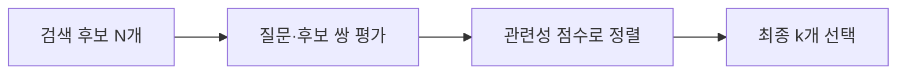

# 리랭킹

검색된 후보를 다시 평가해 순서를 바꾸는 단계입니다. 빠른 검색으로 후보를 확보하고, 더 많은 계산을 쓰는 모델로 **질문에 필요한 근거를 상위에 배치**합니다. 대표적으로 [[Bi-Encoder와 Cross-Encoder|Cross-Encoder]]를 사용합니다.

## 동작

- **N** — 리랭커가 평가할 후보 수. 늘리면 후보 범위와 평가 비용이 함께 커집니다.
- **k** — 최종 선택 수. 늘리면 LLM에 넣는 근거와 입력 길이가 커집니다.

예를 들어 침수 예외 조항이 후보 50개 중 32위라면, 상위 5개만 사용하는 답변에서는 빠집니다. 리랭커가 이를 2위로 올리면 최종 근거에 포함됩니다. 숫자는 설명용 예시입니다.

## 왜 처음부터 전체 문서를 평가하지 않나

문서 임베딩은 미리 계산해 재사용할 수 있지만, Cross-Encoder의 점수는 **질문이 바뀔 때마다 각 문서와 다시 계산**해야 합니다. 전체 문서 대신 좁혀진 후보에 적용해 비용을 줄입니다.

## Recall과의 관계

- 후보에 없던 문서는 복구하지 못합니다. 후보 전체의 Recall@N은 그대로입니다.
- 후보 아래쪽의 정답을 올리면 **최종 Recall@k는 개선될 수 있습니다.**
- 잘못 정렬하면 성능이 떨어질 수도 있으므로 같은 후보로 전후를 비교합니다.

## 관련

- [[Precision과 Recall]] — Recall@N과 Recall@k의 계산 예시
- [[RRF]] — 본문을 평가하지 않고 기존 순위를 합치는 방식
- [[BGE Reranker]] — 관련성 점수를 내는 모델 예시
- [[컨텍스트 구성]] — 정렬 뒤 중복·입력 길이를 처리하는 단계
- [[RAG 평가]] — 리랭커 효과를 분리해 측정하는 방법

## 출처

[Sentence Transformers — Retrieve & Re-Rank](https://www.sbert.net/examples/sentence_transformer/applications/retrieve_rerank/README.html)
