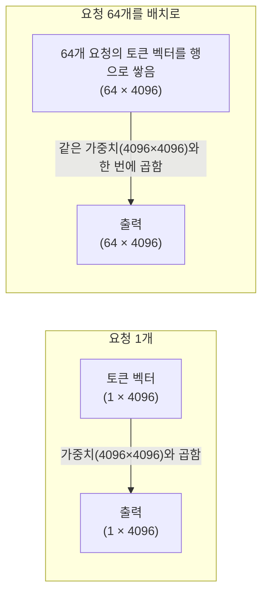

# 배치

여러 개의 요청(질문)을 한 개씩 따로 처리하지 않고, 한 번에 묶어서 GPU에 동시에 넣고 처리하는 단위입니다. "배치 크기"는 이렇게 한 번에 묶는 요청의 개수를 말합니다.

행렬곱은 원래 여러 행을 동시에 계산하도록 설계되어 있어서, 요청 1개를 처리하나 64개를 처리하나 GPU 입장에서는 "행렬에 행이 몇 개 더 있는가"의 차이일 뿐입니다. 반면 [[가중치]]를 메모리에서 읽어오는 시간은 요청 개수와 거의 무관하게 고정적입니다. 그래서 배치를 키우면 같은 가중치 읽기 한 번으로 더 많은 요청을 처리하게 되어 [[처리량과 지연시간|처리량]]이 오릅니다.

## 실제로는 어떻게 하나로 합쳐지는가

한 스텝에서 토큰 하나를 처리한다는 건, 그 토큰의 현재 상태 벡터를 가중치 행렬과 곱하는 일입니다. 요청 1개라면 `토큰 벡터(1×4096) × 가중치(4096×4096) → 출력(1×4096)`. 요청 64개를 배치로 묶는다는 건, 각 요청의 "지금 이 순간의 토큰 벡터" 64개를 행으로 쌓아 하나의 행렬로 만드는 것뿐입니다.

[[VRAM]]에서 가중치를 읽어오는 시간은 두 경우가 거의 같지만, 그 한 번의 읽기로 처리하는 일의 양이 64배가 됩니다.

이 "행으로 쌓기"가 모든 계산에 똑같이 적용되지는 않습니다. Q/K/V 프로젝션이나 MLP 같은 레이어는 토큰 하나하나를 독립적으로 다루기 때문에 이렇게 깔끔하게 쌓입니다. 하지만 어텐션 자체([[Query·Key·Value]])는 다릅니다 — 요청마다 자기 자신의 [[KV 캐시]](자기 대화 히스토리)에만 어텐션을 걸어야 하고, 요청마다 히스토리 길이도 제각각이라 하나의 균일한 행렬로 뭉뚱그릴 수 없습니다. [[PagedAttention]]이 페이지 단위로 KV 캐시를 관리하는 이유가 바로 이 "제각각 길이가 다른 캐시들을 배치 안에서 효율적으로 다뤄야 한다"는 문제 때문입니다.

다만 배치를 무한정 키울 수는 없습니다 — 요청마다 [[KV 캐시]]가 따로 필요해 VRAM이 부족해지고, 배치 안의 모든 요청은 그 스텝이 끝날 때까지 서로를 기다리게 되어 [[처리량과 지연시간|지연시간]]이 늘어납니다. 실제로 요청을 배치에 담고 빼는 전략이 [[Static Batching]]과 [[Continuous Batching]]입니다.

## 관련
- [[가중치]] — 배치가 재사용하는 대상
- [[VRAM]] — 배치 크기가 늘어도 읽기 시간이 거의 그대로인 이유
- [[Query·Key·Value]] · [[PagedAttention]] — 배치로 깔끔하게 안 합쳐지는 어텐션 부분
- [[Static Batching]] · [[Continuous Batching]] — 배치를 실제로 운영하는 두 가지 전략
- [[처리량과 지연시간]] — 배치 크기가 조절하는 트레이드오프
