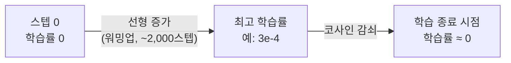

# 사전학습(Pretraining)

[[GPT와 인과적 언어모델링]]에서 다루는 "다음 토큰 예측"을 실제로 대량의 텍스트에 대해 반복해서 가중치를 처음부터 학습시키는 단계입니다. 모델이 문법·상식·세계 지식을 얻는 건 전부 이 단계에서고, 이후 [[SFT (Instruction Tuning)]]·[[RLHF]] 같은 후속 단계는 이미 갖춰진 지식을 "어떻게 답할지"의 형태로 다듬는 역할만 합니다 — 사전학습이 지식을 주고, 후속 단계는 매너를 준다고 정리할 수 있습니다.

## 학습 목표와 손실 함수

입력 시퀀스 `[t₀, t₁, ..., t_{N-1}]`이 주어지면, 모델은 각 위치에서 바로 다음 토큰 `[t₁, t₂, ..., t_N]`을 맞추도록 학습됩니다 — 배치를 만들 때 입력과 정답(target)은 사실 같은 시퀀스를 한 칸 어긋나게 잘라낸 것뿐입니다. 손실은 각 위치에서 "정답 토큰에 모델이 매긴 확률의 로그값에 마이너스를 붙인" 교차 엔트로피를 전체 위치에 대해 평균 낸 값입니다.

```
loss = -mean( log P(정답 토큰 | 그 앞의 모든 토큰) )
```

학습 초반 손실은 대략 `ln(어휘 크기)` 근처에서 시작합니다 — 아무것도 모르는 모델이 어휘 전체에 균등한 확률을 매기는 상태와 같기 때문입니다(예: 어휘 5만 개면 초기 손실이 약 10.8). 학습이 진행되며 이 값이 점점 줄어드는 게 "th 다음엔 e가 자주 온다"처럼 흔한 패턴부터 익혀나가는 과정입니다.

## 학습 루프 4단계

1. **순전파** — 배치를 [[Transformer]] 블록들에 통과시켜 각 위치의 다음 토큰 확률분포(로짓)를 구함.
2. **손실 계산** — 위 교차 엔트로피.
3. **역전파** — [[역전파]]로 모든 파라미터에 대한 기울기를 구함.
4. **옵티마이저 스텝** — Adam 등으로 가중치를 갱신.

## 학습률 워밍업과 코사인 감쇠 — 왜 처음부터 최고 학습률을 안 쓰는가

학습 시작 직후 가중치는 아직 무작위에 가까워 기울기가 불안정합니다. 이 상태에서 처음부터 목표 학습률(예: 3×10⁻⁴)을 그대로 쓰면 손실이 발산해버리는 경우가 흔합니다. 그래서 처음 수천 스텝(예: 2,000스텝) 동안은 학습률을 0에서 목표치까지 선형으로 서서히 올리는 **워밍업**을 거치고, 그 이후로는 코사인 곡선을 따라 서서히 낮추는 **감쇠**를 적용합니다. 학습률을 상수로 고정하면 후반부에 손실이 진동하며 잘 안정되지 않는데, 워밍업+코사인 감쇠 패턴은 지금 나오는 주요 LLM 대부분이 공유하는 표준 레시피입니다. 학습률 스케줄 자체의 일반 이론은 [[학습률 스케줄]] 참고.



## 사전학습이 후속 단계와 갈리는 지점

사전학습은 "모든 토큰에 대해" 손실을 계산합니다 — 텍스트의 어느 자리든 다음 토큰을 못 맞히면 벌점입니다. 반면 [[SFT (Instruction Tuning)]]은 지시문 부분은 손실 계산에서 마스킹하고 응답 부분만 학습합니다. 또한 사전학습은 데이터 규모(수조 토큰)에 비해 학습률이 상대적으로 높고(3e-4 안팎) 딱 1 에폭만 도는 것이 일반적인데, SFT는 데이터가 훨씬 적은 대신(수만 개) 학습률을 10배 이상 낮추고 여러 에폭을 돕니다 — 이미 갖춰진 지식을 깨지 않으면서 응답 형식만 바꾸려는 목적 때문입니다.

## 관련
- [[GPT와 인과적 언어모델링]] — 사전학습이 반복해서 학습시키는 목표 자체
- [[사전학습 데이터 파이프라인]] — 이 단계에 투입되는 데이터가 만들어지는 과정
- [[역전파]] · [[손실 함수]] · [[학습률 스케줄]] — 학습 루프를 구성하는 기초 이론
- [[SFT (Instruction Tuning)]] — 사전학습 다음에 오는, 손실 계산 범위와 학습률이 다른 단계
- [[스케일링 법칙]] — 모델 크기와 학습 토큰 수를 얼마나 늘려야 하는가
