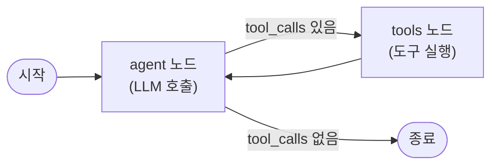

# 에이전트 상태 관리 (LangGraph)

에이전트를 그냥 `while True` 루프로 짜면 실행 중간에 실패했을 때 이어서 재개할 방법이 없고, 어디서 왜 잘못됐는지 들여다볼 방법도 마땅치 않습니다. LangGraph는 이 암묵적인 반복문을 State(상태)·Node(노드)·Edge(엣지)로 이루어진 명시적인 그래프로 바꿔서, 체크포인트·중단·스트리밍·디버깅을 가능하게 만듭니다.

## 세 가지 구성 요소

- **State** — 그래프를 따라 흐르는 타입이 정해진 데이터. 각 노드는 상태 전체가 아니라 "부분 업데이트"만 반환하고, 이를 여러 필드에 병합하는 규칙이 리듀서(reducer)입니다. 기본은 덮어쓰기라서, 대화 기록처럼 계속 쌓여야 하는 리스트 필드에는 append 리듀서를 명시적으로 지정해야 합니다 — 이걸 빼먹는 게 LangGraph 구현에서 가장 흔한 실수로 꼽힙니다.
- **Node** — 상태를 받아 부분 업데이트를 반환하는 함수. 모델 호출, [[함수 호출 (Tool Use)|도구 실행]], 사람의 검토 대기 등 실행의 한 단계 하나하나가 노드입니다.
- **Edge** — 노드 사이의 전이. 무조건 한 노드로 가는 정적 엣지와, 상태를 보고 다음 노드를 결정하는 조건부 엣지가 있습니다.

## 프로덕션에서 필요한 네 가지 기능

- **체크포인트** — 노드가 전이될 때마다 전체 상태를 저장소(메모리·Postgres·Redis 등)에 영속화합니다. 같은 `thread_id`로 다시 호출하면 멈췄던 지점부터 이어집니다.
- **중단(Interrupt)** — 특정 노드 경계에서 실행을 멈춥니다(`interrupt_before`/`interrupt_after`). 상태는 그대로 남아 있다가, 나중에 재개 명령으로 이어받습니다.
- **스트리밍** — 상태 변화 델타(`updates`), 모델이 생성하는 토큰(`messages`), 전체 스냅샷(`values`) 세 모드로 실행 중 결과를 흘려보내 실시간 UI에 반영합니다.
- **타임트래블** — 전체 체크포인트 히스토리를 조회하고, 과거의 특정 체크포인트에서 새로 분기해 다시 실행할 수 있습니다. 대화를 처음부터 다시 돌리지 않고도 "이 지점에서 무슨 일이 있었는지" 디버깅하거나 회귀 테스트를 할 수 있습니다.

## 최소 ReAct 그래프

[[프롬프트 엔지니어링]]에서 다룬 ReAct(Thought→Action→Observation) 루프는 LangGraph로는 아주 단순한 그래프 하나로 표현됩니다 — LLM을 호출하는 `agent` 노드, 도구를 실행하는 `tools` 노드, `agent`에서 tool_calls가 있으면 `tools`로 없으면 종료(END)로 보내는 조건부 엣지, 그리고 `tools`에서 다시 `agent`로 돌아가는 정적 엣지입니다.

체크포인트 없이 배포하지 말 것, 부작용(실제 API 호출·결제 등)이 일어나기 전에 중단 지점을 두는 것, 리스트 필드에는 항상 올바른 리듀서를 쓰는 것이 이 프레임워크가 강조하는 핵심 원칙입니다. 다루려는 작업의 노드를 미리 하나하나 나열할 수 없다면, 애초에 그래프 기반 에이전트로 풀 문제가 아니라는 신호이기도 합니다.

## 관련
- [[함수 호출 (Tool Use)]] — `tools` 노드가 실제로 실행하는 대상
- [[프롬프트 엔지니어링]] — 이 그래프가 구현하는 ReAct 패턴의 원형
- [[MCP (Model Context Protocol)]] — 이 그래프의 도구를 표준화된 방식으로 공급하는 방법
