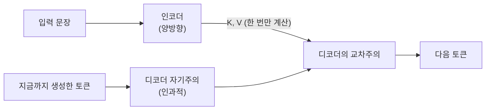

# 인코더-디코더 모델

[[BERT와 MLM|BERT]]가 이해에, [[GPT와 인과적 언어모델링|GPT]]가 생성에 특화됐다면, T5·BART 같은 인코더-디코더 모델은 애초에 "입력 하나를 받아 다른 형태의 출력을 내놓는" 작업 — 번역, 요약, 음성 인식 — 을 위해 [[Transformer]]의 두 절반을 그대로 붙여 쓰는 구조입니다. 인코더가 입력을 통째로 이해해 표현으로 압축하고, 디코더는 그 표현을 곁눈질(교차주의)하면서 출력을 순차적으로 생성합니다.

## T5 — 모든 작업을 "텍스트를 텍스트로" 바꾸기

T5(2019)의 핵심 아이디어는 분류든 번역이든 요약이든 전부 "텍스트 입력 → 텍스트 출력" 형식으로 통일해버리자는 것입니다. 사전학습 방식은 **Span Corruption**입니다 — 입력에서 무작위 구간(평균 3토큰 정도)을 통째로 골라 `<extra_id_0>` 같은 특수 토큰 하나로 뭉개고, 디코더는 그 자리에 원래 뭐가 있었는지만 예측합니다.

```
원본: The quick brown fox jumps over the lazy dog
입력: The quick <extra_id_0> fox jumps <extra_id_1> dog
정답: <extra_id_0> brown <extra_id_1> over the lazy
```

전체 토큰의 약 15%가 이런 식으로 가려집니다. [[BERT와 MLM|BERT의 MLM]]은 가려진 토큰 하나하나를 개별적으로 다 예측해야 하는 반면, T5는 뭉개진 구간 전체를 하나의 짧은 시퀀스로만 예측하면 되므로 예측해야 할 대상 자체가 훨씬 적습니다 — 논문 표현을 빌리면 "더 저렴한 학습 신호"입니다.

## BART — 문장을 망가뜨렸다가 원본으로 복원

BART(2019)는 접근이 조금 다릅니다. 입력을 다섯 가지 방식(토큰 마스킹, 토큰 삭제, 구간 채워넣기, 문장 순서 뒤섞기, 문서 회전)으로 손상시킨 뒤, 디코더가 손상되기 전 **원본 전체**를 복원하도록 학습합니다. T5가 뭉개진 구간만 맞히면 되는 것과 달리 BART는 시퀀스 전체를 다시 만들어내야 하므로 사전학습 계산 비용이 더 큽니다. 다섯 가지 손상 방식 중 구간 채워넣기와 문장 순서 뒤섞기를 함께 쓴 조합이 가장 성능이 좋았다고 알려져 있습니다.

## 교차주의 — 인코더와 디코더를 잇는 유일한 통로

디코더의 각 블록에는 [[Multi-Head Attention|자기주의]] 말고 교차주의(cross-attention)가 하나 더 있습니다. Query는 디코더 자신에게서 나오지만 Key·Value는 인코더의 최종 출력에서 가져옵니다. 인코더는 입력 하나당 딱 한 번만 실행하면 되므로, 이 인코더 출력(K·V)을 한 번 계산해두고 디코더가 토큰을 여러 개 생성하는 내내 재사용할 수 있습니다 — 입력이 길수록 이 캐싱의 이득이 커집니다.



## 2026년, 언제 인코더-디코더를 아직도 쓰는가

| 작업 | 인코더-디코더가 유리한 이유 |
|---|---|
| 번역 | 출력 분포가 명확해 빔서치 같은 탐색 기법이 잘 먹힘 |
| 음성-텍스트(Whisper) | 입력(오디오)과 출력(텍스트)의 모달리티 자체가 다름 |
| 구조화된 정보 추출 | "텍스트를 텍스트로" 방식이 프롬프트 설계를 단순하게 함 |

반대로 대화나 복잡한 추론처럼 문맥이 긴 작업은 2022년 이후 [[GPT와 인과적 언어모델링|디코더 전용]] 구조가 압도했습니다. 지시문 튜닝된 디코더 전용 LLM 하나가 프롬프트만으로 번역·요약·추출을 전부 처리할 수 있게 되면서, 스택 두 개(인코더+디코더)를 따로 유지할 이유가 입력·출력 모달리티가 아예 다른 경우(음성, 이미지)로 좁혀졌기 때문입니다. Flan-T5처럼 작업 이름을 입력 텍스트 안에 접두어로 넣어 하나의 모델이 여러 작업을 처리하게 만든 방식은, 이후 지시문 튜닝된 디코더 모델들의 원형이 되기도 했습니다.

## 관련
- [[Transformer]] — 인코더와 디코더 두 절반이 원래 나온 자리
- [[BERT와 MLM]] — 인코더 절반만 쓴 경우와의 비교
- [[GPT와 인과적 언어모델링]] — 디코더 전용으로 수렴한 현재 주류와의 비교
- [[KV 캐시]] — 교차주의의 인코더 K·V 캐싱과 원리가 같은 개념
