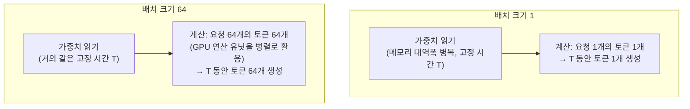

# 처리량과 지연시간

배치를 키우면 GPU당 처리량(throughput)은 오르지만, 개별 요청 입장에서는 다른 요청과 같이 대기하는 시간이 늘어 지연시간(latency)이 나빠집니다. 서빙 설정에서 최대 배치 크기·최대 대기 시간을 튜닝하는 게 결국 이 트레이드오프를 조절하는 일입니다 (vLLM의 `--max-num-seqs`가 대표적인 손잡이). 챗봇처럼 응답 체감이 중요하면 지연시간 쪽으로, 배치 문서 요약처럼 응답 속도가 안 중요하면 처리량 쪽으로 기울입니다.

## 왜 배치를 키우면 처리량이 오르는가

[[Prefill과 Decode|Decode]]는 메모리 대역폭 병목입니다 — 토큰 하나를 생성할 때마다 모델 [[가중치]] 전체를 메모리에서 읽어와야 하는데, 그 가중치로 하는 실제 계산량은 GPU 연산력에 비하면 작아서 연산 유닛 대부분이 놀고 있습니다. 그런데 가중치는 모든 요청이 공유합니다 — 한 번 읽어온 가중치로 요청 1개의 토큰만 계산하지 않고 [[배치]]를 키워 요청 64개의 토큰을 동시에 계산하면, 읽기 시간은 거의 그대로인데 그 시간에 처리하는 일의 양이 64배로 늘어납니다.

트럭이 창고까지 왕복하는 데 30분 걸린다고 하면, 상자 1개만 싣고 오나 64개를 싣고 오나 왕복 시간은 거의 똑같습니다 — 그러면 64개씩 실어 나르는 쪽이 시간당 배달량이 훨씬 높습니다. Decode에서 "가중치 읽기"가 이 왕복, "토큰 계산"이 상자에 해당합니다. 다만 배치가 계속 커지면 결국 GPU의 실제 연산력(FLOPs)을 다 써버리는 지점이 오고, 거기서부터는 더 키워도 처리량이 오르지 않습니다 — 메모리 병목이 연산 병목으로 넘어가는 지점입니다. 동시에 요청마다의 [[KV 캐시]]도 다 메모리에 올라와 있어야 하므로 VRAM이 배치 크기의 또 다른 상한선이 됩니다.

## 관련
- [[배치]] · [[가중치]] — 이 트레이드오프의 재료가 되는 두 기초 개념
- [[Continuous Batching]] — 이 트레이드오프를 실제로 조절하는 메커니즘
- [[Prefill과 Decode]] — 트레이드오프가 발생하는 근본 원인
- [[전통 서버 서빙과의 차이]] — 일반 API 서버에는 없는 이 트레이드오프의 특수성
