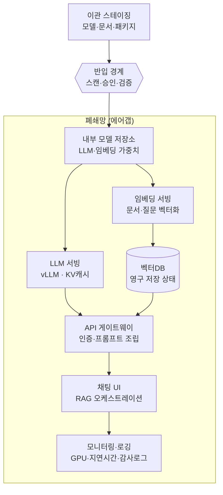

# 표준 아키텍처

폐쇄망 LLM 서비스의 표준 구성을 한 장으로 정리한 다이어그램입니다. 핵심 원칙은 [[폐쇄망]]에서 다룬 것처럼, 점선 경계 안의 어떤 구성요소도 스스로 인터넷에 나가려 하지 않아야 한다는 것입니다.

[[6단계 폐쇄망 이관|이관 스테이징]]에서 반입 경계를 거쳐 폐쇄망에 들어가면, 내부 모델 저장소에서 [[vLLM|LLM 서빙]]과 [[임베딩과 벡터DB|임베딩 서빙]]으로 갈라집니다. 임베딩 서빙은 [[RAG|문서를 색인]]해 벡터DB에 쌓고, LLM 서빙과 벡터DB는 다시 API 게이트웨이로 모여 채팅 UI를 거쳐 모니터링·로깅으로 이어집니다. 이 중 진짜 "모델 서빙"이라 부를 수 있는 건 LLM 서빙과 임베딩 서빙뿐이라는 구분은 [[모델 서빙과 서비스 배포]] 참고.

## 관련
- [[폐쇄망]] — 이 다이어그램이 지키는 기본 원칙
- [[6단계 폐쇄망 이관]] — 반입 경계를 실제로 통과하는 실습 단계
- [[RAG]] — 임베딩 서빙·벡터DB가 만드는 흐름의 배경
- [[모델 서빙과 서비스 배포]] — "모델 서빙"이 이 그림 중 일부일 뿐이라는 구분
- [[vLLM]] · [[임베딩과 벡터DB]] — 다이어그램 속 핵심 서빙 컴포넌트
