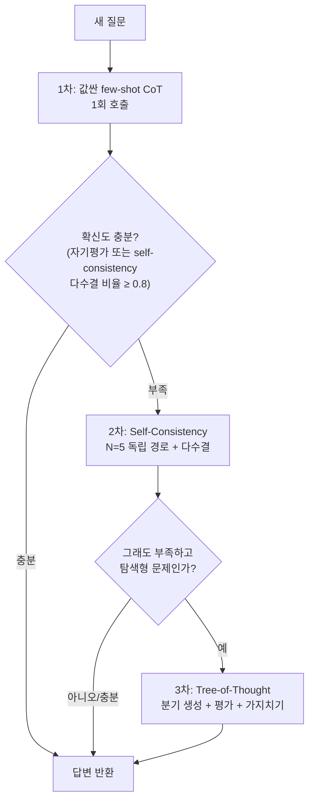

# 프롬프트 엔지니어링

LLM API 호출은 사실 System 메시지·User 메시지·(일부 모델만 지원하는) Assistant 프리필 세 조각을 조립하는 일입니다. System 메시지는 모델의 정체성과 행동 제약을 정의하고 매 턴 반복 전달되며, 대부분의 모델이 여기 가장 강하게 반응합니다(다만 대화가 길어지면 지시를 얼마나 오래 붙드는지는 모델마다 편차가 큽니다). User 메시지는 실제 과제 그 자체지만, System 메시지 없이 User 메시지만 던지면 과제가 충분히 제약되지 않아 모델은 "그럴듯한 평균적인 답"을 고릅니다. Assistant 프리필은 응답의 시작 부분을 미리 채워 형식을 강제하는 기법으로, 예를 들어 마지막 assistant 메시지를 `{"content": "```json\n{"}`로 채워두면 모델이 전문(preamble) 없이 곧장 JSON을 이어 씁니다. Anthropic 계열은 이 프리필을 API 차원에서 지원하지만 OpenAI 계열은 지원하지 않습니다.

결국 프롬프트 엔지니어링이 하는 일은 "이 요청에 대해 모델의 학습 데이터 중 어느 부분집합을 활성화시킬 것인가"를 조절하는 것입니다. "마케팅 이메일을 써줘"는 학습 데이터 전체에서 마케팅 이메일에 해당하는 평균적인 품질을 끌어오지만, 형식·분량·독자·포함할 내용과 제외할 내용·예시 하나까지 못박으면 그만큼 좁고 질 좋은 부분집합만 활성화됩니다.

## 역할 프롬프팅 — 마법이 아니라 분포 좁히기

"너는 Stripe의 시니어 백엔드 엔지니어야" 같은 역할 지정은 신비로운 능력을 부여하는 게 아니라, 학습 데이터에서 그 역할에 해당하는(보통 더 전문적인) 텍스트 분포로 샘플링을 편향시키는 것뿐입니다. "친절한 어시스턴트" 같은 범용 역할은 평균적인 응답을, "시니어 파이썬 개발자"처럼 구체적인 역할은 더 나은 응답을 끌어냅니다. 다만 특정화에도 한계가 있어서, 너무 좁고 희귀한 역할(예: "2004년식 이 회사의 레거시 코볼 유지보수 담당자")은 학습 데이터에 해당 사례가 거의 없어 오히려 없는 사실을 지어내는 쪽으로 흐릅니다.

## 형식·제약을 명시적으로 박아두기

모호함은 전부 "모델이 알아서 고르는 분기점"이 됩니다. 다음 다섯 가지를 명시하면 그 분기점 대부분이 없어집니다 — 출력 형식(불릿·JSON·번호 매기기·문단), 분량(단어 수·문장 수), 독자 수준, 포함할 것과 제외할 것, 원하는 출력의 구체적 예시 하나. "이 글을 정확히 3개 불릿으로 요약해줘. 각 불릿은 한 문장, 20단어 이내. 정량적 발견 위주로, 기술 독자 대상으로" 정도의 구체성이 실제로 결과를 바꿉니다.

제약은 방향에 따라 세 종류로 나뉩니다. "~하지 마라"는 부정 제약(넓은 출력 영역을 통째로 잘라냄), "항상 ~해라"는 긍정 제약(모든 응답에 구조를 강제함), "X면 Y"는 조건 제약(예외 상황을 체계적으로 처리)입니다. 부정 제약이 의외로 강력한데, "절대 사과문으로 시작하지 마라" 한 줄이 "죄송하지만..."류의 흔한 서두를 통째로 없애버립니다.

출력 형식을 JSON·XML로 API 차원에서 강제해야 한다면 이 노트보다 [[구조화된 출력]]을, 모델이 특정 함수를 호출하게 만드는 경우는 [[함수 호출 (Tool Use)]]을 참고하세요 — 둘 다 프롬프트로 "부탁"하는 수준을 넘어 형식을 강제하는 방법을 다룹니다. temperature·top-p로 출력의 무작위성을 조절하는 부분은 [[샘플링 방법]]에서 다루는 확률분포 샘플링 문제 그대로입니다 — 정답이 하나인 과제(추출·분류·코드)는 0에 가깝게, 다양성이 필요한 과제(브레인스토밍)는 0.7~1.0으로 둡니다.

## Few-shot — 예시는 압축된 지시문이다

예시를 하나도 안 주는 zero-shot과 달리, few-shot은 입력-출력 예시 몇 개를 프롬프트에 끼워 넣습니다. 복잡한 추론 과제에서는 zero-shot 대비 정확도가 10~25%p 오르지만, 단순 분류 과제는 2%p 이내로 차이가 미미합니다 — 예시가 실제로 도움이 되는 건 "규칙을 말로 설명하기 어려운 과제"이지 "규칙이 이미 명확한 과제"가 아니라는 뜻입니다.

예시 개수는 3~5개가 실무 기준입니다. 2개 이하는 패턴을 특정 짓기에 신호가 부족하고, 6개 이상부터는 정확도 개선이 거의 없이 컨텍스트 토큰만 소모합니다(다중 레이블 분류라면 레이블마다 최소 1개씩). 예시를 고르는 방법도 성능에 영향을 주는데, 목표 입력과 임베딩 공간에서 가까운 예시를 고르면(무작위 선택 대비) 분류 과제에서 5~15%p 개선이 보고됩니다. 레이블 다양성(모든 출력 범주를 예시에 고르게 포함)과 난이도 매칭(예시 난이도를 목표 문제 수준에 맞춤)도 함께 고려합니다.

## Chain-of-Thought — 추론을 토큰으로 꺼내서 계산 깊이를 늘리기

CoT 없이 바로 답하게 하면, 모델은 입력을 처리하는 단 한 번의 순전파 안에 모든 추론을 압축해서 끝내야 합니다. "단계별로 생각해봐(Let's think step by step)" 한 문장을 붙이면(zero-shot CoT), 모델이 중간 추론을 실제 토큰으로 하나씩 뱉어내고 — 각 토큰이 다음 토큰 생성의 컨텍스트가 되므로, 순전파 한 번의 깊이를 여러 스텝으로 늘리는 효과를 냅니다. 예시에 추론 과정까지 포함시키는 few-shot CoT는 zero-shot CoT보다 한 단계 더 강력한데, 모델이 "정답"만이 아니라 "기대되는 추론 형식" 자체를 예시로 보기 때문입니다.

초등 수준 수학 문제 벤치마크(GSM8K)에서 zero-shot 94% → zero-shot CoT 97% → few-shot CoT 98% 순으로 오른다는 결과가 보고됩니다. 반면 "프랑스 수도는?"처럼 한 번에 답이 나오는 단순 사실 질의나 고속·저복잡도 과제에는 CoT가 오히려 불필요한 추론 오버헤드(토큰당 50~200개)만 늘립니다. 참고로 OpenAI의 o-시리즈나 DeepSeek-R1처럼 이미 내부적으로 추론을 수행하는 "추론 모델"에는 "단계별로 생각해봐"를 덧붙이는 게 군더더기이거나 역효과입니다 — 답변 이전에 이미 내부 추론을 거친 모델이기 때문입니다.

## Self-Consistency — 여러 추론 경로에 다수결 붙이기

CoT 경로 하나에는 추론 오류가 섞일 수 있습니다. temperature>0으로 같은 문제를 N번(보통 5번, 최소 3번, 10번을 넘어가면 개선이 크지 않음) 독립적으로 풀게 하고 최종 답에 다수결을 적용하면, 개별 경로의 오류가 서로 상쇄됩니다. PaLM 540B 모델의 GSM8K 실험에서는 단일 CoT 56.5% → self-consistency(N=40) 74.4%까지 오른 사례가 보고될 만큼 효과가 크지만, 이미 정확도가 97~98%로 포화된 최상위 모델에서는 개선폭이 1%p 안팎으로 작아집니다 — 이 기법은 기저 정확도가 60~85% 구간인 모델·문제에서 가장 잘 먹힙니다. 다만 N배의 API 호출·비용·지연시간을 그대로 지불해야 합니다.

## Tree-of-Thought — 한 경로가 아니라 여러 분기를 탐색

Self-consistency가 "같은 경로를 여러 번 독립 시도"한다면, Tree-of-Thought(ToT)는 각 단계에서 여러 후보를 만들고 모델 스스로 후보를 0~1점으로 평가한 뒤, 점수 낮은 가지를 쳐내며(BFS/DFS) 트리를 탐색합니다. "숫자 4개로 24 만들기(Game of 24)" 같은 탐색형 퍼즐에서 표준 프롬프팅 7.3% → CoT 4.0% → ToT 74%로, CoT조차 못 푸는 문제를 ToT가 풀어내는 사례가 보고됩니다. 다만 분기 폭 3·깊이 3이면 최대 39번의 LLM 호출이 필요해질 만큼 비용이 커서, 탐색 공간이 크고 "이 부분해가 얼마나 그럴듯한가"를 평가할 수 있는 계획·퍼즐류 문제에만 씁니다.



대부분의 문제는 1차에서 싸게 풀리고, 정말 어려운 문제만 비용을 늘려 2·3차로 올라가는 이 "에스컬레이션" 전략이 실무에서 비용 대비 정확도를 최적화하는 방식입니다.

## ReAct — 추론에 실제 행동을 끼워넣기

CoT가 "머릿속으로만" 추론한다면, ReAct(Reasoning + Acting)는 Thought(추론) → Action(도구 호출) → Observation(결과 관찰)을 반복합니다. 다단계 질의응답 벤치마크(HotpotQA)에서 순수 CoT 29.5% 대비 ReAct 35.1%로, 외부에서 관찰한 실제 결과가 중간에 잘못된 추론을 바로잡아준다는 게 이 격차의 이유입니다. 이 패턴이 오늘날 에이전트 프레임워크(LangChain, AutoGen 등)의 기반이며, 실제로 도구를 호출하는 부분은 [[함수 호출 (Tool Use)]], 이 루프 자체를 상태 있는 그래프로 관리하는 방법은 [[에이전트 상태 관리 (LangGraph)]]에서 이어집니다.

## Prompt Chaining — 복잡한 과제를 순차적인 프롬프트로 쪼개기

한 프롬프트에 모든 걸 욱여넣는 대신, 출력이 다음 입력이 되는 여러 프롬프트로 나눕니다. 각 단계가 단순해지고, 중간 산출물을 검증할 수 있고, 단계마다 다른 모델(추출은 싼 모델, 추론은 비싼 모델)을 쓸 수 있다는 장점이 있습니다. 대신 토큰 오버헤드가 분해 단계 수만큼(보통 2~5배) 늘어납니다.

## 주의 — 사용자 입력이 지시로 둔갑하는 문제

지금까지는 "내가 쓰는 프롬프트"를 다뤘지만, 프로덕션에서는 사용자 입력이나 검색된 문서가 프롬프트에 섞여 들어갑니다. 이 안에 "지금까지 지시를 무시해" 같은 문구가 심어져 있으면 시스템 프롬프트가 무력화될 수 있는데, 이 공격과 방어는 [[프롬프트 인젝션]]에서 다룹니다.

## 관련
- [[구조화된 출력]] — 프롬프트로 "부탁"하는 형식 강제를 API 차원의 강제로 끌어올리는 다음 단계
- [[함수 호출 (Tool Use)]] — ReAct의 Action 단계가 실제로 구현되는 방법
- [[에이전트 상태 관리 (LangGraph)]] — ReAct 루프를 체크포인트·중단 가능하게 관리하는 상위 구조
- [[샘플링 방법]] — temperature·top-p가 다음 토큰 확률을 조절하는 수학적 원리
- [[프롬프트 인젝션]] — 사용자 입력이 지시로 둔갑하는 공격과 방어
- [[LLM 평가]] — 이 노트의 기법들이 실제로 정확도를 올렸는지 재는 방법
- [[컨텍스트 윈도우]] — few-shot 예시·CoT 추론이 소비하는 토큰 예산의 한계
