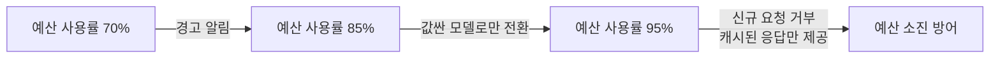

# 프롬프트 캐싱과 비용

일 사용자 1만 명이 하루 10번씩 질문하는 RAG 챗봇은 대충 계산해도 입력 토큰 비용만 하루 $250, 출력까지 합치면 월 $22,500에 이릅니다. 문제는 이 중 40~60%가 사실상 거의 같은 질문의 반복이라는 점 — "연차 며칠이야"와 "제 연차 일수 알려주세요"는 매번 처음 보는 질문처럼 풀프라이스를 내고 처리됩니다. 프롬프트 캐싱은 이 낭비 중 "정확히 같은 앞부분을 반복해서 보내는" 케이스를 값싸게 재사용하는 기법입니다.

## 프로바이더 프롬프트 캐싱 — 사실은 KV 캐시 재사용

Anthropic·OpenAI·Gemini가 제공하는 "프롬프트 캐싱"은 마케팅 용어일 뿐, 메커니즘은 [[KV 캐시]]에서 다룬 attention Key·Value 재사용 그대로입니다. 시스템 프롬프트나 긴 문서처럼 여러 요청이 공유하는 **앞부분(prefix)**이 똑같다면, 그 프리픽스에 대한 K·V를 매번 새로 계산하지 않고 이전에 계산해둔 값을 그대로 재사용합니다. KV 캐시가 원래 "한 요청 안에서 토큰마다 재계산을 피하는" 장치였다면, 프롬프트 캐싱은 이걸 "여러 요청에 걸쳐, 공유하는 프리픽스에 대해" 재사용하도록 확장한 것입니다.

- **Anthropic** — `cache_control` 마커로 캐싱할 지점을 명시. 첫 요청은 25% 쓰기 프리미엄을 물고, 이후 같은 프리픽스로 오는 요청은 90% 할인됩니다. 최소 캐시 크기는 Sonnet/Opus 1,024토큰, Haiku 2,048토큰. 기본 캐시 수명은 5분이고, 2배 프리미엄을 내면 1시간까지 늘어납니다.
- **OpenAI** — 자동 프리픽스 매칭. 코드 변경 없이 동작하고 히트 시 50% 할인되며, 최소 1,024토큰부터 적용됩니다. 응답의 `prompt_tokens_details.cached_tokens`로 실제 히트 여부를 확인합니다.
- **Gemini** — 명시적인 `CachedContent` API로 약 75% 절감되지만 별도 저장 비용이 붙습니다. 최소 크기는 Flash 4,096토큰, Pro 32,768토큰.

숫자로 보면, 2,000토큰짜리 시스템 프롬프트를 캐시 미스로 보낼 때 $0.005가 캐시 히트 시 $0.000625로 떨어집니다 — 하루 10만 요청이면 하루 $437.50가 이 한 항목에서만 절감됩니다.

## 비용 계산 — 항목별로 단가가 다르다는 걸 기억하기

```
비용 = (비캐시 입력 토큰/1M × 입력단가) + (캐시 입력 토큰/1M × 캐시단가) + (출력 토큰/1M × 출력단가)
```

모델마다 입력·출력 단가 자릿수가 크게 다릅니다(예: GPT-4o-mini류 저가형은 입력 $0.1~0.2/1M대, Claude Opus급 최상위 모델은 입력 $15/1M대) — 이 격차가 바로 뒤에 나오는 "모델 라우팅"이 비용을 크게 줄이는 이유이기도 합니다.

## 예산 보호 — 요청량 제한과 서킷 브레이커

**토큰 버킷(Token Bucket)**: 사용자마다 토큰이 담긴 양동이를 주고 초당 일정량씩 다시 채웁니다. 순간적인 버스트는 허용하면서 평균 사용량은 제한합니다. 티어마다 다른 한도(예: 무료 티어 일일 5만 토큰·분당 10요청, 엔터프라이즈 일일 500만 토큰·분당 300요청)를 두는 게 일반적입니다.

**서킷 브레이커**: 예산 소진율에 따라 자동으로 단계를 낮춥니다.



## 이미 다뤄진 다른 절감 축 — 새로 만들지 않고 링크만

같은 "비용 절감"이라는 주제 안에서도 이 노트가 다루는 건 "프로바이더 프리픽스 재사용"과 "예산/속도 제한" 두 축뿐입니다. 나머지 두 축은 이 vault에 이미 별도 노트가 있습니다.

- **의미 기반 캐싱**(문자열은 다르지만 뜻이 비슷한 질문을 재사용) — [[시맨틱 캐싱]]에서 다룹니다.
- **난이도별 모델 배분**(쉬운 질문은 작은 모델로) — [[모델 라우팅]]에서 다룹니다.

실무에서는 이 네 가지(프로바이더 캐싱 30~50% + 정확 일치 캐싱 10~20% + 시맨틱 캐싱 15~30% + 모델 라우팅 40~70%)를 층층이 쌓아서, 앞서 예로 든 월 $22,500짜리 챗봇을 $5,000대까지(약 77% 절감) 낮춘 사례가 보고됩니다. 각 층이 곱셈이 아니라 겹쳐 적용되는 필터라서, 층을 하나씩 더할 때마다 남은 트래픽에 대해서만 절감 효과가 붙습니다.

## 실시간이 아니어도 되는 워크로드 — Batch API

평가·라벨링·대량 요약처럼 지금 당장 답이 필요 없는 작업은 OpenAI Batch API 같은 비동기 대량 처리로 돌리면 균일하게 50% 할인을 받습니다(최대 5만 건을 JSONL로 올리고 24시간 내 결과 수령). 지연시간을 비용과 맞바꾸는 선택지입니다.

## 관련
- [[KV 캐시]] — 프롬프트 캐싱이 실제로 재사용하는 대상(attention K·V)과 그 안전성의 근거
- [[시맨틱 캐싱]] — 문자열이 달라도 의미가 같으면 재사용하는, 이 노트와 겹치지 않는 절감 축
- [[모델 라우팅]] — 난이도별로 모델을 나눠 배분하는, 이 노트와 겹치지 않는 절감 축
- [[처리량과 지연시간]] · [[Goodput]] — 캐시 히트가 곧 지연시간·처리량 개선으로 이어지는 지점
