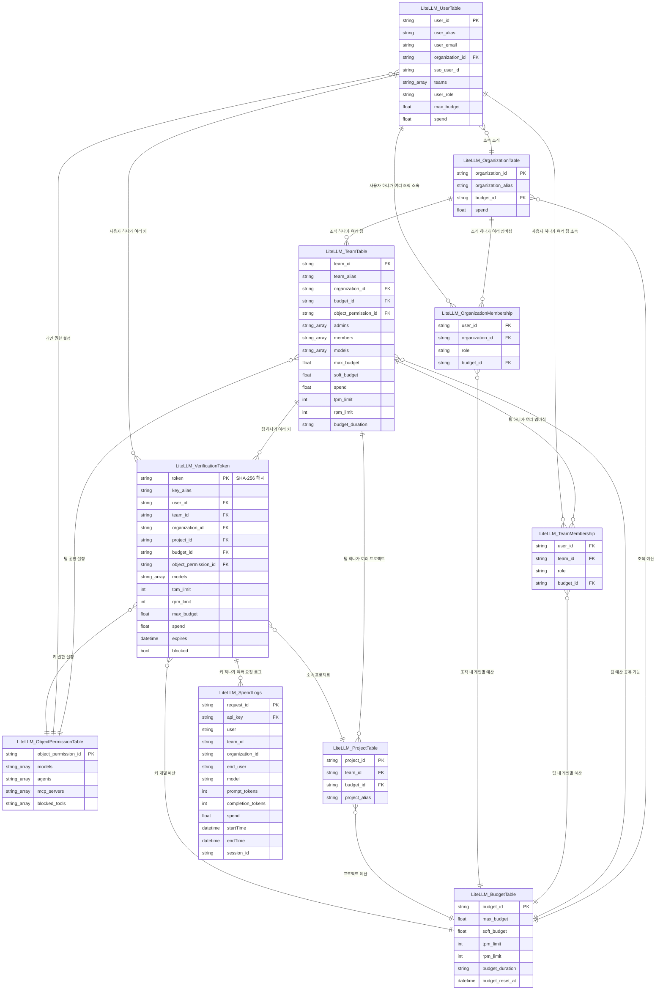

# LiteLLM

[[vLLM]]·[[Ollama]] 같은 서빙 엔진 앞에 세우는 오픈소스 API 게이트웨이입니다. [[표준 아키텍처]] 다이어그램의 "API 게이트웨이" 박스가 실제로는 이 도구인 경우가 흔합니다.

이게 없으면 Open WebUI·Continue.dev 같은 클라이언트가 vLLM·Ollama 같은 실제 서버 주소에 직접 말을 걸어야 하고, 서버 구성이 바뀔 때마다 클라이언트 설정을 전부 고쳐야 합니다. LiteLLM이 그 사이에 끼어들어 다음을 대신 처리합니다.

- **API 통일** — vLLM·Ollama처럼 서로 조금씩 다른 API 형식을 "OpenAI 스타일" 하나로 묶어서 보여줍니다. 클라이언트는 뒤에 뭐가 있는지 몰라도 됩니다.
- **팀별 가상 키(virtual key)** — 실제 서버 키 대신 팀(또는 통합 지점)마다 개별 키를 발급해, 어느 팀이 얼마나 썼는지 구분합니다. **개인마다 발급하는 게 아닙니다** — 새 직원이 들어와도 기존 팀 키를 그대로 쓰고, 개인 단위 구분은 Open WebUI의 LDAP 로그인·로그 쪽에서 담당합니다. 새 키가 필요한 시점은 완전히 새로운 팀(부서)이 통째로 온보딩될 때뿐입니다.
- **팀별 예산·요청량 제한** — 한 팀이 요청을 몰아 보내도 다른 팀 몫이 줄어들지 않게 상한을 겁니다. 이름은 "예산(budget)"이지만, 자체 GPU를 쓰는 [[폐쇄망]]에서는 실제 돈이 나가는 게 아니라 **토큰 사용량(=GPU라는 공유 자원의 쿼터)**에 가깝습니다. LiteLLM은 원래 "토큰당 실제 요금이 나가는 외부 API"를 전제로 만들어진 기능이라, 자체 호스팅 환경에서는 "돈"이 아니라 "공정한 자원 분배·오남용 방지"로 그 의미가 재해석됩니다 — EP13의 KV 캐시 잠식 사고를 막는 예방책이 바로 이 재해석된 용도입니다.
- **로드밸런싱·자동 폴백** — 같은 모델 서버가 여러 대일 때 요청을 나눠 보내고, 하나가 죽으면 다른 서버로 자동 재시도합니다.
- **로깅·사용량 집계** — 누가 언제 뭘 물었는지, 토큰을 얼마나 썼는지 기록해 감사·모니터링에 씁니다.
- **모델 별칭(alias)** — 클라이언트는 항상 고정된 이름(예: `qwen2.5-32b`)만 부르고, 그 이름이 실제로 어느 서버를 가리키는지는 LiteLLM 설정에서만 바꿀 수 있어 뒷단 모델 교체가 클라이언트에 영향을 주지 않습니다.

프록시 서버 자체는 오픈소스로 셀프호스팅이 무료라, [[폐쇄망]] 환경에서 vLLM·Ollama를 여러 팀이 나눠 쓸 때 이 기능들을 통제하는 용도로 자주 쓰입니다.

## 가상 키가 사실상의 관측 단위다

LiteLLM 입장에서 예산·요청량·비용 집계가 전부 **가상 키 단위로만** 쌓입니다. 같은 키를 공유하는 팀원이 10명이면, LiteLLM 로그만으로는 그 10명 중 누가 요청했는지 구분이 안 되고 "이 팀이 이만큼 썼다"까지만 보입니다. 그래서 개인 단위 구분이 필요하면 Open WebUI 같은 클라이언트 쪽 로그인·로그에 따로 의존해야 합니다.

다만 이게 LiteLLM 자체의 한계는 아닙니다 — OpenAI 호환 API에는 원래 어뷰징 감지용으로 만들어진 `user` 필드가 있어서, 요청에 실제 로그인 사용자 ID를 실어 보내면 같은 키를 쓰면서도 그 필드 기준으로 사용자별 집계를 잡을 수 있습니다. 이 필드를 쓰지 않고 클라이언트 쪽 로그로 대체하는 것도 하나의 설계 선택입니다.

## 가상 키를 저장하는 DB 구조 (전체 스키마)

이 프록시가 관리하는 Postgres는 공식적으로 조직(Organization) → 팀(Team) → 프로젝트(Project) → 사용자(User) 계층에, 예산(Budget)·권한(ObjectPermission)이 여러 엔티티에 걸쳐 공유되는 상당히 깊은 스키마를 씁니다. EP05·EP10에서 저희가 실제로 쓴 건 이 중 팀·키·로그 세 조각뿐이지만, 전체 구조를 알아두면 나중에 조직·프로젝트 단위로 확장할 때 참고가 됩니다.

몇 가지 짚어둘 부분:

- **예산(Budget)과 권한(ObjectPermission)은 "공유되는 자원"입니다.** 조직·팀·프로젝트·팀 내 개인·키가 전부 같은 `LiteLLM_BudgetTable`을 참조할 수 있어서, "이 예산 하나를 여러 계층이 나눠 쓴다"는 유연한 설계입니다. 저희는 이 중 **팀 레벨 예산 하나만** 실제로 썼습니다(EP05).
- **`LiteLLM_SpendLogs`는 요청 하나당 한 줄 쌓이는 원본 로그**이고, 여기서 파생된 **일별 집계 테이블**(`LiteLLM_DailyTeamSpend`, `LiteLLM_DailyUserSpend`, `LiteLLM_DailyOrganizationSpend`, `LiteLLM_DailyEndUserSpend`, `LiteLLM_DailyAgentSpend`)이 따로 있습니다 — 구조는 다 동일하고 집계 기준(팀/사용자/조직/최종사용자/에이전트)만 다릅니다. EP13의 모니터링 대시보드는 원본 로그가 아니라 이 일별 집계 테이블을 조회하는 쪽이 훨씬 가볍습니다.
- **삭제 감사 테이블**(`LiteLLM_DeletedTeamTable`, `LiteLLM_DeletedVerificationToken`)도 있습니다 — 원본 테이블과 구조가 같고 `deleted_at`·`deleted_by` 필드만 추가된 형태로, 팀이나 키가 삭제돼도 감사 목적으로 이력이 남습니다.
- 이 스키마 전체는 [BerriAI/litellm의 `schema.prisma`](https://github.com/BerriAI/litellm/blob/main/schema.prisma)에서 확인할 수 있습니다.

## 관련
- [[표준 아키텍처]] — LiteLLM이 채우는 API 게이트웨이 자리
- [[vLLM]] · [[Ollama]] — LiteLLM 뒤에서 실제로 추론하는 엔진
- [[5단계 프로덕션 서빙]] — 게이트웨이를 붙일 때 고려할 도구
- [[nginx]] — LiteLLM 앞에 세우는 표준 진입구(TLS 종료·타임아웃·스트리밍 버퍼링 처리)

## 실전 사례
- [EP05. LiteLLM 설정](../../docs/구축기/EP05-LiteLLM-설정.md) — 팀별 가상 키·예산 분리로 실제 설정 파일을 짠 과정
- [EP10. LiteLLM 게이트웨이 구성](../../docs/구축기/EP10-LiteLLM-게이트웨이-구성.md) — Postgres로 가상 키를 영속화하고 실제로 발급한 과정
- [EP14. 모델 업데이트 전략](../../docs/구축기/EP14-모델-업데이트-전략.md) — 모델 별칭(alias)만 바꿔 클라이언트를 안 건드리고 뒷단 모델을 교체한 사례
