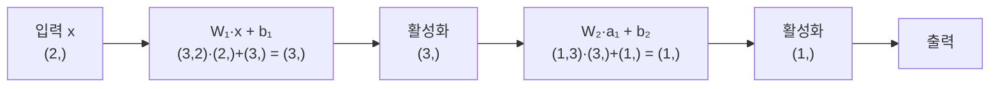

# 다층 신경망과 순전파

[[퍼셉트론]] 하나는 직선 하나만 그릴 수 있지만, 그걸 여러 개 나란히 두고(층) 그 층을 또 쌓으면 임의의 곡선 경계를 흉내 낼 수 있습니다. 입력이 이 층들을 순서대로 통과하며 출력까지 도달하는 계산 과정을 **순전파(forward pass)**라고 부릅니다 — "정보가 앞으로(input→output) 흐른다"는 뜻입니다.

## 구조

- **입력층**: 계산은 없고 원본 데이터를 그대로 들고 있는 층
- **은닉층**: 실제 계산이 일어나는 층. 이전 층의 출력 전부를 입력으로 받아 가중치 곱 → 편향 더하기 → [[활성화 함수]] 순서로 처리
- **출력층**: 최종 답을 내는 층 (이진 분류면 뉴런 1개 + 시그모이드, 다중 분류면 클래스 수만큼의 뉴런 + softmax)

한 층의 계산은 딱 두 줄로 요약됩니다.

```
z = W · x + b      (선형 변환)
a = activation(z)  (비선형 활성화)
```

이 결과 a가 다음 층의 입력 x가 되어 똑같은 계산이 반복됩니다.



## 차원 규칙 — 가장 흔한 버그의 근원

층 k의 가중치 행렬 `Wₖ`의 형태는 항상 **(현재 층 뉴런 수, 이전 층 뉴런 수)**입니다. 예를 들어 784차원 입력을 받아 256개 은닉 뉴런으로 보내는 층이면 `W: (256, 784)`, 그다음 128개로 줄이는 층이면 `W: (128, 256)`입니다. 신경망 구현 버그의 대다수는 이 차원이 어긋나서 생깁니다 — 행렬 곱을 하기 전에 항상 "이 층의 출력 차원이 다음 층이 기대하는 입력 차원과 맞는가"를 확인하는 습관이 필요합니다.

## 구체적 예시 — XOR을 2층으로 풀기

은닉 뉴런 2개짜리 네트워크(2→2→1)에 아래 가중치를 손으로 넣으면 XOR이 정확히 재현됩니다.

```
은닉층: W1=[[20,20],[-20,-20]], b1=[-10, 30]   (각각 OR, NAND 근사)
출력층: W2=[[20,20]], b2=[-30]                  (AND 근사)
```

입력 (0,1)을 넣으면: 첫 은닉 뉴런 `z=20·0+20·1-10=10 → sigmoid(10)≈1`(OR=참), 둘째 은닉 뉴런 `z=-20·0-20·1+30=10 → ≈1`(NAND=참), 출력층 `z=20·1+20·1-30=10 → ≈1`. XOR(0,1)=1과 일치합니다. 네 가지 입력 조합을 모두 넣어보면 전부 맞아떨어집니다 — 퍼셉트론 하나로는 안 됐던 문제가, 두 개의 직선(은닉 뉴런)을 조합하는 것만으로 풀립니다.

## 은닉 상태(hidden state)라는 개념

각 층이 뱉어내는 숫자 벡터를 **은닉 상태**라고 부릅니다. 학습이란 결국 이 중간 표현들을 점점 더 유용하게 바꿔가는 과정입니다 — 예컨대 텍스트라면 단어 하나를 768개 숫자로 인코딩해 의미 정보를 압축하고, 이미지라면 수백만 픽셀을 훨씬 적은 수의 숫자로 압축합니다. "이 모델이 뭘 학습했는가"라는 질문은 사실 "은닉 상태가 무엇을 표현하게 됐는가"라는 질문과 같습니다.

## 왜 깊이가 중요한가 — 범용 근사 정리의 함정

1989년 사이벤코(Cybenko)는 "은닉층이 하나뿐이어도, 뉴런 수만 충분하면 어떤 연속함수든 원하는 정확도로 근사할 수 있다"는 걸 증명했습니다. 하지만 이 정리는 "가능하다"고만 말할 뿐 "효율적으로 가능하다"고는 말하지 않습니다. 필요한 뉴런 수가 실전에서는 수십억 개에 달할 수 있습니다. 반면 같은 함수를 여러 층으로 나눠서 근사하면 훨씬 적은 총 파라미터로 충분한 경우가 많습니다 — 이것이 "넓고 얕은 네트워크" 대신 "깊은 네트워크"를 쓰는 이유입니다. 은닉층 하나짜리 뉴런이 입력 공간에 "봉우리" 하나씩을 새기는 것이라면, 층을 쌓는다는 건 봉우리들의 조합을 다시 조합하는 것이라 표현력이 뉴런 수보다 훨씬 빠르게 늘어납니다.

## 어텐션도 결국 순전파의 한 종류다

[[Query·Key·Value]]에서 Q·K·V를 "만드는" 단계 — 토큰 벡터에 `Wq·Wk·Wv`를 곱하는 연산 — 는 이 노트에서 설명한 `z = W·x + b`와 정확히 같은 선형 변환입니다. 그다음 [[Multi-Head Attention]]에서 여러 헤드로 나눠 계산하고 다시 이어붙이는 것도, "여러 개의 작은 층을 병렬로 통과시킨 뒤 합친다"는 순전파의 변형일 뿐입니다. `softmax(QKᵀ/√d_k)·V` 자체도 학습 가능한 가중치는 없지만 입력에서 출력으로 정해진 순서의 계산을 한 번 흘려보내는 것이므로 넓은 의미의 순전파에 포함됩니다. 즉 트랜스포머 한 층을 통과하는 것도 "선형 변환 → 비선형(softmax나 활성화 함수) → 다음 층"이라는, 이 노트의 패턴이 여러 번 반복되는 것뿐입니다. 트랜스포머 전체 구조는 별도로 다루는 것이 좋지만(패키지 4 참고), "왜 어텐션이 학습 가능한가"를 이해하는 출발점은 바로 이 순전파 구조입니다.

## 관련
- [[퍼셉트론]] — 이 층을 구성하는 가장 작은 단위
- [[활성화 함수]] — z에서 a로 넘어갈 때 비선형성을 주입하는 함수
- [[역전파]] — 순전파의 역방향으로 기울기를 계산해 가중치를 학습시키는 알고리즘
- [[Query·Key·Value]] — 어텐션의 Q·K·V 생성 단계가 곧 하나의 선형 층 순전파
- [[Multi-Head Attention]] — 여러 헤드로 쪼갠 순전파를 병렬로 계산하고 합치는 구조
