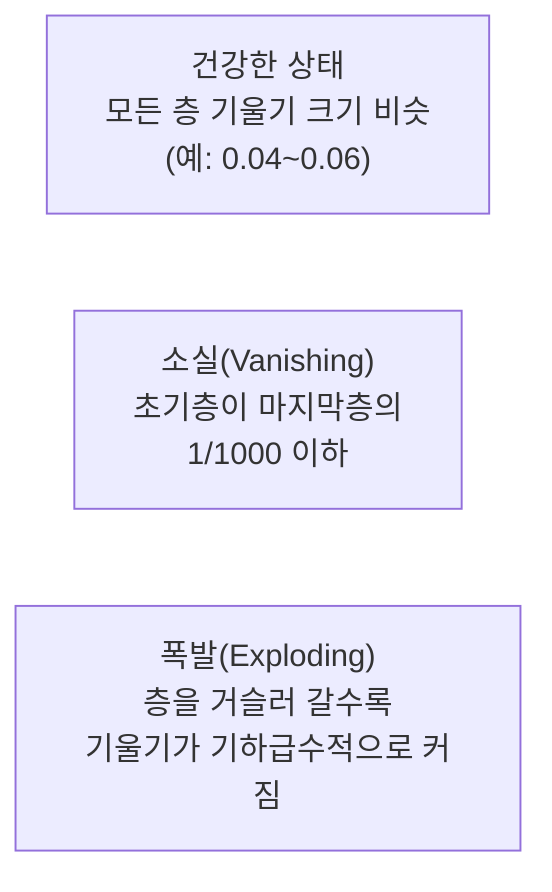

# 신경망 디버깅

신경망은 문법 오류가 있어도 그냥 "조용히 잘못 학습"하는 경우가 많아서, 일반 소프트웨어처럼 에러 메시지에 기대기 어렵습니다. 이 노트는 지금까지의 [[다층 신경망과 순전파|순전파]]·[[역전파]]·[[손실 함수]]·[[가중치 초기화]] 지식을 실제로 "왜 이 모델이 안 배우지?"를 진단하는 데 쓰는 방법을 정리합니다. 서빙 단계의 트러블슈팅은 이 vault의 `docs/03-트러블슈팅-딥리서치.md`에서 별도로 다루고, 여기서는 학습(training) 단계에 국한합니다.

## 손실이 NaN이 되는 네 가지 흔한 원인

1. **학습률이 너무 큼** — 업데이트 폭이 손실 골짜기를 훌쩍 뛰어넘어 발산. 학습률을 10배 낮춰서 재현되는지 먼저 확인합니다.
2. **log(0)** — cross-entropy가 `log(p)`를 계산하는데 `p`가 정확히 0(또는 음수)이 되는 경우. 예측값을 `[ε, 1-ε]`(ε≈1e-7)로 클램프해서 방지합니다.
3. **0으로 나누기** — 배치/레이어 정규화의 분산이 우연히 0에 가까워질 때. 분모에 작은 `ε`을 더해두면 대부분 방지됩니다.
4. **지수 오버플로우** — softmax가 큰 로짓을 그대로 `exp()`에 넣어 무한대가 되는 경우. 로짓에서 최댓값을 미리 빼는 log-sum-exp 트릭으로 해결합니다.

## 기울기 소실/폭발 진단

각 층의 평균 기울기 크기를 층 순서대로 늘어놓아 보면 문제 유형이 바로 드러납니다.



**소실**은 대개 시그모이드/tanh를 깊게 쌓았을 때([[역전파]] 노트의 0.25^L 감쇠) 나타나며, ReLU 계열 [[활성화 함수]]로 바꾸거나 잔차 연결·정규화 층을 추가해 해결합니다. **폭발**은 기울기 노름이 임계값을 넘으면 비례적으로 줄이는 그래디언트 클리핑, 혹은 학습률 자체를 낮추는 방식으로 대응합니다.

## Overfit-One-Batch 테스트 — 가장 먼저 해야 할 검증

본 훈련에 들어가기 전에, **작은 배치 하나(8~32개 샘플)만으로 100번 이상 반복 학습**시켜 손실이 거의 0까지, 정확도가 100%까지 떨어지는지 확인합니다. 이게 안 되면 데이터 규모나 학습 시간의 문제가 아니라 구현 자체에 근본적 결함이 있다는 뜻입니다 — 손실 함수 구현 오류, 역전파 연결 누락, `requires_grad=False`로 얼어붙은 파라미터, 라벨과 입력의 순서가 어긋난 데이터 파이프라인 등이 흔한 원인입니다. 이 테스트를 통과하지 못한 채로 전체 데이터 학습을 시작하면 "학습이 느린 건지 애초에 안 되는 건지" 구분할 수 없습니다.

## 활성화 통계로 보는 건강 상태

| 상태 | 평균 | 표준편차 | 의미 |
|---|---|---|---|
| 건강 | ~0 | ~1 | 정상 |
| 포화 | 0에서 멀리 | ~0 | 활성화가 극값에 고정 |
| 죽음(dead) | 0 | 0 | ReLU 뉴런이 영구적으로 꺼짐 |
| 폭발 | 매우 큼 | 매우 큼 | 값이 통제 불능으로 커짐 |

한 층에서 활성화값의 50% 이상이 정확히 0이면 dead ReLU를 의심하고, Leaky ReLU로 바꾸거나 [[가중치 초기화]]를 점검합니다.

## 학습률 파인더(LR Range Test)

학습률을 아주 작은 값(1e-7)부터 아주 큰 값(10)까지 지수적으로 늘려가며 몇백 스텝만 돌려보고, 손실이 가장 가파르게 줄어드는 지점을 찾습니다. 그 지점보다 한 자릿수 작은 값을 실제 학습률로 채택하는 방식입니다(Leslie Smith, 2017) — 감으로 학습률을 고르는 대신 근거를 만드는 절차입니다.

## 자주 보는 PyTorch 버그 패턴

- **`optimizer.zero_grad()` 누락**: 기울기가 매 스텝 이전 값에 누적돼 학습이 갈수록 불안정해짐(진동 → 발산)
- **`model.eval()` 누락**: 드롭아웃·배치정규화가 훈련 모드로 남아 테스트 정확도가 실행할 때마다 달라짐
- **in-place 연산**(`x += 1`)이 계산 그래프를 훼손해 역전파가 깨짐

## 진단 순서 요약

```
손실이 안 줄어든다
├─ overfit-one-batch 통과? → 아니오면 구현 버그부터 (위 참고)
├─ 학습률 3개(1e-2, 1e-3, 1e-4) 비교 → 어느 쪽이 나은지로 방향 결정
├─ 기울기 확인 → 전부 0이면 dead ReLU, NaN이면 클리핑/학습률 인하
├─ 활성화 확인 → 50% 이상 0이면 활성화 함수·초기화 재검토
└─ 데이터 파이프라인 확인 → 라벨-입력 정렬, 정규화 여부
```

## 관련
- [[역전파]] — 기울기 소실/폭발이 수학적으로 발생하는 지점
- [[손실 함수]] — log(0)·오버플로우 같은 NaN의 근원
- [[가중치 초기화]] — dead neuron·발산의 초기 원인을 예방하는 장치
- [[옵티마이저 (SGD·Adam)]] — 학습률 관련 진단(너무 크면 발산, 너무 작으면 정체)이 직결되는 대상
- [[활성화 함수]] — 포화·dead neuron 등 활성화 통계 이상의 근본 원인
