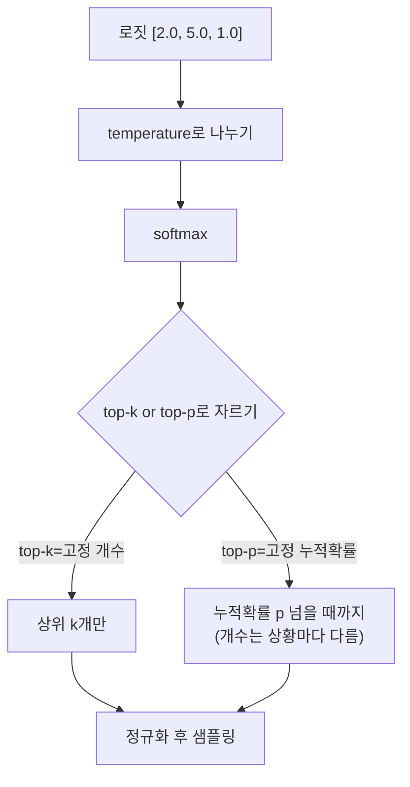

# 샘플링 방법

언어모델이 다음 토큰을 고르는 방식(temperature, top-k, top-p)은 전부 "확률분포에서 값을 하나 뽑는다"는 오래된 수학 문제의 응용입니다. 어디에 쓰이는지 크게 나누면: **생성**(다음 토큰 뽑기), **훈련**(미니배치·dropout 마스크 뽑기), **추정**(적분을 몬테카를로로 근사), **탐색**(MCMC로 베이지안 사후분포 탐색)입니다.

## Temperature — 로짓 사이의 격차를 늘리거나 줄이는 손잡이

```
p_i = exp(z_i / T) / Σ exp(z_j / T)
```
로짓 `z1=2, z2=1`이 있을 때 T=0.5로 나누면 `z1/T=4, z2/T=2`로 **간격이 2배로 벌어집니다** — softmax를 거치면 1등 토큰이 훨씬 큰 확률을 독차지하게 됩니다. T→0이면 사실상 argmax(결정론적), T→∞이면 균등분포(완전 무작위)입니다. **temperature는 어떤 토큰이 후보가 될 수 있는지를 바꾸지 않습니다 — 이미 정해진 후보들에게 확률 질량을 어떻게 재분배할지만 바꿉니다.**

| T | 용도 |
|---|---|
| 0.0 | 탐욕적 디코딩, 사실 기반 Q&A |
| 0.3~0.7 | 코드 생성 등 약간의 창의성 |
| 0.7~1.0 | 일반 대화, 균형 |
| 1.0~1.5 | 창의적 글쓰기 |

## Top-k vs Top-p — 고정 폭 대 적응형 폭

**Top-k**는 확률 상위 k개 토큰만 남기고 나머지를 자릅니다. 문제는 k가 고정이라는 점 — 모델이 한 토큰에 95% 확신을 몰아준 상황에서도 k=40이면 여전히 39개의 (사실상 무의미한) 대안을 열어두고, 반대로 모델이 1000개 토큰에 확률을 고르게 흩뿌린 상황에서는 k=40이 너무 좁습니다.

**Top-p(nucleus sampling)**는 누적 확률이 p(예: 0.9)를 넘을 때까지 상위 토큰을 모읍니다. 이러면 모델이 확신할 때는 자동으로 후보가 2~3개로 줄고, 불확실할 때는 자동으로 200개까지 늘어납니다 — **문맥에 따라 후보 폭이 스스로 조절된다**는 게 top-k 대비 핵심 우위입니다. 실무에서는 `temperature=0.7 + top-p=0.9` 조합이 범용으로 많이 쓰입니다.



## 재매개변수화 트릭 — "무작위성을 밖으로 빼내서" 미분 가능하게 만들기

`z ~ N(μ,σ²)`처럼 직접 샘플링하면 이 과정은 미분 불가능합니다(무작위성이 그래디언트 흐름을 끊음). 해결책은 `ε ~ N(0,1)`을 고정된 잡음으로 따로 뽑고 `z = μ + σ·ε`로 계산하는 것 — 이제 z는 μ, σ의 결정론적(미분 가능한) 함수이고, 무작위성은 파라미터와 무관한 ε 하나에만 들어 있습니다. 이 통찰 하나가 VAE를 표준 역전파로 훈련 가능하게 만든 핵심 아이디어입니다. 확산 모델의 각 노이즈 제거 스텝도 같은 트릭을 반복 적용하는 것입니다.

## MCMC(Metropolis-Hastings, Gibbs) — 왜 여기 있는지만 알아두면 충분

정규화 상수를 몰라도 샘플링만으로 목표 분포를 탐색할 수 있는 방법입니다. 베이지안 사후분포 추정, 시뮬레이션 어닐링 등에 쓰이지만 LLM 서빙과는 거리가 있어 여기서는 존재만 짚고 넘어갑니다.

## 관련
- [[확률분포]] — softmax가 만드는 categorical 분포, 이 샘플링의 대상
- [[수치 안정성]] — 로짓이 극단적일 때 softmax를 안전하게 계산하는 트릭
- [[정보이론]] — perplexity와 temperature의 관계(모델이 얼마나 확신하는가)
