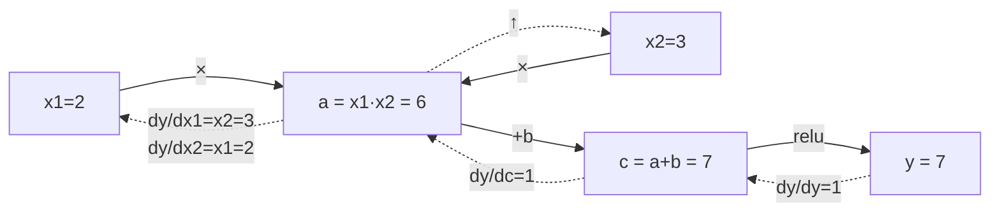

# 연쇄법칙과 자동미분

`y = f(g(x))`처럼 함수가 겹쳐 있으면 `dy/dx = f'(g(x)) · g'(x)` — 바깥 함수의 미분과 안쪽 함수의 미분을 곱하면 됩니다. 신경망은 이 합성이 수백 겹 쌓인 구조입니다: 입력 → 행렬곱 → 활성화 함수 → 행렬곱 → 활성화 함수 → ... → 손실. 이 연쇄를 손으로 미분하는 건 현실적이지 않은데, [[미분과 그래디언트|수치 미분]]으로 가중치 하나씩 유한차분을 계산하는 것도 파라미터 수만큼 함수를 다시 평가해야 해서 너무 느립니다. 연쇄법칙이 수학적 원리를, **자동미분**이 그걸 기계적으로 계산하는 알고리즘을 제공합니다.

## 계산 그래프와 두 가지 진행 방향

모든 계산을 노드(연산)와 간선(값)으로 그린 게 계산 그래프입니다. `x1=2, x2=3, b=1`로 `a=x1*x2 → c=a+b → y=relu(c)`를 계산했다면, 역방향으로 `dy/dc=1 → dy/da=1 → dy/dx1=3(=x2) → dy/dx2=2(=x1)`처럼 출력에서 입력 쪽으로 연쇄법칙을 되짚어가며 그래디언트를 구할 수 있습니다.

**왜 역방향(reverse mode)을 쓰는가** — 신경망은 입력(가중치)이 수백만 개, 출력(손실)은 딱 하나입니다. 정방향(forward mode)은 입력 변수 하나당 한 번씩 전체 그래프를 훑어야 하지만, 역방향은 **단 한 번의 역방향 패스로 모든 가중치의 그래디언트를 동시에** 계산합니다. 입력이 많고 출력이 적은 신경망 구조에 정확히 들어맞는 선택입니다.

## Autograd가 실제로 하는 일

PyTorch 같은 프레임워크는 값 하나마다 `data`(값), `grad`(그래디언트, 처음엔 0), 그리고 이 값을 만든 연산의 "국소 미분 규칙"을 함께 들고 다닙니다. 예를 들어 곱셈 `out = a*b`이면, 역전파 시 `a.grad += b.data * out.grad`, `b.grad += a.data * out.grad`처럼 각 연산이 자기 몫의 연쇄법칙만 책임집니다. 그래프 전체를 위상 정렬한 뒤 출력에서 입력 방향으로 훑으며 이 규칙들을 하나씩 실행하면, 그게 바로 [[역전파|역전파]]입니다. 같은 값이 여러 연산에 재사용되면 그래디언트를 **더해서(+=)** 누적한다는 점이 핵심 — 대체가 아니라 합산입니다.

동적 그래프(그래프가 매 순전파마다 새로 만들어짐)라서 Python의 if/for 같은 제어 흐름이 있어도 자동미분이 그대로 작동합니다.

## 왜 중요한가

이게 없으면 신경망마다 미분 공식을 손으로 유도해야 하고, 아키텍처를 하나 바꿀 때마다 그 유도를 처음부터 다시 해야 합니다. 자동미분 덕분에 "순전파 코드만 짜면 역전파는 프레임워크가 알아서 계산"하는 지금의 딥러닝 개발 방식이 가능해졌습니다. [[역전파|Query·Key·Value]]에서 "Wq·Wk·Wv가 학습 중 어떻게 업데이트되는가"라는 질문도 결국 이 연쇄법칙을 어텐션 계산 그래프에 적용하는 것과 같은 이야기입니다.

## 관련
- [[미분과 그래디언트]] — 이 연쇄법칙이 적용되는 개별 미분의 정의
- [[경사하강법]] — 이렇게 구한 그래디언트로 실제 가중치를 업데이트하는 알고리즘
- [[수치 안정성]] — 그래디언트 검증(수치 미분과 비교)으로 자동미분 구현 오류를 잡는 방법
- [[Query·Key·Value]] — 이 연쇄법칙이 실제로 적용되는 어텐션 학습 과정
