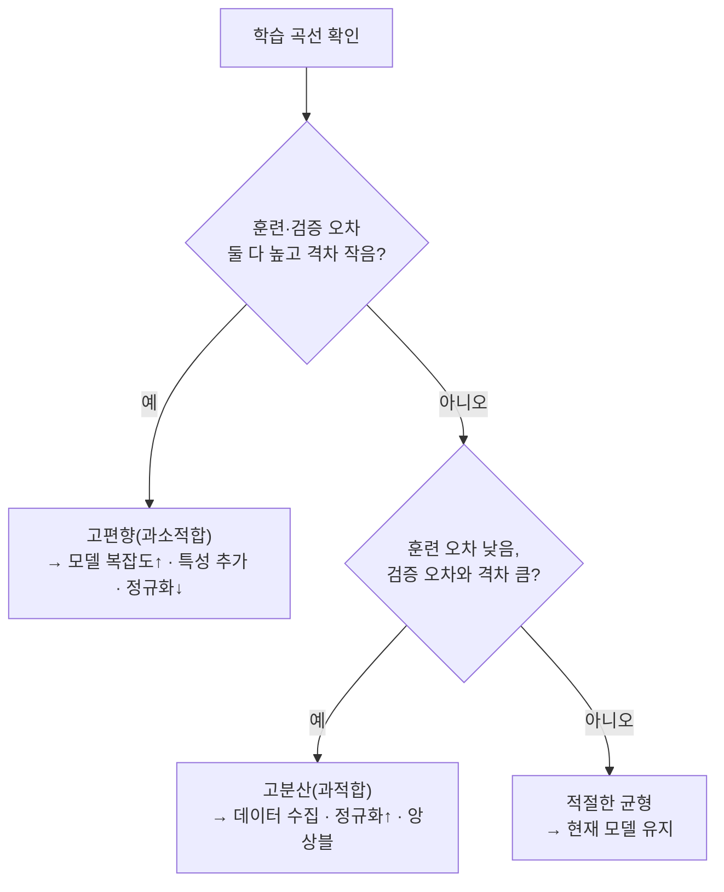

# 모델 평가

모델을 훈련시키고 나면 "정확도 95%"라는 숫자 하나만으로 좋다 나쁘다를 판단하고 싶어지지만, 그 숫자 하나가 완전히 쓸모없는 모델을 가려버리는 경우가 실무에서 흔히 벌어집니다. 데이터 1000건 중 실제 이상(양성)이 100건뿐이고 나머지 900건이 정상(음성)이라면, 무조건 "정상"이라고만 답하는 모델도 정확도 90%를 찍습니다 — 이상을 단 한 건도 잡아내지 못하는데도 말입니다. 모델 평가는 이 숫자 하나 뒤에 숨은 실제 성능을 여러 각도에서 뜯어보는 방법들의 모음입니다.

## 혼동행렬 — 모든 분류 지표의 출발점

이진 분류에서 예측과 실제가 맞물리는 네 가지 경우를 표로 정리한 것이 혼동행렬입니다.

| | 예측 양성 | 예측 음성 |
|---|---|---|
| **실제 양성** | TP (참 양성) | FN (거짓 음성) |
| **실제 음성** | FP (거짓 양성) | TN (참 음성) |

암 진단 모델로 1000명을 검사한 상황을 예로 들어보겠습니다. 실제 암 환자는 100명, 정상은 900명입니다. 모델이 환자 80명을 올바르게 "암"이라고 진단하고(TP=80), 20명은 놓치고(FN=20), 정상인 10명을 잘못 "암"이라고 진단하고(FP=10), 나머지 890명은 올바르게 "정상"이라고 진단했다(TN=890)고 하면:

- **정확도** = (TP+TN)/전체 = (80+890)/1000 = **97%** — 숫자만 보면 훌륭해 보이지만, 정작 놓친 환자가 20명이나 됩니다.
- **정밀도(Precision)** = TP/(TP+FP) = 80/90 ≈ **88.9%** — "암이라고 진단받은 사람 중 실제로 암인 비율". 거짓 양성(정상인데 암이라고 오진)의 비용이 클 때 중요합니다.
- **재현율(Recall)** = TP/(TP+FN) = 80/100 = **80%** — "실제 암 환자 중 놓치지 않고 잡아낸 비율". 거짓 음성(암인데 정상이라고 오진)의 비용이 클 때 중요합니다.
- **F1** = 2·(Precision·Recall)/(Precision+Recall) ≈ **84.2%** — 정밀도와 재현율의 조화평균으로, 한쪽이 극단적으로 낮으면 F1도 같이 낮아져 두 지표를 동시에 챙기게 만듭니다.

어느 지표를 우선할지는 "어느 쪽 실수가 더 비싼가"로 정해집니다. 스팸 필터는 정상 메일을 스팸으로 오분류하는 게(거짓 양성) 뼈아프니 정밀도를, 암 스크리닝은 환자를 놓치는 게(거짓 음성) 뼈아프니 재현율을 우선합니다. 이 트레이드오프를 임계값(기본 0.5)으로 조절하는 원리는 [[로지스틱 회귀]]에서 다룹니다.

## AUC-ROC — 임계값 하나에 얽매이지 않는 평가

정밀도·재현율·F1은 특정 임계값(보통 0.5) 하나를 고정했을 때의 스냅샷입니다. 임계값을 0부터 1까지 쭉 훑으면서 참양성률(재현율)과 거짓양성률을 매 지점마다 찍은 곡선이 ROC 곡선이고, 그 아래 면적이 AUC입니다. AUC 0.5는 동전 던지기와 같은 무작위 추측, 1.0은 완벽한 분류를 뜻하며, 어떤 임계값을 쓰든 상관없이 "모델이 양성을 음성보다 얼마나 잘 순위 매기는가"만 측정하기 때문에 불균형 데이터에서도 왜곡되지 않습니다.

## 회귀 지표

회귀 문제에서는 정밀도·재현율 대신 예측값과 실제값의 차이를 직접 잽니다.

- **MSE** = Σ(실제-예측)²/n — 오차를 제곱해 큰 실수에 불균형적으로 큰 페널티를 줍니다. [[선형 회귀]]의 손실 함수와 같은 형태입니다.
- **RMSE** = √MSE — 제곱을 다시 풀어줘서 원래 변수와 같은 단위로 해석할 수 있습니다.
- **MAE** = Σ|실제-예측|/n — 제곱하지 않으므로 이상치에 덜 민감합니다.
- **R²** = 1 - (잔차제곱합/전체분산) — 항상 평균값만 예측하는 바보 모델 대비 얼마나 나은지를 0~1 사이 비율로 알려주며, 음수가 나오면 평균 예측보다도 못하다는 뜻입니다.

## 훈련/검증/테스트와 교차검증 — 평가 자체를 어떻게 설계하는가

지표를 아무리 잘 골라도, 애초에 모델이 본 적 없는 데이터로 재지 않으면 의미가 없습니다. 데이터를 훈련(60~70%)·검증(15~20%)·테스트(15~20%)로 나누고, 테스트 집합은 맨 마지막에 딱 한 번만 엽니다. 테스트 성능을 보고 모델을 다시 조정하면 그 순간 테스트 집합은 사실상 검증 집합으로 변질되어 버려, 보고하는 숫자가 더 이상 미래 데이터에 대한 정직한 추정치가 아니게 됩니다.

데이터가 넉넉하지 않을 때는 K-Fold 교차검증을 씁니다. 데이터를 K등분해서 매번 한 조각을 검증용으로, 나머지를 훈련용으로 돌아가며 사용하고 K번의 점수를 평균 냅니다. 이렇게 하면 데이터를 낭비하지 않고 모든 조각이 훈련과 검증에 한 번씩 쓰입니다. 다만 양성이 5%뿐인 불균형 데이터를 그냥 K등분하면 어떤 조각에는 양성이 하나도 없고 어떤 조각에는 몰릴 수 있어, 각 조각의 클래스 비율을 원본과 똑같이 맞추는 층화 K-Fold를 씁니다.

## 데이터 누수 — 가장 흔하고 가장 위험한 실수

평가 결과가 실제보다 훨씬 좋게 나오는 가장 흔한 원인은 테스트 데이터의 정보가 훈련 과정에 몰래 섞여 드는 데이터 누수입니다. 전체 데이터로 스케일러의 평균·표준편차를 계산한 뒤에 훈련/테스트로 나누면, 테스트 데이터의 통계가 이미 훈련 과정에 스며든 것이라 잘못된 결과입니다(항상 먼저 나누고, 훈련 데이터에서만 통계를 계산해야 합니다 — 이 원칙을 구조적으로 강제하는 게 [[ML 파이프라인]]입니다). 시계열 데이터를 무작위로 섞어 나누는 것, 예측하려는 값 자체에서 파생된 특성을 실수로 입력에 포함시키는 것도 같은 종류의 실수입니다([[시계열]] 참고).

## 학습 곡선으로 문제 진단하기

훈련 데이터 크기를 늘려가면서 훈련 오차와 검증 오차가 어떻게 움직이는지를 보면, 모델이 겪는 문제가 [[편향-분산 트레이드오프]] 중 어느 쪽인지 구분할 수 있습니다. 둘 다 높은 오차에서 나란히 수렴하면 모델이 너무 단순한 것(고편향)이고, 훈련 오차는 낮은데 검증 오차와 큰 격차가 벌어져 있으면 모델이 노이즈까지 외운 것(고분산)입니다.

## 왜 이게 LLM 평가·서빙에서도 그대로 재사용되는가

정밀도·재현율·F1은 "고전 ML 전용" 개념이 아니라, LLM을 실제로 서빙할 때도 형태만 바꿔서 그대로 다시 나타납니다.

- [[RAG]]의 검색 단계는 사실 이진 분류입니다 — 벡터DB가 뽑아온 문서들 중 실제로 질문과 관련 있는 문서의 비율이 정밀도, 관련 문서 전체 중 놓치지 않고 찾아낸 비율이 재현율입니다. [[하이브리드 검색]]을 쓰는 이유도 결국 이 재현율을 끌어올리기 위해서입니다.
- [[환각]] 탐지도 "이 답변이 근거 문서에 실제로 기반했는가"를 이진 판정하는 문제로 놓으면 똑같이 정밀도·재현율로 잴 수 있고, 사내 QA셋으로 환각률을 측정하는 것도 이 틀을 그대로 씁니다.
- 가드레일이나 안전 필터처럼 LLM 출력을 "허용/차단"으로 나누는 시스템도 임계값을 어디에 두느냐에 따라 정밀도(오차단 최소화)와 재현율(위험한 응답 놓치지 않기)이 정확히 같은 방식으로 충돌합니다.

즉 "정확도 하나로는 부족하다, 어느 쪽 실수가 더 비싼지에 따라 지표를 골라야 한다"는 이 노트의 결론은 분류기뿐 아니라 LLM을 실제 서비스에 앉힐 때도 그대로 적용되는 사고방식입니다.

## 관련
- [[편향-분산 트레이드오프]] — 학습 곡선으로 진단한 문제를 이론적으로 설명하는 짝 노트
- [[불균형 데이터]] — 정확도가 왜곡되는 근본 원인과 대응법
- [[로지스틱 회귀]] — 정밀도·재현율이 임계값 조정과 맞물리는 실제 모델
- [[ML 파이프라인]] — 데이터 누수를 구조적으로 막는 장치
- [[하이퍼파라미터 튜닝]] — 여기서 정한 지표로 좋고 나쁨을 비교하는 다음 단계
- [[RAG]] · [[하이브리드 검색]] · [[환각]] — 정밀도·재현율 개념이 그대로 이어지는 LLM 서빙 쪽 노트
