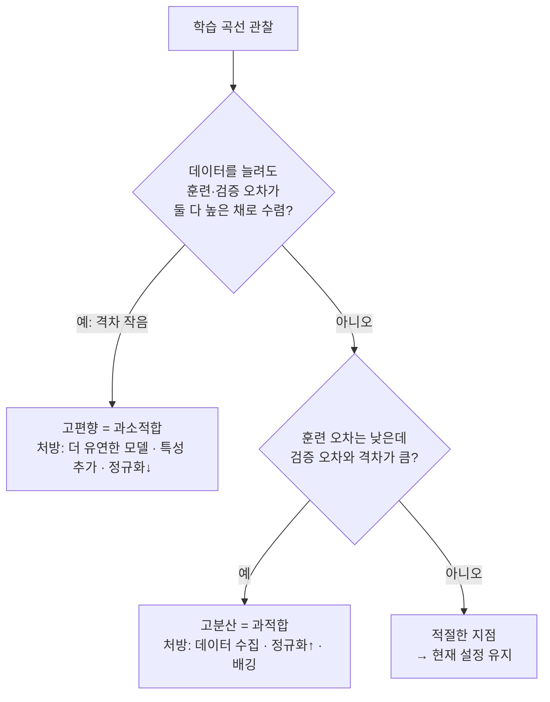

# 편향-분산 트레이드오프

모델이 새 데이터에서 실수하는 이유는 딱 두 가지로 쪼갤 수 있습니다 — 모델이 애초에 세운 가정이 잘못돼서(편향), 또는 데이터가 조금만 바뀌어도 모델의 예측이 크게 흔들려서(분산). 이 둘을 조절하는 다이얼이 사실상 하나뿐이라는 것, 그리고 그 다이얼을 어느 쪽으로 돌리든 항상 대가가 따른다는 것이 이 개념 전체의 핵심입니다.

## 편향과 분산을 각각 정의하면

- **편향(Bias)** — 모델이 세운 가정 자체가 틀려서 생기는 체계적인 오차입니다. 실제 관계가 곡선인데 직선으로 억지로 맞추려 하면, 아무리 많은 데이터를 줘도 이 직선은 곡선을 정확히 따라갈 수 없습니다. 이런 모델은 훈련 데이터에서도, 새 데이터에서도 고르게 못 맞힙니다(훈련 오차 높음, 테스트 오차도 높음, 둘의 격차는 작음) — 이게 과소적합입니다.
- **분산(Variance)** — 훈련 데이터를 조금만 바꿔도(다른 표본을 뽑아도) 학습된 모델이 크게 달라지는 정도입니다. 데이터 15개에 20차 다항식을 맞추면 그 15개는 완벽하게 통과하지만, 다른 15개 표본을 뽑아 다시 학습시키면 완전히 다른 곡선이 나옵니다. 이런 모델은 훈련 데이터에는 기막히게 잘 맞지만 새 데이터에서는 형편없습니다(훈련 오차 낮음, 테스트 오차 높음, 격차가 큼) — 이게 과적합입니다.

두 오차를 합치면 다음과 같이 분해됩니다.

```
기대오차 = 편향² + 분산 + 축약 불가능한 노이즈
```

축약 불가능한 노이즈(σ²)는 데이터 자체에 내재한 무작위성이라 어떤 모델을 써도 없앨 수 없습니다. 결국 우리가 실제로 조절할 수 있는 건 편향²과 분산 두 항뿐이고, 이 둘은 대개 한쪽을 줄이면 다른 쪽이 늘어나는 관계에 있습니다.

| 모델 복잡도 | 편향 | 분산 | 결과 |
|---|---|---|---|
| 너무 낮음 (곡선 데이터에 직선) | 높음 | 낮음 | 과소적합 |
| 적절함 | 중간 | 중간 | 최적 지점 |
| 너무 높음 (15개 데이터에 20차 다항식) | 낮음 | 높음 | 과적합 |

모델 복잡도를 x축, 오차를 y축에 놓으면 편향²은 우하향, 분산은 우상향하는 곡선을 그리고, 이 둘을 더한 총 오차는 U자형이 됩니다. 목표는 이 U자의 바닥, 즉 편향²+분산이 최소가 되는 복잡도를 찾는 것입니다.

## 정규화 — 편향을 일부러 늘려서 분산을 줄이는 도구

L2(릿지)는 모든 가중치를 0 쪽으로 고르게 눌러 축소하고, L1(라쏘)은 일부 가중치를 아예 정확히 0으로 만들어버리며([[피처 선택]]과 자연스럽게 이어집니다), 드롭아웃은 훈련 중 일부 뉴런을 무작위로 꺼버리고, 조기 종료는 훈련 데이터에 완벽히 맞기 전에 훈련을 멈춥니다. 방식은 다 다르지만 공통된 원리는 같습니다 — 모델이 데이터를 "덜 유연하게" 따라가도록 일부러 제약을 걸어(편향을 늘려) 노이즈까지 외우는 것(분산)을 막는 것입니다. 정규화 강도(λ, 드롭아웃 비율, 학습 에폭 수)가 바로 이 U자 곡선 위에서 지금 모델이 어디 서 있는지를 정하는 손잡이입니다.

## 학습 곡선으로 실제로 진단하기

이론적인 U자 곡선을 실제 프로젝트에서 확인하는 도구가 학습 곡선입니다. 훈련 데이터 크기를 늘려가며 훈련/검증 오차를 관찰합니다.



고편향 패턴이면 데이터를 더 모아봐야 소용없습니다 — 모델 자체가 그 패턴을 표현할 능력이 없기 때문입니다. 고분산 패턴이면 반대로 데이터를 더 모으는 것이 가장 직접적인 해법이고([[앙상블]]의 배깅이 정확히 이 원리 — 서로 다른 훈련 표본에서 나온 예측 N개를 평균하면 분산이 σ²/N으로 줄어듭니다), 부스팅은 반대쪽에서 편향을 줄이는 데 특화되어 있습니다.

## 더블 디센트 — 딥러닝이 고전 이론을 뒤집는 지점

2019년 이후 연구들은 고전적인 U자 곡선이 전부가 아니라는 걸 보였습니다. 모델 파라미터 수가 훈련 샘플 수를 훨씬 넘어서기 시작하면(p ≫ n), 한 번 치솟았던 테스트 오차가 다시 떨어지는 두 번째 하강이 나타납니다.

| 구간 | 파라미터 vs 샘플 | 특징 |
|---|---|---|
| 파라미터 부족 | p ≪ n | 고전적인 편향-분산 U자 곡선 |
| 보간 임계점 | p ≈ n | 분산이 최고조, 테스트 오차 급증 |
| 파라미터 과다 | p ≫ n | 암묵적 정규화가 작동, 테스트 오차 재하강 |

이 현상이 중요한 이유는, 파라미터가 수십억~수천억 개인 LLM이 "고전 이론대로라면 극심하게 과적합돼야 정상인데" 실제로는 잘 일반화되는 이유를 설명해주기 때문입니다. 경사하강법 자체가 암묵적인 정규화 역할을 하면서, 극단적으로 과대 파라미터화된 모델은 고전적인 편향-분산 트레이드오프의 U자 곡선 바깥에서 다시 작동한다는 뜻입니다.

## 왜 이게 LLM 평가·서빙에서도 그대로 재사용되는가

편향-분산이라는 어휘 자체는 고전 ML 용어지만, 그 안에 있는 "모델이 데이터를 외웠는가, 진짜로 배웠는가"라는 질문은 LLM 파이프라인 곳곳에서 형태만 바꿔 반복됩니다. 작은 사내 데이터셋으로 파인튜닝(추후 다룰 SFT/LoRA류)을 하면 몇 에폭 만에 훈련 데이터를 그대로 외워버리는 고전적인 과적합이 그대로 재현되고, 이때 조기 종료나 정규화 같은 이 노트의 처방이 그대로 적용됩니다. 반대로 사전학습 단계에서 모델과 데이터를 함께 키우면서 성능이 어떻게 변하는지를 예측하는 스케일링 법칙 논의도, 뿌리를 따라가면 이 노트의 더블 디센트와 같은 질문("파라미터를 늘리는 게 언제 도움이 되고 언제 해가 되는가")에서 출발합니다. [[모델 평가]]에서 다룬 학습 곡선 진단법도 LLM 파인튜닝 실험을 설계할 때 그대로 재사용되는 도구입니다.

## 관련
- [[모델 평가]] — 학습 곡선으로 편향/분산 문제를 실제로 진단하는 방법
- [[선형 회귀]] — 다항식 차수와 릿지 정규화로 편향-분산을 직접 조절하는 가장 단순한 예
- [[앙상블]] — 배깅(분산↓)과 부스팅(편향↓)이 각각 이 트레이드오프의 다른 축을 공략
- [[결정 트리]] · [[KNN]] · [[SVM]] — 트리 깊이·K·C처럼 각 모델마다 이 트레이드오프를 조절하는 손잡이가 따로 있음
- [[머신러닝이란]] — 과적합/과소적합이라는 말이 처음 등장하는 배경 노트
